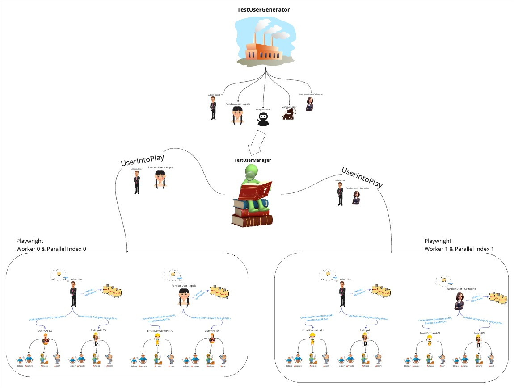

# Automation Test Framework - Architecture & Design Documentation

## Table of Contents

- [Overview](#overview)
- [Architecture](#architecture)
  - [Monorepo Structure](#monorepo-structure)
  - [Service Orchestration](#service-orchestration)
  - [Library Organization](#library-organization)
  - [Testing Types Overview](#testing-types-overview)
  - [SAB Testing Architecture](#sab-testing-architecture)
- [Design Patterns](#design-patterns)
  - [AAA (Arrange-Act-Assert) Pattern](#aaa-arrange-act-assert-pattern)
    - [Core Architecture](#core-architecture)
    - [AAA Pattern Organization](#aaa-pattern-organization)
    - [API Assistant Implementation](#api-assistant-implementation)
    - [SAB Assistant Implementation](#sab-assistant-implementation)
    - [Assistant Mapper Pattern](#assistant-mapper-pattern)
    - [TestUser Integration](#testuser-integration)
  - [Structural Design Patterns](#structural-design-patterns)
    - [Mixin Pattern (SAB Domain)](#mixin-pattern-sab-domain)
    - [Facade Pattern (Assistant Factory)](#facade-pattern-assistant-factory)
    - [Mapper Pattern (Configuration Management)](#mapper-pattern-configuration-management)
  - [Builder Pattern](#builder-pattern)
  - [Factory Pattern](#factory-pattern)
  - [Facade Pattern](#facade-pattern)
  - [Repository Pattern](#repository-pattern)
- [Tech Stack & Dependencies](#tech-stack--dependencies)
  - [Core Technologies](#core-technologies)
  - [Library Dependencies by Domain](#library-dependencies-by-domain)
  - [Path Mapping Configuration](#path-mapping-configuration)
- [Architecture Diagrams](#architecture-diagrams)
  - [User Relationships Diagram](#user-relationships-diagram)
  - [Monorepo Structure](#monorepo-structure-diagram)
  - [Service Orchestration Flow](#service-orchestration-flow)
  - [Test User Lifecycle](#test-user-lifecycle)
  - [AAA Pattern Flow](#aaa-pattern-flow)
  - [Library Dependency Graph](#library-dependency-graph)
  - [CI/CD Pipeline](#cicd-pipeline)
  - [SAB Test Sharding Flow](#sab-test-sharding-flow)
- [Code Samples](#code-samples)
  - [TestUser Creation and Management](#testuser-creation-and-management)
  - [AAA Assistant Usage](#aaa-assistant-usage)
  - [Builder Pattern Examples](#builder-pattern-examples)
  - [Configuration Management](#configuration-management)
  - [SAB Testing Examples](#sab-testing-examples)
- [Complete Flows](#complete-flows)
  - [Test Execution Flow](#test-execution-flow)
  - [Test User Acquisition and Lifecycle](#test-user-acquisition-and-lifecycle)
  - [Configuration Loading and Override](#configuration-loading-and-override)
  - [Report Portal Integration](#report-portal-integration)
  - [SAB Test Execution Flow](#sab-test-execution-flow)
- [CI/CD Integration](#cicd-integration)
- [References](#references)

---

## Overview

This document provides a comprehensive overview of a sophisticated test automation framework built using a monorepo architecture. The framework orchestrates multiple testing services (API, Web Portal, SAB, Performance) while maintaining code reusability, consistency, and scalability through well-defined design patterns and architectural principles.

### Key Objectives

- **Unified Testing Infrastructure**: Integrate different testing types (API, UI, SAB, Performance) in a single repository
- **Code Reusability**: Share common utilities, types, and test assistants across different testing domains
- **Maintainability**: Organize code by domain and feature to minimize coupling and maximize cohesion
- **Scalability**: Support parallel test execution, dynamic test user management, and flexible configuration

---

## Architecture

### Monorepo Structure

The project uses **Nx** (Nrwl Extensions) as the monorepo management tool, enabling:

- **Dependency Management**: Automatic dependency graph computation and affected project detection
- **Code Sharing**: Type-safe imports across projects using TypeScript path mapping
- **Task Orchestration**: Parallel execution of linting, testing, and building tasks
- **Library Management**: Automated refactoring for library creation, renaming, moving, and removal

```
automation-framework/
├── apps/                    # Test applications organized by testing type
│   ├── api/                 # API testing application
│   ├── web-portal/          # Web Portal UI testing application
│   ├── sab/                 # Secure Access Browser testing application
│   ├── performance/         # Performance testing application
│   ├── new-tenant/          # New tenant setup testing application
│   └── playwright.base.config.ts  # Base Playwright configuration
├── libs/                    # Shared libraries organized by domain
│   ├── api/                 # API-specific libraries
│   │   ├── type-api/        # API type definitions
│   │   ├── type-api-core/  # Core API types
│   │   └── util-api/       # API utility functions and builders
│   ├── sab/                 # SAB-specific libraries
│   │   ├── type-sab/        # SAB type definitions
│   │   └── util-sab/       # SAB utility functions
│   ├── web-portal/          # Web Portal-specific libraries
│   │   ├── type-web-portal/ # Web Portal type definitions
│   │   └── util-web-portal/ # Web Portal utility functions
│   └── shared/              # Cross-domain shared libraries
│       ├── feature-aaa/     # AAA pattern implementation
│       ├── feature-http-client/ # HTTP client utilities
│       ├── type-aaa/        # AAA type definitions
│       ├── type-auth/       # Authentication types
│       ├── type-error/      # Error type definitions
│       ├── type-node-process/ # Node.js process types
│       ├── util-aws-cognito/ # AWS Cognito utilities
│       ├── util-core/       # Core utilities (facade, logger, etc.)
│       └── util-playwright/ # Playwright-specific utilities
└── docs/                    # Documentation and resources
    └── resources/           # Diagrams and reference images
```

### Service Orchestration

The framework orchestrates different testing services through:

1. **Centralized Configuration**: Base Playwright configuration shared across apps with per-app overrides
2. **Shared Libraries**: Domain-specific and cross-domain libraries accessible via TypeScript path mapping
3. **Test User Repository**: Centralized test account management with database-backed locking mechanism
4. **Unified Reporting**: Report Portal integration for consolidated test result tracking

#### Configuration Hierarchy

```
┌──────────────────────────────────────────┐
│   playwright.base.config.ts              │  ← Base configuration
│   - Environment config loading            │
│   - Global test settings                  │
│   - Shared timeout values                 │
└───────────────┬───────────────────────────┘
                │
                ├────────────────────────┐
                │                        │
    ┌───────────▼────────────┐  ┌─────────▼──────────┐
    │ api/playwright.config │  │ web-portal/        │
    │ .ts                   │  │ playwright.config   │
    │                       │  │ .ts                 │
    │ - App-specific        │  │                     │
    │   reporters           │  │ - App-specific      │
    │ - Global setup        │  │   projects          │
    │ - Project configs     │  │ - Overrides         │
    └───────────────────────┘  └─────────────────────┘
```

### Library Organization

Libraries are organized by **domain** and **concern**:

#### Domain-Specific Libraries

- **`libs/api/`**: API testing utilities, types, and builders
- **`libs/sab/`**: Secure Access Browser testing utilities
- **`libs/web-portal/`**: Web Portal UI testing utilities

#### Shared Libraries

- **`libs/shared/feature-*`**: Feature implementations (AAA, HTTP client)
- **`libs/shared/type-*`**: Type definitions
- **`libs/shared/util-*`**: Utility functions
- **`libs/shared/error-*`**: Error handling

### Testing Types Overview

| Testing Type | Location | Description |
|-------------|----------|-------------|
| **API Testing** | `apps/api/` | GraphQL and RESTful API endpoint testing |
| **Web Portal Testing** | `apps/web-portal/` | End-to-end web application UI testing |
| **SAB Testing** | `apps/sab/` | Secure Access Browser automation testing |
| **Performance Testing** | `apps/performance/` | Performance and load testing |
| **New Tenant Testing** | `apps/new-tenant/` | Tenant setup and configuration testing |

### SAB Testing Architecture

SAB (Secure Access Browser) testing has a unique architecture that combines multiple components to automate native desktop application testing.

#### SAB Component Architecture

```
┌─────────────────────────────────────────────────────────┐
│                  SAB Test Architecture                   │
├─────────────────────────────────────────────────────────┤
│                                                          │
│  ┌──────────────────────────────────────┐               │
│  │         Test Script                  │               │
│  │  (Playwright test.describe/test)     │               │
│  └──────────────┬───────────────────────┘               │
│                 │                                        │
│                 ▼                                        │
│  ┌──────────────────────────────────────┐               │
│  │      TestUser                         │               │
│  │  - useUnityAssistant()                │               │
│  │  - useCorporateBrowserAssistant()       │               │
│  └──────┬─────────────────┬──────────────┘               │
│         │                 │                              │
│         │                 │                              │
│         ▼                 ▼                              │
│  ┌──────────────┐  ┌─────────────────────┐            │
│  │ Unity Assistant│  │ Corporate Browser      │            │
│  │                │  │ Assistant           │            │
│  │ Unity Tray UI  │  │                     │            │
│  │ Operations     │  │ Browser Automation  │            │
│  └──────┬────────┘  └──────────┬──────────┘            │
│         │                      │                        │
│         │                      │                        │
│         ▼                      ▼                        │
│  ┌──────────────┐  ┌─────────────────────┐            │
│  │PlatformDriver│  │CorporateBrowserDriver  │            │
│  │              │  │                      │            │
│  │ Windows:     │  │ CDP (Chrome DevTools │            │
│  │ WinAppDriver │  │ Protocol) Connection │            │
│  │              │  │                      │            │
│  │ macOS:       │  │ Remote Debugging     │            │
│  │ Appium Mac2  │  │ Port Management      │            │
│  └──────┬───────┘  └──────────┬──────────┘            │
│         │                      │                        │
│         └──────────┬───────────┘                        │
│                    │                                    │
│                    ▼                                    │
│         ┌─────────────────────┐                         │
│         │  SAB Application    │                         │
│         │  (Corporate Browser)  │                         │
│         │                     │                         │
│         │  - Unity Tray       │                         │
│         │  - Browser Engine   │                         │
│         │  - CDP Endpoint     │                         │
│         └─────────────────────┘                         │
│                                                          │
└─────────────────────────────────────────────────────────┘
```

#### Test User Management and Parallel Execution

The framework implements a sophisticated test user management system that supports parallel execution across multiple Playwright workers. The architecture includes:

**Test User Generation Layer**
- **`TestUserGenerator`**: Factory component responsible for creating diverse user personas (Admin User, Random User, Anonymous User, Managed User)
- **Behavior**: Users are either dynamically generated or reused from existing pools to facilitate interaction with the system under test

**Test User Management Layer**
- **`TestUserManager`**: Central orchestrator that manages user allocation and state
- **Functionality**: Receives generated users from `TestUserGenerator` and dispatches them into active test scenarios
- **Distribution**: Users are allocated to parallel execution workers via `UserIntoPlay` mechanism

**Parallel Execution Workers**
- The system leverages Playwright's parallel execution capabilities with multiple worker instances
- Each worker operates with a unique Parallel Index and receives a distinct subset of user entities
- **User Distribution**: Specific users are assigned to specific workers to prevent state collision
- **Test Assistants (TA)**: Within each worker, domain-specific assistants (e.g., `UserAPI TA`, `PolicyAPI TA`, `EmailDomainAPI TA`) encapsulate logic for specific API domains
- **AAA Pattern Implementation**: Each assistant structures test logic following the Arrange-Act-Assert pattern:
  - **Helper**: Utility functions or setup
  - **Arrange**: Test setup and preconditions
  - **Actions**: The actual operations or interactions being tested
  - **Assert**: Verification of expected outcomes

This design promotes efficient test execution, reusability of test data, and clear structuring of test logic while ensuring thread-safe user state management across parallel test execution environments.

#### Key Components

**1. PlatformDriver (Unity Tray Automation)**
- **Purpose**: Controls the Unity Tray application (system tray integration)
- **Platform Implementations**:
  - **WindowsDriver**: Uses WinAppDriver for Windows automation
  - **MacOSDriver**: Uses Appium Mac2 Driver for macOS automation
- **Responsibilities**:
  - Launch/terminate Unity Tray
  - Interact with Unity Tray UI elements
  - Execute system-level actions (keyboard shortcuts, window management)
  - Access desktop elements

**2. CorporateBrowserDriver (Browser Automation)**
- **Purpose**: Controls the Corporate Browser application via Chrome DevTools Protocol (CDP)
- **Connection Method**: CDP over WebSocket to `--remote-debugging-port`
- **Responsibilities**:
  - Initialize browser context
  - Manage browser tabs and pages
  - Execute JavaScript in browser context
  - Capture screenshots, videos
  - Monitor network traffic

**3. Unity Assistant**
- **Purpose**: Provides AAA pattern interface for Unity Tray operations
- **Components**: Arrange, Actions, Assert classes for Unity Tray interactions
- **Usage**: `testUser.useUnityAssistant()`

**4. CorporateBrowserAssistant**
- **Purpose**: Provides AAA pattern interface for browser operations
- **Components**: Arrange, Actions, Assert classes for browser interactions
- **Usage**: `testUser.useCorporateBrowserAssistant()`

#### SAB Test Structure Organization

SAB tests are organized by feature categories in a hierarchical structure:

```
apps/sab/tests/
├── 01-install/                    # Installation tests
│   ├── 01-010-001-install.win.msi.spec.ts
│   ├── 01-010-002-install.win.msix.spec.ts
│   └── 01-010-003-install.mac.spec.ts
├── 02-features/                   # Feature tests
│   ├── enterpriseBrowser/
│   │   ├── 010-login/            # Login feature tests
│   │   │   ├── 02-010-001-enterprise.login.spec.ts
│   │   │   └── 02-010-002-enterprise.login.loginPolicy.spec.ts
│   │   ├── 020-webDefault/       # Web default tests
│   │   │   ├── 02-020-001-enterprise.saas.spec.ts
│   │   │   ├── 02-020-002-enterprise.contentScanning.spec.ts
│   │   │   └── src/               # Shared test utilities
│   │   ├── 030-app/               # App launch tests
│   │   │   ├── 02-030-001-enterprise.app.rdp.spec.ts
│   │   │   ├── 02-030-002-enterprise.app.ssh.spec.ts
│   │   │   └── 02-030-003-enterprise.app.fileShare.spec.ts
│   │   └── 090-quit/              # Quit/cleanup tests
│   │       └── 02-090-001-enterprise.quit.spec.ts
│   └── unity/                     # Unity-specific tests
│       ├── 02-01-unity.login.spec.ts
│       └── 02-02-unity.quit.spec.ts
├── 03-logout/                     # Logout tests
│   └── 03-logout.spec.ts
└── 04-upgrade/                     # Upgrade tests
    ├── 04-010-upgrade.spec.ts
    └── 04-020-upgrade.msix.spec.ts
```

#### Test Naming Convention

SAB tests follow a structured naming pattern:
- **Format**: `{category}-{subcategory}-{sequence}-{feature}.spec.ts`
- **Example**: `02-010-001-enterprise.login.spec.ts`
  - `02`: Feature category (02 = features)
  - `010`: Subcategory (010 = login)
  - `001`: Sequence number
  - `enterprise.login`: Feature description

---

## Design Patterns

### AAA (Arrange-Act-Assert) Pattern

The framework implements a structured AAA pattern where each test assistant provides three distinct interfaces. The pattern is consistently applied across API testing, SAB (Secure Access Browser) testing, and Web Portal testing domains.

#### Core Architecture

The AAA pattern is built upon a foundation of several key components:

**1. TestAAA Base Class**
- **Location**: `libs/shared/feature-aaa/src/lib/aaa/feature-test-aaa.ts`
- **Purpose**: Base class that all Arrange, Actions, and Assert classes extend
- **Responsibilities**:
  - Provides access to API service instances
  - Manages utility managers (faker, logger, mapper, etc.)
  - Validates API service context for arrange steps
  - Offers builder managers for API and E2E operations

**2. Step Decorator**
- **Location**: `libs/shared/feature-aaa/src/lib/aaa/test-step-decorator.ts`
- **Purpose**: Automatically tracks test execution steps with context-aware logging
- **Behavior**:
  - Uses Playwright `test.step()` in test contexts
  - Falls back to direct logging in global setup/teardown
  - Supports custom step descriptions
  - Integrates with execution tracker for reporting

**3. Assistant Facade Pattern**
- **Purpose**: Provides a unified interface to Arrange, Actions, and Assert components
- **Structure**: Each assistant exposes four properties:
  - `arrange`: Setup and data preparation methods
  - `actions`: Operation execution methods
  - `assert`: Validation and assertion methods
  - `helper`: Alias to arrange for convenience

#### Pattern Structure

```typescript
// Example: LoginPolicyAPIAssistant structure
type TALoginPolicyAPI = {
  arrange: LoginPolicyAPIArrange;   // Setup and data preparation
  actions: LoginPolicyAPIActions;   // API operations execution
  assert: LoginPolicyAPIAssert;      // Result validation
  helper: LoginPolicyAPIArrange;    // Helper methods (same as arrange)
};
```

#### AAA Pattern Organization

The AAA pattern is organized into domain-specific implementations:

**API Domain Structure:**
```
libs/shared/feature-aaa/src/lib/api/
├── gql/                          # GraphQL API assistants
│   ├── assistants/
│   │   ├── login-policy/
│   │   │   ├── login-policy-actions.ts
│   │   │   ├── login-policy-arrange.ts
│   │   │   ├── login-policy-assert.ts
│   │   │   └── login-policy-facade.ts
│   │   └── [other-assistants]/
│   └── managers/                 # API client managers
├── restful/                      # RESTful API assistants
│   ├── assistants/
│   └── managers/
└── config-aaa-assistant-mapper.ts  # Mapper configuration
```

**SAB Domain Structure:**
```
libs/shared/feature-aaa/src/lib/sab/
├── corporate-browser/              # Corporate Browser assistants
│   ├── assistant/
│   │   ├── appLauncherPage/
│   │   │   ├── mb-appLauncherPage-actions.ts
│   │   │   ├── mb-appLauncherPage-arrange.ts
│   │   │   ├── mb-appLauncherPage-assert.ts
│   │   │   └── mb-appLauncherPage-facade.ts
│   │   └── [other-pages]/
│   ├── components/              # Shared mixin components
│   │   ├── basePageActions.ts   # Actions mixin
│   │   ├── basePageArrange.ts   # Arrange mixin
│   │   ├── basePageAssert.ts    # Assert mixin
│   │   └── basePage.ts          # Base page class
│   └── config-aaa-assistant-mapper.ts
└── platform-driver/              # Platform driver assistants
    ├── assistant/
    └── config-aaa-assistant-mapper.ts
```

#### Arrange Phase

The `Arrange` class handles:
- **Input Payload Creation**: Generate create/update input payloads using builders
- **Preset Data Generation**: Create prerequisite test data
- **Expected Result Preparation**: Construct expected responses for validation

```typescript
// Example: Arrange phase
export class LoginPolicyAPIArrange extends TestAAA<LoginPolicyAPI> {
  @Step()
  async getCreateInputPayload(
    options?: Partial<TCreateLoginPolicyInput>
  ): Promise<TCreateLoginPolicyInput> {
    return await utilAPIForCreateInputOrBodyPayloadBuilder<
      TCreateLoginPolicyInput
    >(
      CreateLoginPolicyInputBuilder,
      options,
    );
  }

  @Step()
  async generatePresetLoginPolicyEntry(
    actions: LoginPolicyAPIActions,
  ): Promise<TCreateLoginPolicyResult> {
    const createInput = await this.getCreateInputPayload();
    return await actions.createLoginPolicy(createInput);
  }
}
```

#### Actions Phase

The `Actions` class executes:
- **CRUD Operations**: Create, Read, Update, Delete API calls
- **Result Tracking**: Store created resource IDs in TestUser notes
- **Error Handling**: Type-safe error result handling

```typescript
// Example: Actions phase
export class LoginPolicyAPIActions extends TestAAA<LoginPolicyAPI> {
  @Step()
  async createLoginPolicy(
    input: TCreateLoginPolicyInput,
  ): Promise<TCreateLoginPolicyResult> {
    const resp = await this.getApiService()
      .getGqlClient()
      .mutation<TCreateLoginPolicyResult, TCreateLoginPolicyErrorResult>(
        createLoginPolicyMutation,
        { input },
      );

    // Track created resources in TestUser notes
    if (smartTypeGuardian<TCreateLoginPolicyResult, TCreateLoginPolicyErrorResult>(
      resp,
      'createLoginPolicy'
    )) {
      this.getApiService()
        .getTestUser()
        .appendNote(NoteKey.LoginPolicyIds, [resp.createLoginPolicy.id]);
    }

    return resp;
  }
}
```

#### Assert Phase

The `Assert` class validates:
- **Response Structure**: Verify response properties exist
- **Data Consistency**: Compare actual vs expected results
- **Error Scenarios**: Validate error responses

```typescript
// Example: Assert phase
export class LoginPolicyAPIAssert {
  @Step()
  async loginPolicyCreatedOK(
    actualResult: TCreateLoginPolicyResult,
    expectedResult: TCreateLoginPolicyResult,
  ): Promise<void> {
    baseExpect(actualResult.createLoginPolicy, {
      message: AssertMessage.common.toBeTruthy('property createLoginPolicy'),
    }).toBeTruthy();

    this.assertLoginPolicyContent(
      actualResult.createLoginPolicy,
      expectedResult.createLoginPolicy,
    );
  }
}
```

### API Assistant Implementation

API assistants follow a consistent structure for both GraphQL and RESTful APIs.

#### API Assistant Structure

**1. Manager Layer (API Client)**
- **Purpose**: Encapsulates API client logic (GraphQL or RESTful)
- **Location**: `libs/shared/feature-aaa/src/lib/api/gql/managers/` or `restful/managers/`
- **Responsibilities**:
  - Manages HTTP connections
  - Handles authentication
  - Executes API requests
  - Returns typed responses

**2. Assistant Layer (AAA Implementation)**
- **Purpose**: Implements the AAA pattern for specific API endpoints
- **Location**: `libs/shared/feature-aaa/src/lib/api/gql/assistants/{service-name}/`
- **File Structure**:
  - `{service-name}-actions.ts`: CRUD operations
  - `{service-name}-arrange.ts`: Data preparation and builders
  - `{service-name}-assert.ts`: Validation logic
  - `{service-name}-facade.ts`: Assistant factory function

**3. Mapper Configuration**
- **Purpose**: Maps API manager types to their corresponding assistant factory functions
- **Location**: `libs/shared/feature-aaa/src/lib/api/config-aaa-assistant-mapper.ts`
- **Functionality**:
  - Associates API client constructors with assistant factories
  - Configures endpoint URLs (GraphQL and RESTful)
  - Enables dynamic assistant instantiation

#### API Assistant Usage Pattern

```typescript
// 1. TestUser acquires API assistant via useAPIAssistant
const adminUserAPITA = await adminUser.useAPIAssistant<
  LoginPolicyAPI,
  TALoginPolicyAPI
>(LoginPolicyAPI);

// 2. Arrange: Prepare test data
const createInput = await adminUserAPITA.arrange.getCreateInputPayload({
  isDenyAction: false,
});

// 3. Actions: Execute API operation
const actualResult = await adminUserAPITA.actions.createLoginPolicy(createInput);

// 4. Assert: Validate results
const expectedResult = await adminUserAPITA.arrange.getExpectedResultForCreatePolicyOK(createInput);
await adminUserAPITA.assert.loginPolicyCreatedOK(actualResult, expectedResult);
```

#### API Assistant Naming Conventions

**Arrange Methods:**
- `getCreate{ServiceName}InputPayload()`: Generate create input payloads
- `getUpdate{ServiceName}InputPayload()`: Generate update input payloads
- `generatePreset{ServiceName}Entry()`: Create prerequisite test data
- `getExpectedResultFor{Description}()`: Construct expected responses

**Actions Methods:**
- `create{ServiceName}()`: Create resource
- `update{ServiceName}()`: Update resource
- `get{ServiceName}()`: Retrieve resource
- `list{ServiceName}()`: List resources
- `delete{ServiceName}()`: Delete resource

**Assert Methods:**
- `{serviceName}CreatedOK()`: Validate successful creation
- `{serviceName}UpdatedOK()`: Validate successful update
- `{serviceName}GotOK()`: Validate successful retrieval
- `{serviceName}GotNull()`: Validate resource not found
- `{serviceName}ListedOK()`: Validate successful listing

### SAB Assistant Implementation

SAB assistants utilize a **Mixin Pattern** to share common functionality across multiple page assistants while maintaining domain-specific implementations.

#### Mixin Pattern Architecture

The Mixin pattern allows composition of classes from multiple base classes, enabling code reuse without multiple inheritance limitations.

**Base Mixin Components:**
- **Location**: `libs/shared/feature-aaa/src/lib/sab/corporate-browser/components/`
- **Components**:
  - `basePageActions.ts`: `CBPageActionsMixin` - Common browser actions
  - `basePageArrange.ts`: `CBPageArrangeMixin` - Common setup operations
  - `basePageAssert.ts`: `CBPageAssertMixin` - Common assertions

**Mixin Implementation Pattern:**

```typescript
// Base class for the assistant
class BaseClassCBAppLauncherPage extends TestAAA<CBAppLauncherPage> {}

// Apply mixin to extend base class with shared functionality
export class CBAppLauncherPageActions extends CBPageActionsMixin<
  CBAppLauncherPage,
  TConstructorArgs<BaseClassCBAppLauncherPage>
>(BaseClassCBAppLauncherPage) {
  // Page-specific actions that extend mixin functionality
  @Step()
  async openApp(options: TSabAppCategory) {
    // Implementation specific to app launcher page
  }
}
```

#### SAB Assistant Structure

**1. Page Object Manager**
- **Purpose**: Encapsulates page element definitions and structure
- **Location**: `libs/shared/feature-aaa/src/lib/sab/corporate-browser/pageObjectManager/`
- **Responsibilities**:
  - Defines page element locators
  - Provides element access patterns
  - Manages page state

**2. Assistant Layer (AAA Implementation)**
- **Purpose**: Implements AAA pattern for specific browser pages
- **Location**: `libs/shared/feature-aaa/src/lib/sab/corporate-browser/assistant/{pageName}/`
- **File Structure**:
  - `cb-{pageName}-actions.ts`: Extends `CBPageActionsMixin`
  - `cb-{pageName}-arrange.ts`: Extends `CBPageArrangeMixin`
  - `cb-{pageName}-assert.ts`: Extends `CBPageAssertMixin`
  - `cb-{pageName}-facade.ts`: Assistant factory function

**3. Mapper Configuration**
- **Purpose**: Maps page object manager types to assistant factories
- **Location**: `libs/shared/feature-aaa/src/lib/sab/corporate-browser/config-aaa-assistant-mapper.ts`
- **Additional Configuration**:
  - `locatorStrategies`: Element location strategies
  - `uiActions`: UI interaction utilities
  - `pageTitles`: Page title validation
  - `safeChecker`: Optional page readiness validation

#### SAB Assistant Usage Pattern

```typescript
// 1. TestUser acquires Corporate Browser assistant
const cbTA = await adminUser.useCorporateBrowserAssistant<
  CBAppLauncherPage,
  TACBAppLauncherPage
>(CBAppLauncherPage);

// 2. Arrange: Setup test environment
await cbTA.arrange.initializeDebuggerSession();

// 3. Actions: Perform browser operations
await cbTA.actions.openApp({ category: 'web', appName: 'example-app' });

// 4. Assert: Validate browser state
await cbTA.assert.appLaunchedOK('example-app');
```

#### Mixin Benefits

**Code Reusability:**
- Common browser operations (navigation, keyboard shortcuts, clipboard operations) are defined once in mixins
- Page-specific assistants inherit shared functionality automatically
- Reduces code duplication across multiple page assistants

**Maintainability:**
- Changes to common functionality are made in one place (mixin)
- All page assistants automatically benefit from mixin updates
- Clear separation between shared and page-specific logic

**Extensibility:**
- New page assistants can easily extend mixins
- Page-specific methods can override or extend mixin methods
- Mixin methods are prefixed with `mx` to indicate mixin origin

### Assistant Mapper Pattern

The framework uses a **Mapper Pattern** to dynamically associate API clients and page objects with their corresponding AAA assistants.

#### Mapper Architecture

**API Assistant Mapper:**
- **Location**: `libs/shared/feature-aaa/src/lib/api/config-aaa-assistant-mapper.ts`
- **Structure**: `Map<Constructor, MapperData>`
- **MapperData Properties**:
  - `gqlEndpoint`: GraphQL endpoint URL (optional)
  - `restHost`: RESTful API host URL (optional)
  - `restApiPath`: RESTful API path (optional)
  - `getTACallBackFunction`: Factory function that creates the assistant

**SAB Assistant Mapper:**
- **Location**: `libs/shared/feature-aaa/src/lib/sab/corporate-browser/config-aaa-assistant-mapper.ts`
- **Structure**: `Map<Constructor, TMapperData>`
- **TMapperData Properties**:
  - `getTACallBackFunction`: Factory function
  - `locatorStrategies`: Element location strategies
  - `uiActions`: UI interaction utilities
  - `pageTitles`: Page title validation array (optional)
  - `safeChecker`: Page readiness validation function (optional)

#### Mapper Registration

```typescript
// API Mapper Registration Example
mapper.set(LoginPolicyAPI, {
  gqlEndpoint: utilManager.processNode().facade().getter().getGraphQLEndpoint(),
  getTACallBackFunction: getLoginPolicyAPIAssistant,
});

// SAB Mapper Registration Example
mapper.set(CBAppLauncherPage, {
  getTACallBackFunction: getCBAppLauncherPageAssistant,
  locatorStrategies,
  uiActions: actions,
  pageTitles: [
    TEnumValuesPageTitleChecker.AppLauncherPage,
    TEnumValuesPageTitleChecker.InstallerPage,
  ],
});
```

#### Mapper Benefits

**Type Safety:**
- TypeScript ensures correct association between clients and assistants
- Compile-time validation of mapper entries
- Prevents runtime errors from missing mappings

**Dynamic Resolution:**
- Assistants are resolved at runtime based on client type
- Enables flexible test execution patterns
- Supports multiple assistant implementations for the same client

**Centralized Configuration:**
- Single source of truth for assistant mappings
- Easy to add new assistants
- Clear documentation of available assistants

### TestUser Integration

The `TestUser` class serves as the central interface for acquiring and using AAA assistants across all testing domains.

#### Assistant Acquisition Methods

**1. useAPIAssistant**
- **Purpose**: Acquires API assistants for GraphQL or RESTful APIs
- **Signature**: `useAPIAssistant<T, TAAA>(t: TApi<T>, uriOptions?: TUriOptions): Promise<TAAA>`
- **Behavior**:
  - Checks mapper for assistant factory function
  - Creates API client instance with connection options
  - Instantiates assistant via factory function
  - Caches assistant in TestUser notes for reuse
  - Handles authentication automatically

**2. useCorporateBrowserAssistant**
- **Purpose**: Acquires Corporate Browser page assistants
- **Signature**: `useCorporateBrowserAssistant<T, TAAA>(t: TCorporateBrowser<T>, options?: TACorporateBrowserOptions): Promise<TAAA>`
- **Behavior**:
  - Resolves page object manager from mapper
  - Initializes Corporate Browser driver connection
  - Creates page instance with locator strategies and UI actions
  - Validates page readiness using safe checker (if configured)
  - Caches assistant for reuse

**3. usePlatformDriverAssistant**
- **Purpose**: Acquires Unity Tray platform driver assistants
- **Signature**: `usePlatformDriverAssistant<T, TAAA>(t: TUserPlatformDriver<T>): Promise<TAAA>`
- **Behavior**:
  - Retrieves platform driver from system controller
  - Creates platform-specific page object manager
  - Instantiates assistant with driver and test user context
  - Caches assistant for reuse

#### Assistant Caching Mechanism

Assistants are cached in `TestUser.notes` using a map key derived from:
- Constructor type
- Connection options (for API assistants)
- Page options (for UI assistants)

This caching ensures:
- **Performance**: Assistants are created once and reused
- **State Management**: Assistant state persists across test steps
- **Resource Efficiency**: Reduces redundant object creation

#### Execution Context Detection

The framework automatically detects execution context (test vs utility) through:
- **TestUser.getExecutionContext()**: Returns current execution context
- **Step Decorator**: Uses context to determine logging strategy
- **Execution Tracker**: Records steps with appropriate context markers

This enables:
- Proper step tracking in Playwright test reports
- Appropriate logging in global setup/teardown
- Context-aware error handling

### Structural Design Patterns

The AAA pattern implementation leverages several structural design patterns to achieve code organization, reusability, and maintainability.

#### Mixin Pattern (SAB Domain)

The **Mixin Pattern** is extensively used in SAB assistants to share common functionality across multiple page assistants.

**Implementation Approach:**
- Mixin functions accept a base class constructor and return an extended class
- Multiple mixins can be composed to build complex class hierarchies
- Page-specific assistants extend mixin-enhanced base classes

**Benefits:**
- **Code Reusability**: Common browser operations defined once
- **Type Safety**: TypeScript ensures proper mixin composition
- **Flexibility**: Page assistants can override or extend mixin methods
- **Maintainability**: Changes to common functionality propagate automatically

**Example Mixin Structure:**
```typescript
// Mixin function definition
export function CBPageActionsMixin<
  TPage extends BasePage<unknown>,
  TBase extends TConstructorArgs<TestAAA<TPage>>,
>(BaseActions: TBase) {
  return class extends BaseActions {
    // Shared methods available to all page assistants
    async mxNavigateToUrl(url: string) { /* ... */ }
    async mxPerformKeyboardShortcut(key: string) { /* ... */ }
    // ... more shared methods
  };
}

// Usage in page assistant
class BaseClass extends TestAAA<CBAppLauncherPage> {}
export class CBAppLauncherPageActions extends CBPageActionsMixin<
  CBAppLauncherPage,
  TConstructorArgs<BaseClass>
>(BaseClass) {
  // Page-specific methods
  async openApp(options: TSabAppCategory) { /* ... */ }
}
```

#### Facade Pattern (Assistant Factory)

The **Facade Pattern** is used to provide a simplified interface to the AAA assistant components.

**Implementation:**
- Each assistant has a facade file that exports:
  - Type definition for the assistant interface
  - Factory function that creates and returns the assistant
- The factory function instantiates Arrange, Actions, and Assert classes
- Returns a unified interface with `arrange`, `actions`, `assert`, and `helper` properties

**Benefits:**
- **Simplified Interface**: Single entry point for assistant creation
- **Consistency**: Uniform assistant structure across all domains
- **Type Safety**: TypeScript ensures correct assistant composition
- **Encapsulation**: Hides internal assistant construction details

#### Mapper Pattern (Configuration Management)

The **Mapper Pattern** provides dynamic resolution of assistants based on client types.

**Implementation:**
- Map data structure associates constructors with configuration data
- Configuration includes factory functions, endpoints, and domain-specific settings
- Lazy initialization: Maps are populated on first access
- Type-safe lookups ensure correct assistant resolution

**Benefits:**
- **Dynamic Resolution**: Assistants resolved at runtime
- **Centralized Configuration**: Single source of truth for mappings
- **Extensibility**: Easy to add new assistants
- **Type Safety**: Compile-time validation of mappings

### Builder Pattern

The framework extensively uses the Builder pattern for constructing complex objects:

#### Input Builders

Input builders generate request payloads with default values and customization options:

```typescript
// Example: Create Input Builder
export const CreateLoginPolicyInputBuilder = {
  async _default(): Promise<TCreateLoginPolicyInput> {
    return {
      name: await utilManager.faker().random.word(),
      description: await utilManager.faker().lorem.sentence(),
      isDenyAction: false,
      // ... other default properties
    };
  },
};

// Usage with customization
const createInput = await utilAPIForCreateInputOrBodyPayloadBuilder<
  TCreateLoginPolicyInput
>(
  CreateLoginPolicyInputBuilder,
  { isDenyAction: true } // Override default
);
```

#### Response Builders

Response builders construct expected API responses from input payloads:

```typescript
// Example: Response Builder
export const CreateLoginPolicyResponseBuilder = {
  async _default(
    input: TCreateLoginPolicyInput,
  ): Promise<TCreateLoginPolicyResult> {
    return {
      createLoginPolicy: {
        id: expect.any(String),
        name: input.name,
        description: input.description,
        isDenyAction: input.isDenyAction,
        // ... other mapped properties
      },
    };
  },
};
```

#### Builder Utility Functions

The framework provides utilities to simplify builder usage:

```typescript
// Generic builder function for create inputs
export async function utilAPIForCreateInputOrBodyPayloadBuilder<T>(
  builderCallBackFunction: { _default: () => Promise<T> },
  options?: Partial<T>,
): Promise<T> {
  const inputPayload = await builderCallBackFunction._default();
  
  if (options) {
    // Merge options into default payload
    utilManager.handler().object().smartObjUpdates({
      thisObj: inputPayload as object,
      otherObj: options,
      union: true,
    });
  }
  
  return inputPayload;
}
```

### Factory Pattern

The Factory pattern is used for TestUser creation through `TestUserGenerator`:

```typescript
// Example: TestUser Factory
export class TestUserGenerator {
  static async createAdminUser(
    options?: Partial<TUserBuilderOptions>
  ): Promise<TestUser> {
    return await TestUser.create({
      role: TEnumUserRole.ADMIN,
      ...options,
    });
  }

  static async createRandomUser(
    options?: Partial<TUserBuilderOptions>
  ): Promise<TestUser> {
    return await TestUser.create({
      role: TEnumUserRole.USER,
      username: utilManager.faker().internet.userName(),
      ...options,
    });
  }
}

// Usage in tests
const adminUser = await TestUserGenerator.createAdminUser();
const randomUser = await TestUserGenerator.createRandomUser();
```

### Facade Pattern (Utility Manager)

The Facade pattern is implemented through `utilManager`, providing a unified interface to various utility functions across the framework:

```typescript
// Example: Utility Manager Facade
export const utilManager = {
  faker: () => utilFakerData,
  handler: () => ({
    object: () => utilObjectHandler,
    apiVersionHandler: () => utilVersionHandler,
    gmailClient: (oAuth2: TGmailOAuth2) => utilGmailClient(oAuth2),
    totp: () => new TOTPService(),
  }),
  logger: () => utilLogger,
  mapper: () => utilMapper,
  processNode: () => utilProcessNode,
  typeChecker: () => utilTypeChecker,
  reportPortal: () => utilReportPortal,
  // ... more utilities
};

// Usage
const randomName = utilManager.faker().internet.userName();
const env = utilManager.processNode().facade().getter().getNodeEnv();
```

### Repository Pattern

The Repository pattern manages test account lifecycle through `TestAccountRepository`:

```typescript
// Example: Test Account Repository
export class TestAccountRepository {
  /**
   * Acquires and locks a test account from the database
   * Supports hostname-based filtering and retry logic
   */
  async getAndLockTestAccount(
    options: TGetAndLockOptions
  ): Promise<TTestAccount> {
    // Implementation with retry logic, hostname filtering,
    // and database transaction management
  }

  /**
   * Releases locked test accounts
   * Supports targeted unlocking by username or bulk unlocking
   */
  async unlockTestAccounts(
    options: TUnlockTestAccountsOptions
  ): Promise<void> {
    // Implementation with transaction safety
  }
}
```

---

## Tech Stack & Dependencies

### Core Technologies

| Technology | Version | Purpose |
|-----------|--------|---------|
| **Nx** | 17.1.3 | Monorepo management and task orchestration |
| **Playwright** | ^1.52.0 | End-to-end testing framework |
| **TypeScript** | ^5.1.6 | Type-safe development |
| **GraphQL** | 16.8.1 | API query language |
| **Axios** | ^1.7.2 | HTTP client for RESTful APIs |
| **Node.js** | ^22.0.0 | Runtime environment |

### Library Dependencies by Domain

#### API Domain
```json
{
  "@graphql-codegen/cli": "^5.0.2",
  "@graphql-codegen/typescript": "^4.0.9",
  "graphql": "16.8.1",
  "graphql-request": "6.1.0",
  "gql-query-builder": "^3.8.0"
}
```

#### SAB Domain
```json
{
  "appium": "^2.17.1",
  "webdriverio": "^9.12.4",
  "robotjs": "^0.6.0",
  "node-pty": "^1.0.0"
}
```

#### Shared Utilities
```json
{
  "@aws-sdk/client-ec2": "^3.529.0",
  "amazon-cognito-identity-js": "^6.3.7",
  "date-fns": "^3.6.0",
  "@faker-js/faker": "^8.3.1",
  "mysql2": "^3.14.3"
}
```

### Path Mapping Configuration

TypeScript path mappings enable type-safe imports across the monorepo:

```json
{
  "compilerOptions": {
    "baseUrl": "./",
    "paths": {
      "@framework/api/type-api": ["libs/api/type-api/src/index.ts"],
      "@framework/api/util-api": ["libs/api/util-api/src/index.ts"],
      "@framework/shared/feature-aaa": ["libs/shared/feature-aaa/src/index.ts"],
      "@framework/shared/util-core": ["libs/shared/util-core/src/index.ts"],
      "@framework/web-portal/type-web-portal": ["libs/web-portal/type-web-portal/src/index.ts"]
    }
  }
}
```

---

## Architecture Diagrams

### User Relationships Diagram

The following diagram illustrates the relationships between TestUser, TestUserManager, and TestUserGenerator:



*Diagram showing TestUser, TestUserManager, and TestUserGenerator relationships and lifecycle*

### Monorepo Structure Diagram

```
┌─────────────────────────────────────────────────────────────┐
│                   automation-framework                      │
│                     (Nx Monorepo)                           │
├─────────────────────────────────────────────────────────────┤
│                                                              │
│  ┌────────────────────┐    ┌────────────────────┐             │
│  │      apps/         │    │      libs/         │             │
│  │                    │    │                    │             │
│  │  ┌──────────────┐ │    │  ┌──────────────┐ │             │
│  │  │  api/        │ │    │  │  api/        │ │             │
│  │  │              │ │    │  │              │ │             │
│  │  │  tests/      │ │    │  │  type-api/   │ │             │
│  │  │  config/     │ │    │  │  util-api/   │ │             │
│  │  └──────────────┘ │    │  └──────────────┘ │             │
│  │                    │    │                    │             │
│  │  ┌──────────────┐ │    │  ┌──────────────┐ │             │
│  │  │  web-portal/ │ │    │  │  eab/        │ │             │
│  │  │              │ │    │  │              │ │             │
│  │  │  tests/      │ │    │  │  type-sab/   │ │             │
│  │  │  config/     │ │    │  │  util-sab/   │ │             │
│  │  └──────────────┘ │    │  └──────────────┘ │             │
│  │                    │    │                    │             │
│  │  ┌──────────────┐ │    │  ┌──────────────┐ │             │
│  │  │  sab/        │ │    │  │  shared/     │ │             │
│  │  │              │ │    │  │              │ │             │
│  │  │  tests/      │ │    │  │  feature-aaa  │ │             │
│  │  │  config/     │ │    │  │  util-core   │ │             │
│  │  └──────────────┘ │    │  │  util-playwr │ │             │
│  │                    │    │  │  ...         │ │             │
│  │  ┌──────────────┐ │    │  └──────────────┘ │             │
│  │  │  performance/│ │    │                    │             │
│  │  └──────────────┘ │    │                    │             │
│  └────────────────────┘    └────────────────────┘             │
│                                                              │
└─────────────────────────────────────────────────────────────┘
```

### Service Orchestration Flow

```
┌──────────────┐
│  Test Script │
└──────┬───────┘
       │
       ▼
┌─────────────────────────┐
│  Playwright Config      │
│  - Load base config     │
│  - Load app config      │
│  - Load env variables   │
└──────┬──────────────────┘
       │
       ▼
┌─────────────────────────┐
│  Test User Fixtures      │
│  - TestUserGenerator     │
│  - TestUserRepository   │
│  - Account acquisition   │
└──────┬──────────────────┘
       │
       ▼
┌─────────────────────────┐
│  AAA Assistant          │
│  - Arrange              │
│  - Actions              │
│  - Assert               │
└──────┬──────────────────┘
       │
       ▼
┌─────────────────────────┐
│  API Client             │
│  - GraphQL Client      │
│  - RESTful Client      │
└──────┬──────────────────┘
       │
       ▼
┌─────────────────────────┐
│  Report Portal          │
│  - Test results         │
│  - Attachments          │
└─────────────────────────┘
```

### Test User Lifecycle

```
                    ┌─────────────┐
                    │ Test Start  │
                    └──────┬──────┘
                           │
                           ▼
            ┌───────────────────────────┐
            │ TestUserGenerator        │
            │ - createAdminUser()      │
            │ - createRandomUser()     │
            └──────┬───────────────────┘
                   │
                   ▼
        ┌───────────────────────┐
        │ TestAccountRepository │
        │ - getAndLockAccount() │
        └──────┬────────────────┘
               │
               ▼
    ┌──────────────────────────────┐
    │ Database Account Pool        │
    │ - Query available accounts   │
    │ - Lock account (hostname)   │
    │ - Return account info       │
    └──────┬───────────────────────┘
           │
           ▼
┌──────────────────────┐
│ TestUser Instance    │
│ - username          │
│ - credentials       │
│ - Cognito session   │
└──────┬───────────────┘
       │
       ▼
┌──────────────────────┐
│ Test Execution       │
│ - useAPIAssistant()  │
│ - takeNote()         │
│ - appendNote()       │
└──────┬───────────────┘
       │
       ▼
┌──────────────────────┐
│ Test Cleanup         │
│ - Cleanup resources  │
│ - unlockAccount()    │
└──────────────────────┘
```

### AAA Pattern Flow

```
┌─────────────────────────────────────────────────────────┐
│                    Test Case                             │
└─────────────────────────────────────────────────────────┘
                            │
                            ▼
        ┌───────────────────────────────────┐
        │     ARRANGE Phase                 │
        │  ┌─────────────────────────┐    │
        │  │ Arrange Methods          │    │
        │  │ - getCreateInputPayload() │    │
        │  │ - generatePresetEntry()   │    │
        │  │ - getExpectedResult()     │    │
        │  └─────────────────────────┘    │
        └───────────────┬──────────────────┘
                        │
                        ▼
        ┌───────────────────────────────────┐
        │     ACTIONS Phase                 │
        │  ┌─────────────────────────┐    │
        │  │ Actions Methods          │    │
        │  │ - createResource()       │    │
        │  │ - updateResource()       │    │
        │  │ - getResource()          │    │
        │  │ - deleteResource()       │    │
        │  └─────────────────────────┘    │
        │         │                        │
        │         ▼                        │
        │  ┌─────────────┐                │
        │  │ API Client   │                │
        │  │ - GraphQL    │                │
        │  │ - RESTful    │                │
        │  └─────────────┘                │
        └───────────────┬──────────────────┘
                        │
                        ▼
        ┌───────────────────────────────────┐
        │     ASSERT Phase                  │
        │  ┌─────────────────────────┐    │
        │  │ Assert Methods           │    │
        │  │ - resourceCreatedOK()    │    │
        │  │ - resourceUpdatedOK()   │    │
        │  │ - resourceGotOK()       │    │
        │  │ - validateContent()     │    │
        │  └─────────────────────────┘    │
        └──────────────────────────────────┘
```

### Library Dependency Graph

```
┌─────────────────────────────────────────────────────────┐
│                      Apps Layer                         │
│                                                          │
│  ┌─────────┐  ┌────────────┐  ┌──────┐  ┌────────────┐ │
│  │  api/   │  │ web-portal/│  │ sab/ │  │performance/│ │
│  └────┬────┘  └──────┬──────┘  └───┬──┘  └──────┬─────┘ │
└───────┼──────────────┼──────────────┼─────────────┼──────┘
        │              │              │             │
        └──────────────┴──────────────┴─────────────┘
                         │
        ┌────────────────┼────────────────┐
        │                │                │
┌───────▼──────┐  ┌──────▼──────┐  ┌─────▼─────────┐
│ libs/api/    │  │ libs/sab/    │  │libs/web-portal│
│              │  │              │  │               │
│  type-api    │  │  type-sab    │  │  type-web-    │
│  util-api    │  │  util-sab    │  │  portal       │
└───────┬──────┘  └──────┬───────┘  └──────┬────────┘
        │                │                 │
        └────────────────┼─────────────────┘
                         │
        ┌────────────────▼─────────────────┐
        │        libs/shared/               │
        │                                   │
        │  ┌───────────────────────────┐   │
        │  │  feature-aaa              │   │
        │  │  feature-http-client      │   │
        │  │  util-core                │   │
        │  │  util-playwright          │   │
        │  │  util-aws-cognito         │   │
        │  │  type-aaa                 │   │
        │  │  type-auth                │   │
        │  └───────────────────────────┘   │
        └───────────────────────────────────┘
```

### CI/CD Pipeline

```
┌─────────────────────────────────────────────────────────┐
│                  Jenkins Pipeline                        │
├─────────────────────────────────────────────────────────┤
│                                                         │
│  Stage 1: Prerequisite                                 │
│  ┌────────────────────────────────────────────┐         │
│  │ - Copy source files                       │         │
│  │ - Setup directories                       │         │
│  │ - Prepare environment                      │         │
│  └────────────────────────────────────────────┘         │
│                        │                                 │
│                        ▼                                 │
│  Stage 2: API Tests                                      │
│  ┌────────────────────────────────────────────┐         │
│  │ - Load credentials                         │         │
│  │ - Run API test suite                       │         │
│  │ - Generate HTML report                     │         │
│  └────────────────────────────────────────────┘         │
│                        │                                 │
│                        ▼                                 │
│  Stage 3: E2E Tests                                      │
│  ┌────────────────────────────────────────────┐         │
│  │ - Load credentials                         │         │
│  │ - Run Web Portal test suite                │         │
│  │ - Generate HTML report                     │         │
│  └────────────────────────────────────────────┘         │
│                        │                                 │
│                        ▼                                 │
│  Post Actions                                           │
│  ┌────────────────────────────────────────────┐         │
│  │ - Archive test reports                      │         │
│  │ - Publish HTML reports                      │         │
│  │ - Send notifications                        │         │
│  └────────────────────────────────────────────┘         │
│                                                         │
└─────────────────────────────────────────────────────────┘
```

### SAB Test Sharding Flow

SAB tests use Playwright's **shard feature** to distribute tests across multiple machines, with each machine running a single worker. This approach is necessary because SAB (Secure Access Browser) cannot run multiple instances on the same machine simultaneously.

**Key Characteristics:**
- **Sharding**: Tests are distributed across multiple machines using Playwright's `--shard=X/Y` flag
- **Single Worker Per Machine**: Each machine runs with `workers: 1` to avoid SAB instance conflicts
- **Machine-Level Isolation**: Each machine has its own SAB instance, Unity Tray, and test accounts
- **Parallel Execution**: Multiple machines execute their assigned shards in parallel

#### Test Distribution Strategy

```
┌─────────────────────────────────────────────────────────┐
│            SAB Test Sharding Architecture                │
├─────────────────────────────────────────────────────────┤
│                                                          │
│  ┌────────────────────────────────────┐                │
│  │   Playwright Test Runner            │                │
│  │   (Coordinator)                     │                │
│  └──────────────┬─────────────────────┘                │
│                 │                                        │
│                 ▼                                        │
│  ┌────────────────────────────────────┐               │
│  │   Test Discovery                     │               │
│  │   - Scan tests/ directory            │               │
│  │   - Match: /.*spec.ts/               │               │
│  │   - Collect all test files           │               │
│  └──────────────┬─────────────────────┘                  │
│                 │                                        │
│                 ▼                                        │
│  ┌────────────────────────────────────┐                │
│  │   Shard Distribution                 │                │
│  │   - Total shards: N (e.g., 4)        │                │
│  │   - Distribute tests across shards   │                │
│  │   - Each shard runs on separate      │                │
│  │     machine                          │                │
│  └─────┬─────────────┬───────────┬─────┘                │
│        │             │           │                      │
│        ▼             ▼           ▼                      │
│  ┌──────────────┐ ┌──────────────┐ ┌──────────────┐    │
│  │ Machine 1    │ │ Machine 2    │ │ Machine N    │    │
│  │ (Shard 1/4)  │ │ (Shard 2/4)  │ │ (Shard N/4)  │    │
│  │              │ │              │ │              │    │
│  │ Worker: 1    │ │ Worker: 1    │ │ Worker: 1    │    │
│  │              │ │              │ │              │    │
│  │ ┌──────────┐ │ │ ┌──────────┐ │ │ ┌──────────┐ │    │
│  │ │ SAB Inst│ │ │ │ SAB Inst│ │ │ │ SAB Inst│ │    │
│  │ │ Unity   │ │ │ │ Unity   │ │ │ │ Unity   │ │    │
│  │ │ Platform│ │ │ │ Platform│ │ │ │ Platform│ │    │
│  │ │ Driver  │ │ │ │ Driver  │ │ │ │ Driver  │ │    │
│  │ └──────────┘ │ │ └──────────┘ │ │ └──────────┘ │    │
│  │              │ │              │ │              │    │
│  │ Tests A,B,C  │ │ Tests D,E,F  │ │ Tests X,Y,Z  │    │
│  └──────────────┘ └──────────────┘ └──────────────┘    │
│        │             │           │                      │
│        └─────────────┴───────────┘                      │
│                    │                                     │
│                    ▼                                     │
│       ┌─────────────────────────┐                        │
│       │  Resource Isolation      │                        │
│       │                          │                        │
│       │  Each Machine Has:       │                        │
│       │  - 1 Worker (required)    │                        │
│       │  - 1 SAB Instance         │                        │
│       │  - 1 Unity Tray Process   │                        │
│       │  - 1 PlatformDriver       │                        │
│       │  - 1 CorporateBrowserDriver │                        │
│       │  - Test Accounts          │                        │
│       │    (hostname-filtered)    │                        │
│       └─────────────────────────┘                        │
│                                                          │
│  Note: Multiple workers on same machine is not          │
│        supported due to SAB instance limitations        │
│                                                          │
└─────────────────────────────────────────────────────────┘
```

#### Test Project Configuration

SAB tests use a single Playwright project with pattern-based test matching:

```typescript
// apps/sab/playwright.config.ts
projects: [
  {
    name: 'e2e',
    testMatch: /.*spec.ts/,  // Matches all .spec.ts files
    use: {
      channel: 'chrome',
    },
    outputDir: 'out/e2e-ts-test-results/',
  },
]
```

#### Sharding Mechanism

**1. Test Discovery**
- Playwright scans `apps/sab/tests/` directory
- Matches files ending with `.spec.ts`
- Collects all test files for shard distribution

**2. Shard Distribution**
- Tests are distributed across N shards (configured via `--shard=X/Y` flag)
- Each shard runs on a separate machine
- Distribution algorithm balances test execution time across shards
- Example: `--shard=1/4` means machine 1 of 4 total machines

**3. Single Worker Per Machine**
- Each machine runs with `workers: 1` (configured in base config)
- This is required because SAB cannot run multiple instances on the same machine
- Tests within a shard run sequentially within the single worker

**4. Parallel Execution Across Machines**
- Multiple machines execute their assigned shards in parallel
- Each machine maintains isolated resources (SAB instance, Unity Tray, accounts)
- No resource sharing between machines

#### Execution Configuration

**Standard Configuration (Single Worker Per Machine):**
```
┌─────────────────────────────────────┐
│         Worker 1                    │
│                                     │
│  ┌─────────────────────────────┐   │
│  │  SAB Instance (Shared)      │   │
│  │  Unity Tray Process         │   │
│  │  PlatformDriver             │   │
│  └─────────────────────────────┘   │
│                                     │
│  Test Execution Order:              │
│  1. Test A (install)                │
│  2. Test B (login)                  │
│  3. Test C (webDefault)             │
│  4. Test D (app)                    │
│  5. Test E (quit)                   │
│                                     │
│  Resource Sharing:                  │
│  - SAB persists across tests        │
│  - Unity Tray persists              │
│  - Faster execution (no startup)    │
└─────────────────────────────────────┘
```

**Multiple Shards (Multiple Machines):**
```
┌─────────────────────────────────────────────────────────┐
│        Multiple Shards Across Multiple Machines         │
├─────────────────────────────────────────────────────────┤
│                                                          │
│  ┌──────────────┐  ┌──────────────┐  ┌──────────────┐  │
│  │ Machine 1    │  │ Machine 2    │  │ Machine 3    │  │
│  │ (Shard 1/3)  │  │ (Shard 2/3)  │  │ (Shard 3/3)  │  │
│  │              │  │              │  │              │  │
│  │ Worker: 1    │  │ Worker: 1    │  │ Worker: 1    │  │
│  │              │  │              │  │              │  │
│  │ SAB Inst 1  │  │ SAB Inst 2   │  │ SAB Inst 3   │  │
│  │ Unity 1     │  │ Unity 2      │  │ Unity 3      │  │
│  │              │  │              │  │              │  │
│  │ Test A       │  │ Test D       │  │ Test G       │  │
│  │ Test B       │  │ Test E       │  │ Test H       │  │
│  │ Test C       │  │ Test F       │  │ Test I       │  │
│  └──────────────┘  └──────────────┘  └──────────────┘  │
│                                                          │
│  Resource Isolation:                                     │
│  - Each machine has separate SAB instance               │
│  - Each machine has separate Unity Tray                 │
│  - Each machine has separate test accounts               │
│    (filtered by machine hostname)                       │
│  - No resource sharing between machines                 │
│                                                          │
│  Parallel Execution:                                     │
│  - Tests run simultaneously across machines             │
│  - Faster overall execution                             │
│  - Requires multiple machines                           │
│                                                          │
│  Command Example:                                        │
│  Machine 1: --shard=1/3                                 │
│  Machine 2: --shard=2/3                                 │
│  Machine 3: --shard=3/3                                 │
└─────────────────────────────────────────────────────────┘
```

#### Persistent Session Mode and Sharding

SAB supports persistent session mode, where SAB instance is shared across tests within the single worker on each machine:

**Persistent Mode (Standard Single Worker Configuration):**
```
┌─────────────────────────────────────┐
│         Worker 1 (Persistent Mode)  │
│                                     │
│  ┌─────────────────────────────┐   │
│  │  beforeAll:                 │   │
│  │  - Launch SAB once          │   │
│  │  - Initialize Unity Tray    │   │
│  └─────────────────────────────┘   │
│                                     │
│  Test Execution:                    │
│  ┌───────────────────────────┐   │
│  │  Test A: Use existing SAB   │   │
│  └───────────────────────────┘   │
│  ┌───────────────────────────┐   │
│  │  Test B: Use existing SAB  │   │
│  └───────────────────────────┘   │
│  ┌───────────────────────────┐   │
│  │  Test C: Use existing SAB  │   │
│  └───────────────────────────┘   │
│                                     │
│  ┌─────────────────────────────┐   │
│  │  afterAll:                  │   │
│  │  - Cleanup SAB              │   │
│  │  - Terminate Unity Tray     │   │
│  └─────────────────────────────┘   │
│                                     │
│  Benefits:                          │
│  - Faster execution (no per-test    │
│    SAB startup)                     │
│  - Reduced resource usage           │
│  - Shared state across tests        │
└─────────────────────────────────────┘
```

**Persistent Mode with Multiple Shards (Multiple Machines):**
```
┌─────────────────────────────────────────────────────────┐
│   Multiple Shards with Persistent Mode (Per Machine)     │
├─────────────────────────────────────────────────────────┤
│                                                          │
│  ┌──────────────┐         ┌──────────────┐             │
│  │ Machine 1    │         │ Machine 2     │             │
│  │ (Shard 1/2)  │         │ (Shard 2/2)   │             │
│  │              │         │              │             │
│  │ Worker: 1    │         │ Worker: 1     │             │
│  │              │         │              │             │
│  │ SAB Inst 1   │         │ SAB Inst 2    │             │
│  │ (Persistent) │         │ (Persistent)  │             │
│  │              │         │              │             │
│  │ Tests A,B,C  │         │ Tests D,E,F   │             │
│  │ Share SAB 1  │         │ Share SAB 2   │             │
│  └──────────────┘         └──────────────┘             │
│                                                          │
│  Behavior:                                               │
│  - Each machine maintains its own persistent SAB        │
│  - Tests within a machine (shard) share SAB instance    │
│  - Tests across machines use different SAB instances    │
│  - Parallel execution with machine-level isolation       │
│                                                          │
│  Benefits:                                               │
│  - Faster execution (no per-test SAB startup)           │
│  - Reduced resource usage per machine                    │
│  - Scales horizontally with more machines               │
└─────────────────────────────────────────────────────────┘
```

#### Test Account Management Across Machines

Test accounts are managed using **hostname-based filtering**, which is **machine-level**. Since SAB tests use sharding with one worker per machine, each machine has a single worker that uses the machine's hostname for account filtering.

**Important Concepts:**
- **Hostname**: Extracted from the machine's OS hostname (e.g., VM-01, VM-02)
- **Shard**: A subset of tests assigned to a specific machine
- **Worker**: Single worker per machine (workers: 1 is required for SAB)
- **Account Filter**: Based on machine hostname, extracted as last 2 digits (e.g., "%01%" for VM-01)

```
┌─────────────────────────────────────────────────────────┐
│    Test Account Distribution (Hostname-Based)           │
├─────────────────────────────────────────────────────────┤
│                                                          │
│  ┌──────────────────────────────────────┐               │
│  │    Database Account Pool             │               │
│  │    (Filtered by machine hostname)    │               │
│  └──────────────┬───────────────────────┘               │
│                 │                                         │
│                 ├──────────┬──────────┬──────────┐       │
│                 │          │          │          │       │
│                 ▼          ▼          ▼          ▼       │
│      ┌──────────────┐ ┌──────────────┐ ┌──────────────┐ │
│      │  Machine 1    │ │  Machine 2    │ │  Machine N    │ │
│      │  (Shard 1/3)  │ │  (Shard 2/3)  │ │  (Shard 3/3)  │ │
│      │               │ │               │ │               │ │
│      │  Hostname:    │ │  Hostname:    │ │  Hostname:    │ │
│      │  Extract "01" │ │  Extract "02" │ │  Extract "N" │ │
│      │  Filter: %01% │ │  Filter: %02% │ │  Filter: %N% │ │
│      │               │ │               │ │               │ │
│      │  ┌──────────┐ │ │  ┌──────────┐ │ │  ┌──────────┐ │ │
│      │  │ Worker:  │ │ │  │ Worker:  │ │ │  │ Worker:  │ │ │
│      │  │    1     │ │ │  │    1     │ │ │  │    1     │ │ │
│      │  └──────────┘ │ │  └──────────┘ │ │  └──────────┘ │ │
│      │               │ │               │ │               │ │
│      │  Account:     │ │  Account:     │ │  Account:     │ │
│      │  user-01      │ │  user-02      │ │  user-N       │ │
│      │  Locked: %01% │ │  Locked: %02% │ │  Locked: %N% │ │
│      └──────────────┘ └──────────────┘ └──────────────┘ │
│                 │          │          │                  │
│                 └──────────┴──────────┘                  │
│                          │                               │
│                          ▼                               │
│              ┌────────────────────────┐                  │
│              │   Test Execution       │                  │
│              │   (Parallel, Isolated) │                  │
│              └────────────────────────┘                  │
│                                                          │
│  Key Points:                                             │
│  - Hostname extracted from machine OS hostname           │
│  - All workers on same machine share same hostname       │
│  - Account filter: %{hostnameDigits}% (e.g., %01%)       │
│  - Accounts locked per account, not per worker           │
│  - Each machine (shard) uses accounts matching its       │
│    hostname pattern                                      │
└─────────────────────────────────────────────────────────┘
```

#### Sharding Execution Flow

```
1. Playwright Initialization
   │
   ├─> Load playwright.config.ts
   │    ├─> Load base config
   │    ├─> Load SAB-specific config
   │    └─> Configure workers: 1 (fixed for SAB)
   │
   ├─> Test Discovery
   │    ├─> Scan apps/sab/tests/ directory
   │    ├─> Match files: /.*spec.ts/
   │    └─> Collect all test files
   │
   ├─> Shard Distribution (if --shard=X/Y specified)
   │    ├─> Calculate total shards from --shard flag
   │    ├─> Distribute tests across shards
   │    ├─> Assign current shard to this machine
   │    └─> Balance test execution time across shards
   │
   ├─> Worker Initialization (Single Worker Per Machine)
   │    ├─> Global Setup
   │    │    ├─> Install platform packages (if needed)
   │    │    ├─> Verify Appium installation
   │    │    └─> Prepare test environment
   │    │
   │    └─> SAB Instance Setup (If Persistent Mode)
   │         ├─> Launch SAB with --remote-debugging-port
   │         ├─> Initialize PlatformDriver
   │         └─> Initialize CorporateBrowserDriver
   │
   ├─> Test Execution (Within Single Worker)
   │    │
   │    ├─> For each test in shard's queue:
   │    │    ├─> Test Setup (beforeEach/beforeAll)
   │    │    │    └─> Initialize SAB (if not persistent)
   │    │    │
   │    │    ├─> Test Run
   │    │    │    ├─> Create TestUser
   │    │    │    │    ├─> Extract hostname from machine OS
   │    │    │    │    ├─> Build filter: %{hostnameDigits}%
   │    │    │    │    ├─> Acquire account: Query DB with hostname filter
   │    │    │    │    └─> Lock account in database
   │    │    │    ├─> Use Unity/CorporateBrowser Assistant
   │    │    │    ├─> Execute test steps
   │    │    │    └─> Verify results
   │    │    │
   │    │    └─> Test Cleanup (afterEach/afterAll)
   │    │         ├─> Cleanup resources (if not persistent)
   │    │         └─> Unlock test accounts
   │    │
   │    └─> Worker Completion
   │         ├─> Cleanup SAB instance (if persistent)
   │         ├─> Unlock test accounts
   │         └─> Report results
   │
   └─> Global Teardown (Per Machine)
        ├─> Terminate SAB instance
        ├─> Cleanup Unity Tray process
        └─> Release machine resources
```

---

## Code Samples

### TestUser Creation and Management

#### Basic TestUser Creation

```typescript
import { testFixturesAPI as test } from '@framework/shared/util-playwright';
import { TestUserGenerator, TestUserManager } from '@framework/shared/feature-aaa';

test.describe('Example Test Suite', () => {
  test('Create and use test users', async ({ adminUser }) => {
    // Admin user is provided via fixture
    const adminUserAPITA = await adminUser.useAPIAssistant<
      UserAPI,
      TAUserAPI
    >(UserAPI);

    // Create a random user using generator
    const randomUser = await TestUserGenerator.createRandomUser({
      subDomainName: 'main',
    });

    // Register user in authentication system
    await randomUser.cognitoSignUp();

    // Use TestUserManager to track users
    TestUserManager.userIntoPlay(randomUser);

    // Perform test actions
    // ...

    // Cleanup: users are automatically cleaned up via TestUserManager
    TestUserManager.takeABow(randomUser);
  });
});
```

#### TestUser with Notes (Resource Tracking)

```typescript
import { NoteKey } from '@framework/shared/type-aaa';

test('Track created resources', async ({ adminUser }) => {
  const adminAPITA = await adminUser.useAPIAssistant<
    LoginPolicyAPI,
    TALoginPolicyAPI
  >(LoginPolicyAPI);

  // Arrange: Create input payload
  const createInput = await adminAPITA.arrange.getCreateInputPayload();

  // Actions: Create resource
  // The created ID is automatically stored in TestUser notes during creation
  const actualResult = await adminAPITA.actions.createLoginPolicy(createInput);

  // Access tracked resource IDs via: adminUser.getNote(NoteKey.LoginPolicyIds)

  // Assert: Verify creation
  const expectedResult = await adminAPITA.arrange.getExpectedResultForCreatePolicyOK(
    createInput
  );
  await adminAPITA.assert.loginPolicyCreatedOK(actualResult, expectedResult);
});
```

### AAA Assistant Usage

#### Complete CRUD Example

```typescript
import { LoginPolicyAPI } from '@framework/api/util-api';
import type { TALoginPolicyAPI } from '@framework/shared/feature-aaa';

test.describe('LoginPolicy API Tests', () => {
  test('Create LoginPolicy @C1234 sanity', async ({ adminUser }) => {
    // Arrange
    const adminAPITA = await adminUser.useAPIAssistant<
      LoginPolicyAPI,
      TALoginPolicyAPI
    >(LoginPolicyAPI);

    const createInput = await adminAPITA.arrange.getCreateInputPayload({
      isDenyAction: false,
    });

    // Actions
    const actualResult = await adminAPITA.actions.createLoginPolicy(createInput);

    // Assert
    const expectedResult = await adminAPITA.helper.getExpectedResultForCreatePolicyOK(
      createInput
    );
    await adminAPITA.assert.loginPolicyCreatedOK(actualResult, expectedResult);
  });

  test('Update LoginPolicy @C1235 sanity', async ({ adminUser }) => {
    // Arrange
    const adminAPITA = await adminUser.useAPIAssistant<
      LoginPolicyAPI,
      TALoginPolicyAPI
    >(LoginPolicyAPI);

    // Preset: Create a policy first
    const presetPolicy = await adminAPITA.arrange.generatePresetLoginPolicyEntry(
      adminAPITA.actions
    );

    const updateInput = await adminAPITA.arrange.getUpdateInputPayload(
      presetPolicy,
      { isDenyAction: true }
    );

    // Actions
    const actualResult = await adminAPITA.actions.updateLoginPolicy(updateInput);

    // Assert
    const expectedResult = await adminAPITA.helper.getExpectedResultForUpdatePolicyOK(
      updateInput
    );
    await adminAPITA.assert.loginPolicyUpdatedOK(actualResult, expectedResult);
  });

  test('Delete LoginPolicy @C1236 sanity', async ({ adminUser }) => {
    // Arrange
    const adminAPITA = await adminUser.useAPIAssistant<
      LoginPolicyAPI,
      TALoginPolicyAPI
    >(LoginPolicyAPI);

    const presetPolicy = await adminAPITA.arrange.generatePresetLoginPolicyEntry(
      adminAPITA.actions
    );

    // Actions
    const deleteResult = await adminAPITA.actions.deleteLoginPolicy(
      presetPolicy.createLoginPolicy.id
    );

    // Assert
    await adminAPITA.assert.loginPolicyDeletedOK(
      deleteResult,
      presetPolicy
    );

    // Verify deletion: Get should return null
    const getResult = await adminAPITA.actions.getLoginPolicy(
      presetPolicy.createLoginPolicy.id
    );
    await adminAPITA.assert.loginPolicyGotNull(getResult);
  });
});
```

### Builder Pattern Examples

#### Create Input Builder

```typescript
// Input builder with default values
export const CreateLoginPolicyInputBuilder = {
  async _default(): Promise<TCreateLoginPolicyInput> {
    return {
      name: await utilManager.faker().random.word(),
      description: await utilManager.faker().lorem.sentence(),
      isDenyAction: false,
      conditions: {
        and: [
          {
            datetime: {
              daysOfWeek: ['Monday', 'Friday'],
              hours: { start: '09:00', end: '17:00' },
              timeZone: 'America/New_York',
            },
          },
        ],
      },
    };
  },
};

// Usage with customization
const createInput = await utilAPIForCreateInputOrBodyPayloadBuilder<
  TCreateLoginPolicyInput
>(
  CreateLoginPolicyInputBuilder,
  { 
    isDenyAction: true,  // Override default
    name: 'Custom Policy Name'  // Override default
  }
);
```

#### Response Builder

```typescript
// Response builder constructs expected result from input
export const CreateLoginPolicyResponseBuilder = {
  async _default(
    input: TCreateLoginPolicyInput,
  ): Promise<TCreateLoginPolicyResult> {
    return {
      createLoginPolicy: {
        id: expect.any(String),
        name: input.name,
        description: input.description,
        isDenyAction: input.isDenyAction,
        conditions: input.conditions,
        createdAt: expect.any(String),
        updatedAt: expect.any(String),
      },
    };
  },
};

// Usage in Arrange phase
const expectedResult = await utilAPIForInputOrResponseBuilder(
  CreateLoginPolicyResponseBuilder,
  actualResult.createLoginPolicy,  // Use actual result as base
  { /* additional overrides */ }
);
```

### Configuration Management

#### Environment Configuration Loading

```typescript
// Base configuration loader
export function loadEnvConfig(rootPath: string): void {
  const env = utilManager
    .processNode()
    .facade()
    .getter()
    .getNodeEnv();  // Get NODE_ENV, defaults to 'qa'

  const dotenvPath = path.resolve(
    rootPath,
    `./config/.env.${env}`
  );

  config({ path: dotenvPath });
}

// Global environment values (shared across apps)
export function getGlobalEnvValues() {
  return {
    tenant: {
      region: 'us-east-1',
      clientId: 'xxx',
      userPoolId: 'xxx',
      subs: [/* sub-tenant configs */]
    },
    hostNamePool: {
      BASE_URL: 'https://example.com',
      APP_SYNC: 'https://api.example.com/graphql',
      GRAPHQL_API: 'https://api.example.com/graphql',
    },
    testSettings: {
      API_VERSION: 'v4-3-0',
      LONG_TIMEOUT: 60000,
      NORMAL_TIMEOUT: 30000,
    },
  };
}
```

#### Playwright Configuration Inheritance

```typescript
// Base configuration (apps/playwright.base.config.ts)
export const baseConfig: PlaywrightTestConfig = {
  testDir: './tests',
  timeout: utilManager.processNode().facade().getter().getTimeouts().testDefault,
  expect: {
    timeout: utilManager.processNode().facade().getter().getTimeouts().expectDefault,
  },
  fullyParallel: true,
  retries: 0,
  workers: 1,
  use: {
    baseURL: utilManager.processNode().facade().getter().getWebPortalOldBaseUrl(),
    actionTimeout: utilManager.processNode().facade().getter().getTimeouts().action,
    trace: 'retain-on-failure',
    headless: true,
  },
};

// App-specific configuration (apps/api/playwright.config.ts)
module.exports = defineConfig({
  ...baseConfig,  // Inherit base config
  reporter: utilPlaywright.reporters.getPlaywrightReporter({
    launch: 'api',
    description: 'API E2E Test',
  }),
  globalSetup: require.resolve('./src/fixtures/globalSetup'),
  projects: [
    {
      name: 'api testing',
      testMatch: /.*\.(api\.ts|api\.js)$/,
      outputDir: 'out/api-test-results/',
    },
  ],
});
```

### SAB Testing Examples

#### Basic SAB Test with Unity Assistant

```typescript
import { testFixturesSAB as test } from '@framework/shared/util-playwright';
import { UnityTrayPage } from '@framework/shared/feature-aaa';

test.describe('Unity Tray Tests', () => {
  test('Login via Unity Tray @C2001 sanity', async ({ adminUser }) => {
    // Arrange: Get Unity Assistant
    const unityTrayTA = await adminUser.useUnityAssistant<
      UnityTrayPage,
      TAUnityTrayPage
    >(UnityTrayPage);

    // Actions: Open Unity Tray and perform login
    await unityTrayTA.actions.openTray();
    await unityTrayTA.actions.gotoAbout();

    // Assert: Verify Unity Tray is accessible
    await unityTrayTA.assert.trayOpenedOK();
  });
});
```

#### SAB Test with Corporate Browser Assistant

```typescript
import { testFixturesSAB as test } from '@framework/shared/util-playwright';
import { CorporateAppLauncherPage } from '@framework/shared/feature-aaa';

test.describe('Corporate Browser Tests', () => {
  test('Launch SaaS Application @C2002 sanity', async ({ adminUser }) => {
    // Arrange: Get Corporate Browser Assistant
    const cbTA = await adminUser.useCorporateBrowserAssistant<
      CorporateAppLauncherPage,
      TACorporateAppLauncherPage
    >(CorporateAppLauncherPage);

    // Actions: Launch application
    await cbTA.actions.launchSaaSApp('example-app');

    // Assert: Verify application launched
    await cbTA.assert.appLaunchedOK('example-app');
  });
});
```

#### SAB Test with Persistent Session Mode

```typescript
import { testFixturesSAB as test } from '@framework/shared/util-playwright';
import { createHooksManager } from '@framework/shared/feature-aaa';

test.describe('SAB Persistent Session Tests', () => {
  // Configure persistent mode for all tests in this describe block
  test.use({
    sabSessionMode: {
      mode: 'persistent',
    },
  });

  // Configure parallel execution within worker
  test.describe.configure({ mode: 'parallel' });

  let hooksManager: ReturnType<typeof createHooksManager>;
  let globalUser: TestUser;

  test.beforeAll(async ({ }) => {
    // Initialize hooks manager
    hooksManager = createHooksManager(test);
    
    globalUser = await TestUserGenerator.createAdminUser();

    // Setup persistent SAB session
    hooksManager
      .initialize()
      .configure({
        sabSessionMode: 'persistent',
        enableLogging: true,
      })
      .beforeAll()
      .setupSabSession()
      .afterAll()
      .cleanupSabAndTestEntities();
  });

  test('First test using persistent SAB @C2003 sanity', async ({ }) => {
    const cbTA = await globalUser.useCorporateBrowserAssistant<
      CorporateAppLauncherPage,
      TACorporateAppLauncherPage
    >(CorporateAppLauncherPage);

    // SAB instance is already running from beforeAll
    await cbTA.actions.navigateToUrl('https://example.com');
    await cbTA.assert.pageLoadedOK();
  });

  test('Second test reusing same SAB @C2004 sanity', async ({ }) => {
    // This test reuses the same SAB instance from previous test
    const cbTA = await globalUser.useCorporateBrowserAssistant<
      CorporateAppLauncherPage,
      TACorporateAppLauncherPage
    >(CorporateAppLauncherPage);

    // Faster execution - no SAB startup overhead
    await cbTA.actions.navigateToUrl('https://another-site.com');
    await cbTA.assert.pageLoadedOK();
  });

  test.afterAll(async () => {
    // Cleanup persistent SAB instance
    await hooksManager.executeAfterAll();
  });
});
```

#### SAB Test with Content Scanning

```typescript
import { ContentScanningTestManager } from './content-scanning-test-manager';
import { testFixturesSAB as test } from '@framework/shared/util-playwright';

test.describe('Content Scanning Tests', () => {
  const contentScanningTestManager = new ContentScanningTestManager();

  // Get test data based on configuration
  const getTestData = () => {
    const config = utilManager
      .processNode()
      .facade()
      .getter()
      .getSabConfigHandler()
      .getContentScanningTestConfig();

    return contentScanningTestManager.getSensitiveTestDataWithOptions(config);
  };

  const testData = getTestData();

  testData.forEach(({ type, values, priority }) => {
    test(`Test ${type} detection - ${priority} priority`, async ({ adminUser }) => {
      // Arrange
      const cbTA = await adminUser.useCorporateBrowserAssistant<
        CorporateAppLauncherPage,
        TACorporateAppLauncherPage
      >(CorporateAppLauncherPage);

      const qaWebServerTA = await contentScanningTestManager.setupQAWebServerPage(
        adminUser,
        'Content Scanning Policy'
      );

      // Actions: Test copy functionality with sensitive content
      for (const value of values) {
        await contentScanningTestManager.testCopyFunctionalityWithSensitiveContent(
          qaWebServerTA,
          value
        );
      }

      // Assert: Verify content scanning logs
      const logs = await contentScanningTestManager.verifyContentScanningLogs({
        adminUser,
        policyName: 'Content Scanning Policy',
        appTags: [TEnumValuesLogAppTag.PageCopyBlock],
        eventTriggerTime: [],
        shouldContainBlock: true,
      });

      expect(logs.length).toBeGreaterThan(0);
    });
  });
});
```

---

## Complete Flows

### Test Execution Flow

```
1. Developer writes test script
   │
   ├─> Uses Playwright fixtures (adminUser, pendingRandomUser, etc.)
   │
   ├─> Test script imports AAA assistant
   │    import { UserAPI } from '@framework/api/util-api';
   │
   ├─> Test execution begins
   │    │
   │    ├─> Playwright loads configuration
   │    │    ├─> Load base config (playwright.base.config.ts)
   │    │    ├─> Load app config (apps/api/playwright.config.ts)
   │    │    └─> Load environment variables (.env.{env})
   │    │
   │    ├─> Test fixtures are injected
   │    │    ├─> TestUserGenerator creates users
   │    │    ├─> TestAccountRepository acquires accounts from DB
   │    │    └─> Users are registered in TestUserManager
   │    │
   │    ├─> Test runs AAA pattern
   │    │    ├─> Arrange: Prepare input payloads
   │    │    ├─> Actions: Execute API calls
   │    │    └─> Assert: Validate results
   │    │
   │    └─> Cleanup phase
   │         ├─> Delete created resources (from TestUser notes)
   │         ├─> Unlock test accounts
   │         └─> Release resources
   │
   └─> Results reported
        ├─> Playwright HTML report
        └─> Report Portal (if configured)
```

### Test User Acquisition and Lifecycle

```
1. TestUserGenerator.createAdminUser() called
   │
   ├─> TestUser.create() invoked
   │    │
   │    ├─> Check if user provided in fixture options
   │    │    └─> If yes, use provided user
   │    │
   │    └─> If not, acquire from repository
   │         │
   │         ├─> TestAccountRepository.getAndLockTestAccount()
   │         │    │
   │         │    ├─> Determine hostname (VM-01, VM-02, etc.)
   │         │    │
   │         │    ├─> Build username filter (e.g., '%01%')
   │         │    │
   │         │    ├─> Query database with retry logic
   │         │    │    ├─> SELECT ... WHERE lock_flag = 0
   │         │    │    ├─> UPDATE ... SET lock_flag = 1
   │         │    │    └─> Return account info
   │         │    │
   │         │    └─> If no account found, retry with delay
   │         │
   │         ├─> TestUser instance created
   │         │    ├─> username, password stored
   │         │    ├─> Cognito session initialized (lazy)
   │         │    └─> Notes storage initialized
   │         │
   │         └─> TestUserManager.userIntoPlay(user)
   │              └─> User tracked in worker/parallel index map
   │
2. During test execution
   │
   ├─> User performs actions
   │    ├─> cognitoSignUp() - Register in Cognito
   │    ├─> useAPIAssistant() - Get AAA assistant (auto-auth)
   │    ├─> takeNote() - Store temporary values
   │    └─> appendNote() - Add to existing notes (e.g., resource IDs)
   │
3. Test cleanup
   │
   ├─> TestUserManager.takeABow(user) called (auto or manual)
   │    │
   │    ├─> Cleanup resources based on NoteKeys
   │    │    ├─> Delete in dependency order (e.g., ContentProfileIds before PolicyIds)
   │    │    └─> For each NoteKey, delete associated resources
   │    │
   │    ├─> TestAccountRepository.unlockTestAccounts()
   │    │    └─> UPDATE ... SET lock_flag = 0 WHERE username = ?
   │    │
   │    └─> Remove user from TestUserManager tracking
```

### Configuration Loading and Override

```
Configuration Hierarchy (bottom to top priority):

1. Global Environment Values (libs/shared/util-core/util-node-globalEnvValues.ts)
   - Tenant configurations
   - Hostname pools (URLs)
   - Test settings (timeouts, API versions)
   │
   └─> Used by: All apps via utilManager.processNode()

2. Base Playwright Config (apps/playwright.base.config.ts)
   - Base timeout values
   - Default test settings
   - Shared use options
   │
   └─> Used by: All app playwright.config.ts files

3. App Environment Config (apps/{app}/config/.env.{env})
   - App-specific environment variables
   - API endpoints
   - Credentials (via environment variables)
   │
   └─> Loaded by: loadEnvConfig() in app's playwright.config.ts

4. App Playwright Config (apps/{app}/playwright.config.ts)
   - Reporter configuration
   - Project definitions
   - Global setup hooks
   │
   └─> Extends: Base config with app-specific overrides

5. Command Line Environment Variables
   - NODE_ENV={env}
   - Test credentials (via environment variables)
   - API keys (via environment variables)
   - Reporting mode configuration
   │
   └─> Highest priority, overrides all above

Override Flow:
┌─────────────────────────┐
│ Global Env Values       │  ← Base layer
└──────────┬──────────────┘
           │
           ▼
┌─────────────────────────┐
│ Base Playwright Config  │  ← Inherited
└──────────┬──────────────┘
           │
           ▼
┌─────────────────────────┐
│ App Env Config          │  ← App-specific
└──────────┬──────────────┘
           │
           ▼
┌─────────────────────────┐
│ App Playwright Config   │  ← Merged with base
└──────────┬──────────────┘
           │
           ▼
┌─────────────────────────┐
│ CLI Env Variables       │  ← Final overrides
└─────────────────────────┘
```

### Report Portal Integration

```
Test Execution
   │
   ├─> Playwright runs tests
   │    │
   │    ├─> Test steps tracked via @Step() decorator
   │    │    └─> Step metadata: name, message, timestamp
   │    │
   │    └─> Test results collected
   │         ├─> Pass/Fail status
   │         ├─> Screenshots (on failure)
   │         ├─> Videos (on failure)
   │         └─> Traces (on failure)
   │
   ├─> Report Portal Reporter (if RP_MODE != DISABLED)
   │    │
   │    ├─> Initialize Report Portal client
   │    │    └─> Use RP_API_KEY from environment
   │    │
   │    ├─> Start test launch
   │    │    ├─> Create launch with attributes
   │    │    │    ├─> testAppType: 'api' | 'web-portal' | 'eab'
   │    │    │    ├─> type: 'e2e'
   │    │    │    └─> env: 'qa' | 'dev' | 'demo' | 'prod'
   │    │    │
   │    │    └─> Mode determines visibility
   │    │         ├─> DEFAULT: Visible in main dashboard
   │    │         └─> DEBUG: Visible in debug tab only
   │    │
   │    ├─> For each test
   │    │    ├─> Create test item
   │    │    ├─> Report test steps
   │    │    ├─> Attach screenshots/videos
   │    │    └─> Report test result (PASSED/FAILED)
   │    │
   │    └─> Finish launch
   │
   └─> Results available in Report Portal
        └─> Accessible via web UI or API
```

### SAB Test Execution Flow

```
1. Test Command Execution
   │
   ├─> Nx command: npx nx run sab:test@default
   │    └─> Executes: npx playwright test --reporter=html --project=e2e
   │
   ├─> Playwright Initialization
   │    ├─> Load playwright.config.ts
   │    │    ├─> Load base config
   │    │    ├─> Fetch SAB build info from GitHub
   │    │    ├─> Configure Report Portal attributes
   │    │    └─> Setup web server for testing
   │    │
   │    └─> Global Setup
   │         ├─> Install platform packages (Appium drivers)
   │         ├─> Verify Appium server
   │         └─> Prepare SAB build (if globalSetup enabled)
   │
   ├─> Test Discovery and Sharding
   │    ├─> Scan apps/sab/tests/ directory
   │    ├─> Match files: /.*spec.ts/
   │    ├─> Collect test files
   │    └─> Distribute tests across shards (if --shard specified)
   │
   ├─> Worker Initialization (Single Worker Per Machine)
   │    └─> SAB Environment Setup (If Persistent Mode)
   │         ├─> Launch SAB with --remote-debugging-port=9222
   │         ├─> Initialize PlatformDriver
   │         │    ├─> Windows: Connect to WinAppDriver
   │         │    └─> macOS: Connect to Appium Mac2 Driver
   │         └─> Initialize CorporateBrowserDriver
   │              └─> Connect via CDP to SAB instance
   │
   ├─> Test Execution (Within Single Worker)
   │    │
   │    ├─> For each test in shard queue:
   │    │    │
   │    │    ├─> Test Setup (beforeEach/beforeAll)
   │    │    │    ├─> Create TestUser (or reuse from fixture)
   │    │    │    │    ├─> Extract hostname from machine OS
   │    │    │    │    ├─> Build username filter: %{hostnameDigits}%
   │    │    │    │    ├─> Acquire account: Query DB WHERE lock_flag = 0 AND username LIKE filter
   │    │    │    │    └─> Lock account: UPDATE ... SET lock_flag = 1
   │    │    │    ├─> Register user in TestUserManager
   │    │    │    └─> Initialize SAB (if not persistent mode)
   │    │    │
   │    │    ├─> Test Run
   │    │    │    ├─> Get Unity Assistant (testUser.useUnityAssistant())
   │    │    │    │    └─> PlatformDriver controls Unity Tray
   │    │    │    │
   │    │    │    ├─> Get CorporateBrowser Assistant (testUser.useCorporateBrowserAssistant())
   │    │    │    │    └─> CorporateBrowserDriver controls browser via CDP
   │    │    │    │
   │    │    │    ├─> Execute test steps
   │    │    │    │    ├─> Unity Tray operations (open, navigate, close)
   │    │    │    │    ├─> Browser operations (navigate, click, fill)
   │    │    │    │    └─> Content scanning verification
   │    │    │    │
   │    │    │    └─> Assert results
   │    │    │    │
   │    │    └─> Test Cleanup (afterEach/afterAll)
   │    │         ├─> Cleanup test resources (if not persistent)
   │    │         └─> Store test results
   │    │
   │    └─> Worker Completion
   │         ├─> Cleanup persistent SAB instance (if applicable)
   │         ├─> Unlock test accounts
   │         ├─> Terminate PlatformDriver connection
   │         └─> Report results to Playwright
   │
   ├─> Global Teardown (Per Machine)
   │    ├─> Terminate SAB instance
   │    ├─> Cleanup Unity Tray process
   │    └─> Release Appium connection
   │
   ├─> Result Aggregation
   │    ├─> Collect results from all machines/shards
   │    ├─> Generate HTML report
   │    └─> Send to Report Portal (if configured)
   │
   └─> Test Completion
        ├─> HTML report available
        └─> Report Portal updated (if enabled)
```

**Key Differences from API/Web Portal Tests:**

1. **Platform Drivers**: SAB tests require platform-specific drivers (WinAppDriver/Appium Mac2)
2. **CDP Connection**: CorporateBrowserDriver connects via Chrome DevTools Protocol
3. **Native Application**: Tests interact with desktop application, not just browser
4. **Resource Isolation**: Each worker maintains separate SAB and Unity Tray instances
5. **Persistent Mode**: Optional mode to share SAB instance across tests within a worker
6. **Hostname-Based Account Assignment**: Test accounts assigned based on worker hostname

---

## CI/CD Integration

### Jenkins Pipeline Structure

The framework supports multiple Jenkins pipelines for different testing scenarios:

#### Main Pipeline (Jenkinsfile)
- **Schedule**: Daily at 8:30 AM
- **Stages**:
  1. Prerequisite: Copy files, setup directories
  2. API Tests: Execute API test suite
  3. E2E Tests: Execute Web Portal test suite
- **Post Actions**: Archive reports, publish HTML, send notifications

#### Platform-Specific Pipelines
- **Jenkinsfile.macos**: macOS-specific SAB tests
  - Runs on `macbook-slave` agent
  - Executes API and E2E tests on macOS
  - Uses `--headed` flag for E2E tests
- **Jenkinsfile.windows**: Windows-specific SAB tests
  - Runs on `windows-slave` agent
  - Executes Unity/Corporate Browser tests on Windows
  - Filters tests with `-g "Corporate Browser"` pattern
- **Jenkinsfile.idp**: Identity Provider tests
- **Jenkinsfile.auto**: Automated test execution

#### Pipeline Configuration Example

```groovy
pipeline {
    options {
        disableConcurrentBuilds()
        timeout(time: 1, unit: 'HOURS')
    }

    agent {
        label 'jenkins-slave'
    }

    stages {
        stage('Prerequisite') {
            steps {
                container('playwright') {
                    sh '''
                        cp -a playwright/src /app
                        cp -a playwright/tests /app
                        mkdir -p /app/out/api_html
                        mkdir -p /app/out/e2e_html
                    '''
                }
            }
        }

        stage('API Tests') {
            steps {
                container('playwright') {
                    withCredentials([
                        usernamePassword(
                            credentialsId: 'automation-test',
                            usernameVariable: 'ADMIN_USERNAME',
                            passwordVariable: 'ADMIN_PASSWORD'
                        )
                    ]) {
                        sh '''
                            cd /app
                            export PLAYWRIGHT_HTML_REPORT=out/api_html
                            npx playwright test --project="api testing"
                        '''
                    }
                }
            }
        }
    }

    post {
        always {
            publishHTML target: [
                reportName: 'Playwright result',
                reportDir: 'out',
                reportFiles: 'api_html/index.html, e2e_html/index.html',
                keepAll: true
            ]
        }
    }
}
```

---

## References

### Key Documentation Files

- **Main README**: `/automation-framework/README.md` - Comprehensive project overview
- **Apps Documentation**: `/automation-framework/apps/README.md` - App organization guide
- **Libraries Documentation**: `/automation-framework/libs/README.md` - Library structure
- **API Testing Guide**: `/automation-framework/apps/api/README.md` - API testing specifics
- **Web Portal Guide**: `/automation-framework/apps/web-portal/README.md` - UI testing guide
- **SAB Guide**: `/automation-framework/apps/sab/README.md` - SAB testing guide
- **Structure Guidelines**: `/automation-framework/docs/structure_guideline.md` - Code organization rules

### Key Diagrams and Resources

- **User Relationships**: `docs/resources/relationships-users-in-automation.jpeg` - TestUser, TestUserManager, TestUserGenerator relationships
- **Configuration Examples**: Various screenshots in `docs/resources/` showing configuration setup

### Design Pattern References

- **AAA Pattern**: Based on standard Arrange-Act-Assert testing pattern
- **Builder Pattern**: Implementation inspired by GoF Builder pattern
- **Factory Pattern**: TestUser creation follows Factory method pattern
- **Facade Pattern**: utilManager provides unified interface to utilities
- **Repository Pattern**: TestAccountRepository follows data access repository pattern

---

## Conclusion

This automation test framework demonstrates a sophisticated approach to test automation through:

1. **Monorepo Architecture**: Efficient code sharing and dependency management using Nx
2. **Design Pattern Implementation**: Consistent application of established patterns (AAA, Builder, Factory, Facade, Repository)
3. **Service Orchestration**: Unified configuration and execution across multiple testing types
4. **Scalability**: Support for parallel execution, dynamic user management, and flexible configuration
5. **Maintainability**: Clear separation of concerns, domain-driven organization, and comprehensive documentation

The framework successfully integrates API, UI, SAB, and Performance testing into a cohesive, maintainable, and scalable testing infrastructure.

