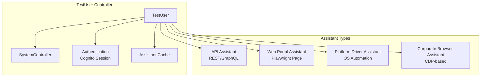

# The AAA Pattern (Arrange-Act-Assert)

## Core Philosophy
The framework utilizes a strict **Arrange-Act-Assert** pattern, enforced structurally through Page Objects and Controllers. This pattern ensures clear separation of test concerns: setup (Arrange), execution (Act), and verification (Assert).

## 🧩 The `TestUser` Controller

The `TestUser` class is the central orchestrator for all test automation capabilities, implementing a facade pattern that provides unified access to multiple testing interfaces.

### Architecture



### Core Responsibilities

| Responsibility           | Description                                  |
| ------------------------ | -------------------------------------------- |
| **Identity Management**  | Username, password, role, metadata           |
| **Authentication**       | Cognito session management and token refresh |
| **Assistant Factory**    | Creates and caches test assistants           |
| **System Control**       | Provides access to SystemController          |
| **Lifecycle Management** | Account acquisition and release              |

### TestUser Properties

```typescript
export class TestUser {
  // Identity
  username!: string;
  password: string = '';
  userType: TEnumUserRole = TEnumUserRole.USER;
  alias?: string;
  subDomainName?: string;
  
  // Authentication
  private cognitoUserSession?: CognitoUserSession;
  private cognitoAuthInfo?: TCognitoAuthInfo;
  
  // Metadata
  metadata: TUserMetaData = {
    accessRoleIds: [],
    isMagicLinkTurnOn: false,
    invitationCode: undefined,
    isCognitoUser: false,
    status: undefined,
  };
  
  // Internal state
  private notes: Map<unknown, unknown> = new Map(); // Assistant cache
  private controller: SystemController;
}
```

### Four Assistant Types

#### 1. API Assistant

For REST and GraphQL API automation:

```typescript
const userAPI = await testUser.useAPIAssistant<UserAPI, TAUserAPI>(UserAPI);

// Arrange
const user = await userAPI.arrange.createUser({
  username: 'test@example.com',
  role: 'admin',
});

// Act
const response = await userAPI.actions.getUser(user.id);

// Assert
await userAPI.assert.userExists(user.id);
```

#### 2. Web Portal Assistant

For standard browser automation using Playwright Page:

```typescript
const loginPage = await testUser.useWebPortalAssistant<
  LoginPage,
  TALoginPage
>(LoginPage, { page });

// Arrange
await loginPage.arrange.navigateToLoginPage();

// Act
await loginPage.actions.login();

// Assert
await loginPage.assert.loginSuccessful();
```

#### 3. Platform Driver Assistant

For native OS-level automation (Windows/macOS):

```typescript
const installerTA = await testUser.usePlatformDriverAssistant<
  MSIInstallerPage,
  TAMSIInstallerPage
>(MSIInstallerPage);

// Arrange
await installerTA.arrange.prepareInstaller();

// Act
await installerTA.actions.install();

// Assert
await installerTA.assert.installationSuccessful();
```

#### 4. Corporate Browser Assistant

For web content within Corporate Browser (CDP-based):

```typescript
const appLauncherTA = await testUser.useCorporateBrowserAssistant<
  AppLauncherPage,
  TAAppLauncherPage
>(AppLauncherPage, { timeout: 30000 });

// Arrange
await appLauncherTA.arrange.ensurePageLoaded();

// Act
await appLauncherTA.actions.launchApp('Document Editor');

// Assert
await appLauncherTA.assert.appLaunched('Document Editor');
```

### SystemController Integration

The `TestUser` provides access to the `SystemController` for driver and handler management:

```typescript
// Get platform driver
const platformDriver = await testUser
  .systemController()
  .getPlatformDriver();

// Get Corporate Browser driver
const browserDriver = testUser
  .systemController()
  .getCorporateBrowserDriver();

// Access SAB handlers
const sabHandlers = await testUser
  .systemController()
  .useSabHandlers()
  .primary();

await sabHandlers.launchSAB();
```

### Assistant Caching

Assistants are automatically cached to improve performance:

```typescript
// First call creates and caches assistant
const userAPI1 = await testUser.useAPIAssistant<UserAPI, TAUserAPI>(UserAPI);

// Second call returns cached assistant
const userAPI2 = await testUser.useAPIAssistant<UserAPI, TAUserAPI>(UserAPI);

// userAPI1 === userAPI2 (same instance)
```

**Cache Invalidation**: Assistants are invalidated when underlying drivers are reset (e.g., platform driver reset between tests).

### Authentication Management

```typescript
// Set/refresh Cognito session
await testUser.setCognitoUserSession();

// Get current auth info
const authInfo = testUser.getCognitoAuthInfo();
console.log({
  idToken: authInfo.idToken,
  accessToken: authInfo.accessToken,
  expiresAt: authInfo.expiresAt,
});

// Check if token is expiring
if (testUser.isTokenExpiring()) {
  // Token auto-refreshes via TestUserTokenProvider
}
```

### Usage in Tests

```typescript
test('User flow', async ({ adminUser }) => {
  // Use API assistant for setup
  const userAPI = await adminUser.useAPIAssistant<UserAPI, TAUserAPI>(UserAPI);
  const user = await userAPI.arrange.createUser({
    username: 'test@example.com',
  });
  
  // Use web portal assistant for verification
  const userPageTA = await adminUser.useWebPortalAssistant<
    UserManagementPage,
    TAUserManagementPage
  >(UserManagementPage, { page });
  
  await userPageTA.assert.userVisible(user.username);
});
```

## 🏗️ Page Object Architecture

We do not use standard Playwright Page Objects (POMs). Instead, we use a **Componentized Generic POM**.

### `BasePage<T>`
Found in `libs/shared/feature-aaa/.../components/basePage.ts`, this class provides the foundational Dependency Injection.

```typescript
export class BasePage<T> {
  elements!: T;  // The type-safe container for DOM Locators
  protected page: Page;
  protected testUser: TestUser;
  
  // Injected Core Services
  protected locatorStrategies: TLocatorStrategies; // Smart selectors
  protected uiActions: TUIActions; // Standardized clicks/hovers
}
```

### The Three-Layer Composition
A concrete Page Object (e.g., `LoginPage`) is composed of three distinct parts to satisfy AAA:

1.  **Elements Interface (`T`)**: Defines strictly *what* is on the page.
    ```typescript
    interface ILoginElements {
        usernameInput: Locator;
        submitButton: Locator;
    }
    ```
2.  **Arrange/Act/Assert Classes**: Logic is split into specialized sub-classes.
    -   `LoginArrange`: "Navigate to page", "Set cookies".
    -   `LoginActions`: "Type password", "Click submit".
    -   `LoginAssert`: "Verify URL change", "Check error toast".
3.  **The Page Assembly**: The main class inherits `BasePage<ILoginElements>` and instantiates the AAA sub-classes.

## 🚌 Facade Implementations

The framework relies heavily on Facades to provide stable interfaces over complex logic.

-   **`UIActions`**: Wraps Playwright's `click`, `fill`, etc., adding automatic logging to ReportPortal (`@Step` decorators) and retry logic.
-   **`LocatorStrategies`**: precise selectors strategy (e.g., `data-testid`, `aria-label`).
-   **`EnvService`**: (`util-core`) Provides type-safe, validated access to `process.env`.

## Related Documentation

- [Test Assistants](./test-assistants.md) - Detailed assistant patterns, mappers, and lifecycle
- [Test User Management](./test-user-management.md) - TestUser lifecycle and account pooling
- [Token Management](./token-management.md) - Authentication and token refresh
- [Drivers](./drivers.md) - Platform driver and Corporate Browser driver architecture
- [Fixtures](./fixtures.md) - TestUser fixtures and session modes
