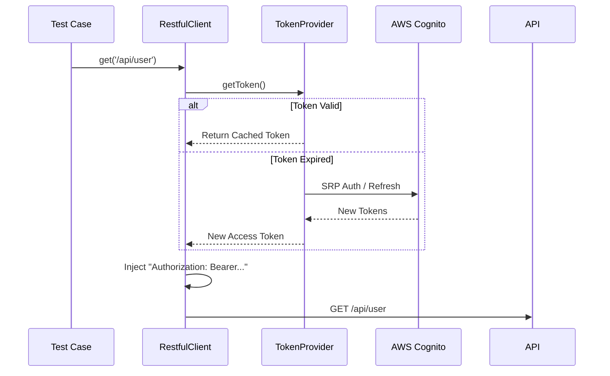

# API Testing Guide

This guide details how to create and execute API tests using our framework's specialized tools and patterns.

## 🛠️ The Builder Pattern

To handle complex GraphQL mutations and queries, we utilize **Builder Patterns**. This avoids massive JSON blobs in test code and ensures type safety.

### 1. Input Builder (`CreateInputBuilder`)
Constructs the payload for creation/update mutations.

```typescript
const input = new CreateUserInputBuilder()
  .withEmail('test@example.com')
  .withRole('ADMIN')
  .build();
```

### 2. Response Builder (`ResponseBuilder`)
Defines the structure of the expected response.

```typescript
const expectedResponse = new UserResponseBuilder()
  .withId()
  .withEmail()
  .build();
```

## 📡 Networking Abstraction (`feature-http-client`)

All API interactions are routed through our enhanced HTTP Client, which wraps `axios` with critical testing capabilities.

### `RestfulClient` & `GraphqlClient`
These classes provide:
1.  **Smart Logging**:
    -   Automatically sanitizes `Authorization` headers.
    -   Truncates massive response payloads.
    -   Logs `[METHOD] => URI`.

2.  **Auth Abstraction (`ITokenProvider`)**:


    -   Attributes: Decouples "How" (SRP/Refresh) from "What" (API Test).
    -   Clients are injected with a `TokenProvider` instance.

3.  **Typed Responses**:
    -   Methods support generics for Success (`TOK`) and Error (`TNOK`) types.
    -   `client.get<UserSuccess, UserError>(path)`
3.  **Automatic Validation**:
    -   Throws structured `Status Code Check Error Occurred` if the status code doesn't match the expected `httpCheckOptions`.

```typescript
await restfulClient.get<TSuccess, TError>('/api/users', config, {
    OK: 200, // Explicitly expect 200, else throw
    loggingConfig: { enableResponsePayloadLogging: false }
});
```

## 🏃 Execution & Configuration

API tests are environment-agnostic. The target is defined via environment variables.

### Environment Variables

| Variable          | Description             | Example                   |
| :---------------- | :---------------------- | :------------------------ |
| `NODE_ENV`        | Target Environment      | `qa`, `dev`, `prod`       |
| `SHARED_PASSWORD` | Shared account password | `secret123`               |
| `ADMIN_USERNAME`  | Custom admin user       | `admin@test.com`          |
| `API_VERSION`     | Target API Version      | `v1` (or `null` for auto) |

### Running Tests

**Shell (macOS/Linux)**
```bash
NODE_ENV=qa SHARED_PASSWORD="pass" npx nx run api:test@default
```

**PowerShell (Windows)**
```powershell
$env:NODE_ENV = "qa"; $env:SHARED_PASSWORD = "pass"; npx nx run api:test@default
```

## 🔐 Token Management

API tests automatically handle token refresh through the `TestUserTokenProvider`:

### Automatic Token Refresh

```typescript
// Token provider handles expiration automatically
const restClient = RestfulClient.build(
  host,
  config,
  loggingConfig,
  new TestUserTokenProvider(testUser)
);

// All requests automatically include fresh tokens
await restClient.get('/api/users');
```

### Retry Logic

The token provider implements exponential backoff for transient failures:

- **Initial delay**: 1 second
- **Backoff multiplier**: 2x
- **Maximum delay**: 10 seconds
- **Maximum attempts**: 3 (configurable)

For detailed token management, see [Token Management](./token-management.md).

## Related Documentation

- [Token Management](./token-management.md) - TestUserTokenProvider and retry logic
- [AAA Pattern](./aaa-pattern.md) - TestUser and API assistant patterns
- [Configuration](./configuration.md) - API endpoint configuration
- [Test Assistants](./test-assistants.md) - API assistant lifecycle

