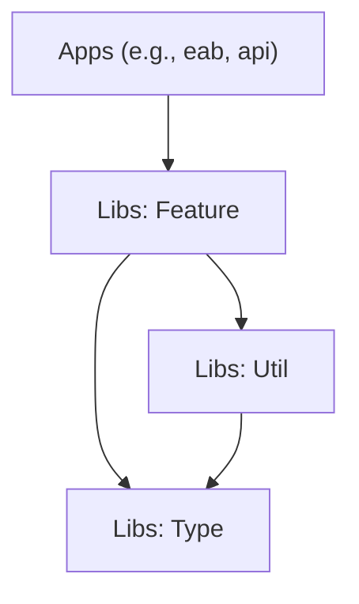
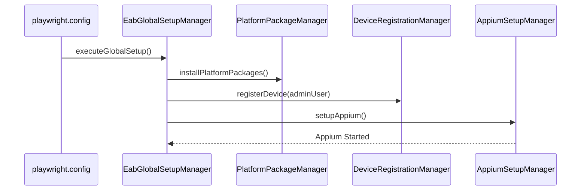

# Architecture Overview

This project utilizes an **Nx Monorepo** structure to ensure scalability, modularity, and code sharing across multiple testing domains (API, Web, Desktop). This document outlines the core architectural principles, library organization, and dependency rules.

## ✨ Project Structure

The codebase is organized into two main directories:

-   `apps/`: Runnable applications (test suites).
-   `libs/`: Shareable libraries containing logic, helpers, and type definitions.

### Library Classification

We follow a strict classification for our libraries to maintain dependency hygiene:

| Type        | Prefix     | Purpose                                            | Dependency Rule                                                 |
| :---------- | :--------- | :------------------------------------------------- | :-------------------------------------------------------------- |
| **Feature** | `feature-` | Contains heavy business logic and page objects.    | Can import `util`, `type`, `ui`. Cannot import other `feature`. |
| **Utility** | `util-`    | Pure functions, helpers, and framework core logic. | Can import `type`. Cannot import `feature`.                     |
| **Type**    | `type-`    | TypeScript definitions, enums, interfaces.         | **Leaf node**. Cannot import anything else.                     |
| **UI**      | `ui-`      | Reusable UI components (if applicable).            | Can import `type`, `util`.                                      |

### Dependency Graph

## 🏗️ Core Framework Components

### 1. `util-core` (libs/shared/util-core)
The foundation of the entire framework. It handles:
-   **Service Locator (`utilManager`)**: A central singleton that orchestrates access to all utilities (`logger`, `faker`, `os`, `processNode`). This avoids "Prop Drilling" of dependencies.
-   **Orchestration (`util-coordinator`)**: Defines the **Sharding Strategy** (Hostname-based, Round-Robin) for distributed test execution.
-   **Environment Variables**: Strongly typed access via `EnvService` and `env-accessor`.
-   **Process Management**: Node process wrappers (`NodeProcess`), signal handling, and singleton access.
-   **FileSystem**: Wrapper around `fs-extra` for consistent file operations.
-   **PowerShell Wrappers**: Scripts for Windows automation (`check-eab-is-alive.ps1`, `start-recording.ps1`).

### 2. `util-playwright` (libs/shared/util-playwright)
The custom test runner extension. It provides:
-   **Global Setup Manager**: The `EabGlobalSetupManager` acts as a "Manager of Managers", coordinating:

    -   `AppiumSetupManager` (Mobile/Windows Driver)
    -   `PlatformPackageManager` (OS Dependencies)
    -   `DeviceRegistrationManager` (MDM Enrollment)

-   **Fixtures**:
    -   `testUser`: The main actor.
    -   `adminUser`: Specialized actor with elevated privileges.
    -   `page`: Overridden Playwright page with auto-waiting.
-   **Reporters**: `ReportPortalReporter` and custom console loggers.
-   **Hooks**: Global `beforeAll` (Setup) and `afterEach` (Teardown/Restore).

### 3. `feature-aaa` (libs/shared/feature-aaa)
The heart of the "Arrange-Act-Assert" logic. It contains:
-   **TestUser**: The central controller for all test interactions.
-   **Assistants**: Domain-specific helpers (API, Web, Desktop).
-   **Page Objects**: Encapsulated UI logic.

### 4. `feature-http-client` (libs/shared/feature-http-client)
The standard networking layer. It provides:
-   **RestfulClient**: Wrapped `axios` instance with automatic token injection.
-   **GraphqlClient**: Apollo-like wrapper for backend API interactions.
-   **Interceptors**: Automatic request/response logging and payload truncation.

### 5. `util-aws-cognito` (libs/shared/util-aws-cognito)
Handles Identity Management.
-   **AuthService**: Manages the lifecycle of Cognito User Pools.
-   **Token Generation**: Automates the SRP (Secure Remote Password) protocol to acquire ID Tokens for test users.

## 📦 Infrastructure

The framework is designed to run in diverse environments:
-   **Local**: Developer machines (macOS/Windows).
-   **CI**: Jenkins agents (Dockerized Linux, Native Windows, Native macOS).

Configuration is managed dynamically via `EnvService`, stripping sensitive data from the codebase and relying on secure injection during runtime.
