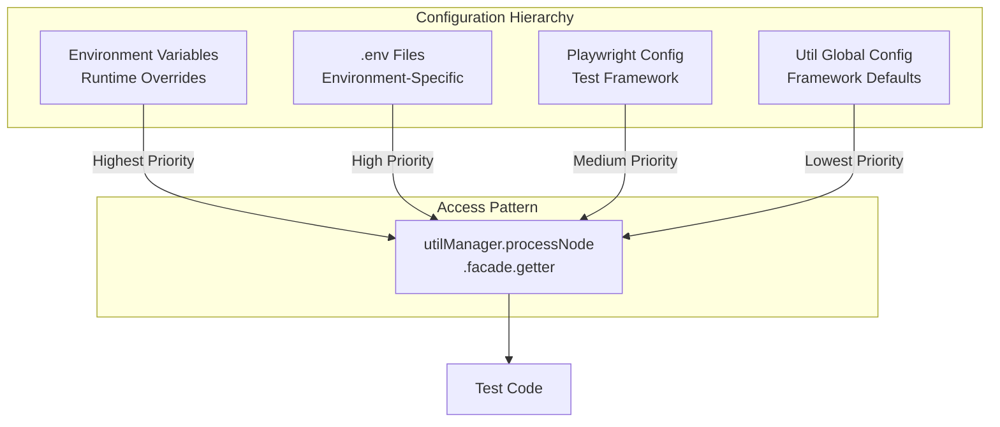
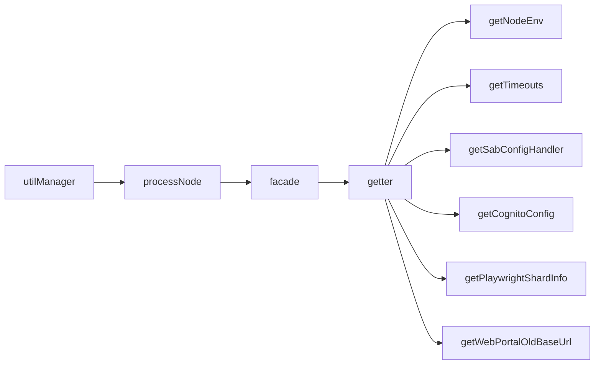

# Configuration Management

## Overview

The framework implements a multi-layered configuration system that provides flexible environment management, runtime overrides, and centralized access to configuration values. This architecture enables consistent configuration across all test types while supporting environment-specific customization.

## Configuration Layers



### Priority Order

1. **Environment Variables** (Highest) - Runtime overrides
2. **.env Files** - Environment-specific configuration
3. **Playwright Config** - Test framework settings
4. **Util Global Config** (Lowest) - Framework defaults

## Environment Loading

### loadEnvConfig Function

Automatically loads environment-specific configuration files:

```typescript
export function loadEnvConfig(rootPath: string): void {
  // Get current environment (defaults to 'qa')
  const env = utilManager
    .processNode()
    .facade()
    .getter()
    .getNodeEnv();
  
  // Construct path to .env file
  const dotenvPath = path.resolve(
    rootPath,
    `./config/.env.${env}`
  );
  
  // Load environment variables
  config({ path: dotenvPath });
}
```

### Environment Files

```
project-root/
├── config/
│   ├── .env.qa        # QA environment
│   ├── .env.demo      # Demo environment
│   └── .env.prod      # Production environment
```

### Environment Detection

```typescript
// Automatic detection from NODE_ENV
const env = utilManager
  .processNode()
  .facade()
  .getter()
  .getNodeEnv(); // 'qa' | 'demo' | 'prod'

// Manual override
process.env.NODE_ENV = 'demo';
const env = utilManager
  .processNode()
  .facade()
  .getter()
  .getNodeEnv(); // 'demo'
```

### Usage in Playwright Config

```typescript
import { loadEnvConfig } from './playwright.base.config';

// Load environment variables before config
loadEnvConfig(__dirname);

export default {
  // Config using loaded env vars
  use: {
    baseURL: process.env.BASE_URL,
  },
};
```

## Playwright Configuration

### Base Configuration

The `playwright.base.config.ts` provides shared configuration with `utilManager` integration:

```typescript
import { utilManager } from '@mammothcyber-qa/shared/util-core';
import type { PlaywrightTestConfig } from '@playwright/test';

export const baseConfig: PlaywrightTestConfig = {
  testDir: './tests',
  
  // Timeout from utilManager
  timeout: utilManager
    .processNode()
    .facade()
    .getter()
    .getTimeouts().testDefault,
  
  expect: {
    timeout: utilManager
      .processNode()
      .facade()
      .getter()
      .getTimeouts().expectDefault,
  },
  
  fullyParallel: true,
  forbidOnly: !!process.env['CI'],
  retries: 0,
  workers: 1,
  
  use: {
    // Base URL from utilManager
    baseURL: utilManager
      .processNode()
      .facade()
      .getter()
      .getWebPortalOldBaseUrl(),
    
    // Action timeout from utilManager
    actionTimeout: utilManager
      .processNode()
      .facade()
      .getter()
      .getTimeouts().action,
    
    trace: 'retain-on-failure',
    headless: true,
    screenshot: 'only-on-failure',
    video: 'off',
  },
};
```

### Per-App Configuration Overrides

Each test app can override base configuration:

```typescript
// apps/api/playwright.config.ts
import { baseConfig } from '../playwright.base.config';
import { utilManager } from '@mammothcyber-qa/shared/util-core';

const config: PlaywrightTestConfig = {
  ...baseConfig,
  
  // Override test directory
  testDir: './tests',
  
  // Add custom fixtures
  use: {
    ...baseConfig.use,
    utilManager: {
      value: utilManager,
    },
  },
  
  // Custom reporter
  reporter: [
    ['html', { outputFolder: './out/api_html' }],
    ['list'],
  ],
};

export default config;
```

### SAB-Specific Configuration

```typescript
// apps/sab/playwright.config.ts
const config: PlaywrightTestConfig = {
  ...baseConfig,
  
  // SAB global setup
  globalSetup: './src/globalSetup.ts',
  
  // Custom timeout for SAB tests
  timeout: utilManager
    .processNode()
    .facade()
    .getter()
    .getTimeouts().sabTestDefault,
  
  // SAB-specific workers
  workers: process.env.CI ? 1 : 2,
};
```

## Util Global Config (Facade Pattern)

### Configuration Facade

The framework uses a facade pattern for accessing configuration:



### Common Configuration Getters

#### Environment Detection

```typescript
const env = utilManager
  .processNode()
  .facade()
  .getter()
  .getNodeEnv();

// Returns: 'qa' | 'demo' | 'prod'
```

#### Timeout Configuration

```typescript
const timeouts = utilManager
  .processNode()
  .facade()
  .getter()
  .getTimeouts();

console.log({
  testDefault: timeouts.testDefault,      // 60000ms
  expectDefault: timeouts.expectDefault,  // 5000ms
  action: timeouts.action,                // 10000ms
  short: timeouts.short,                  // 5000ms
  thirtySeconds: timeouts.thirtySeconds,  // 30000ms
  oneSecond: timeouts.oneSecond,          // 1000ms
});
```

#### SAB Configuration

```typescript
const sabConfig = utilManager
  .processNode()
  .facade()
  .getter()
  .getSabConfigHandler()
  .getConfig();

console.log({
  videoRecording: sabConfig.videoRecording,
  debug: sabConfig.debug,
  verboseToggle: sabConfig.verboseToggle,
  corporateBrowser: {
    timeout: {
      browserConnection: sabConfig.corporateBrowser.timeout.browserConnection,
    },
  },
  retention: {
    data: sabConfig.retention.data,
  },
});
```

#### Cognito Configuration

```typescript
const cognitoConfig = utilManager
  .processNode()
  .facade()
  .getter()
  .getCognitoConfig();

console.log({
  tokenRefreshRetry: {
    maxAttempts: cognitoConfig.tokenRefreshRetry.maxAttempts,
    initialDelayMs: cognitoConfig.tokenRefreshRetry.initialDelayMs,
    maxDelayMs: cognitoConfig.tokenRefreshRetry.maxDelayMs,
    backoffMultiplier: cognitoConfig.tokenRefreshRetry.backoffMultiplier,
  },
});
```

#### Sharding Information

```typescript
const shardInfo = utilManager
  .processNode()
  .facade()
  .getter()
  .getPlaywrightShardInfo();

console.log({
  isSharded: shardInfo.isSharded(),
  shardNumber: shardInfo.getShardNumber(),
  totalShards: shardInfo.getShardTotal(),
});
```

## Environment Variable Overrides

### Runtime Configuration

Environment variables provide runtime overrides for configuration:

```bash
# Set environment
export NODE_ENV=demo

# Set SAB configuration
export SAB_TEST_BUILD_CONFIG='{"tagName":"v1.2.3","buildType":"qa","useCachedBuilds":true}'

# Set video recording
export SAB_VIDEO=always

# Set Report Portal mode
export RP_MODE=DEBUG
```

### SAB Environment Variables

The framework sets SAB-specific environment variables during test execution:

```typescript
await testUser
  .systemController()
  .useSabHandlers()
  .primary()
  .setSabEnvVariables({
    environment: utilManager
      .processNode()
      .facade()
      .getter()
      .getNodeEnv(),
    debug: true,
  });
```

**Generated Variables**:
```bash
CORPORATE_BROWSER_ENVIRONMENT=qa
CORPORATE_BROWSER_DEBUG=true
```

### Port Configuration

Ports are configured in `globalSetup`:

```typescript
// API globalSetup.ts
process.env.CORPORATE_BROWSER_LOGIN_PORT = '19227';
process.env.CORPORATE_BROWSER_APP_SESSION_PORT = '19228';
process.env.CORPORATE_BROWSER_INTERNET_SESSION_PORT = '19229';
process.env.APPIUM_HOST = 'localhost';
process.env.CORPORATE_BROWSER_PORT = '4567';
process.env.APPIUM_FOR_TERMINAL_PORT = '4724';
```

### Test Build Configuration

SAB test build can be configured via environment variable:

```typescript
// Environment variable
export SAB_TEST_BUILD_CONFIG='{
  "tagName": "v1.2.3",
  "buildType": "qa",
  "useCachedBuilds": true
}'

// Access in code
const buildConfig = utilManager
  .processNode()
  .facade()
  .getter()
  .getSabConfigHandler()
  .getTestBuildConfig();
```

**Build Types**:
- `qa` - QA builds
- `rc` - Release candidates
- `rel` - Release builds

## Configuration Patterns

### Environment-Specific Values

```typescript
// Get environment-specific base URL
const baseUrl = utilManager
  .processNode()
  .facade()
  .getter()
  .getWebPortalOldBaseUrl();

// Returns based on NODE_ENV:
// - qa: 'https://qa.example.com'
// - demo: 'https://demo.example.com'
// - prod: 'https://prod.example.com'
```

### Conditional Configuration

```typescript
// Different workers for CI vs local
const config: PlaywrightTestConfig = {
  workers: process.env.CI ? 1 : 4,
  
  // Retry only on CI
  retries: process.env.CI ? 2 : 0,
  
  // Forbid .only on CI
  forbidOnly: !!process.env.CI,
};
```

### Dynamic Timeout Adjustment

```typescript
// Adjust timeout based on environment
const timeout = utilManager
  .processNode()
  .facade()
  .getter()
  .getNodeEnv() === 'prod'
    ? 120000  // 2 minutes for prod
    : 60000;  // 1 minute for qa/demo
```

## Configuration Best Practices

### 1. Use Facade Pattern

```typescript
// ✅ Good - Use facade
const config = utilManager
  .processNode()
  .facade()
  .getter()
  .getSabConfigHandler()
  .getConfig();

// ❌ Avoid - Direct access
import { sabConfig } from './config';
```

### 2. Environment-Specific Files

```typescript
// ✅ Good - Separate env files
// .env.qa
BASE_URL=https://qa.example.com

// .env.prod
BASE_URL=https://prod.example.com

// ❌ Avoid - Single file with conditionals
if (env === 'qa') {
  BASE_URL = 'https://qa.example.com';
}
```

### 3. Centralized Timeouts

```typescript
// ✅ Good - Use utilManager timeouts
timeout: utilManager
  .processNode()
  .facade()
  .getter()
  .getTimeouts().testDefault

// ❌ Avoid - Hardcoded values
timeout: 60000
```

### 4. Type-Safe Configuration

```typescript
// ✅ Good - Typed configuration
type TSabConfig = {
  videoRecording: TTestRetainOptions;
  debug: boolean;
  verboseToggle: boolean;
};

const config: TSabConfig = getSabConfig();

// ❌ Avoid - Untyped configuration
const config = getSabConfig(); // any
```

## Configuration Validation

### Environment Validation

```typescript
const validEnvironments = ['qa', 'demo', 'prod'];
const env = process.env.NODE_ENV;

if (!validEnvironments.includes(env)) {
  throw new Error(
    `Invalid environment: ${env}. Valid options: ${validEnvironments.join(', ')}`
  );
}
```

### Required Variables

```typescript
const requiredVars = ['SHARED_PASSWORD', 'RP_API_KEY'];

for (const varName of requiredVars) {
  if (!process.env[varName]) {
    throw new Error(`Required environment variable missing: ${varName}`);
  }
}
```

## Troubleshooting

### Common Issues

| Issue                   | Cause                | Solution                          |
| ----------------------- | -------------------- | --------------------------------- |
| **Wrong environment**   | NODE_ENV not set     | Set NODE_ENV before running tests |
| **Missing variables**   | .env file not loaded | Call `loadEnvConfig()` in config  |
| **Timeout errors**      | Hardcoded timeouts   | Use utilManager timeouts          |
| **Config not updating** | Cached values        | Restart test process              |

### Debug Configuration

```typescript
// Log current environment
console.log('Environment:', utilManager
  .processNode()
  .facade()
  .getter()
  .getNodeEnv());

// Log all timeouts
console.log('Timeouts:', utilManager
  .processNode()
  .facade()
  .getter()
  .getTimeouts());

// Log environment variables
console.log('Env vars:', process.env);
```

## Related Documentation

- [Orchestration](./orchestration.md) - utilManager facade pattern
- [Infrastructure](./infrastructure.md) - CI/CD configuration
- [Token Management](./token-management.md) - Cognito configuration
- [Fixtures](./fixtures.md) - Test retention configuration
