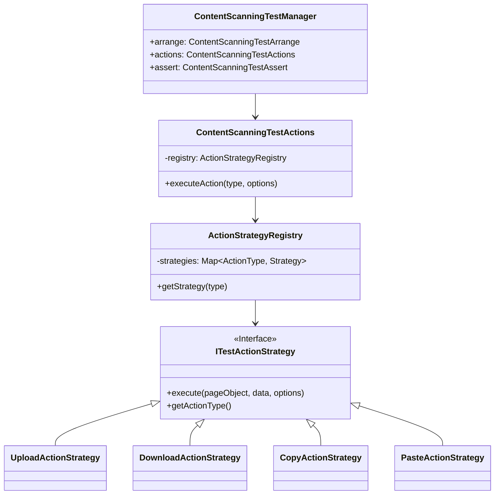

# Content Scanning Framework

The Content Scanning module (`apps/eab/tests/.../content-scanning`) is a deterministic framework for validating Data Loss Prevention (DLP) capabilities. It is architected to handle the combinatorial complexity of PII types, sensitivity levels, and user actions.

## 🏛️ Architecture

The system utilizes the **Strategy** and **Manager** patterns to decouple test logic from specific user actions.

### Class Diagram



## 🧠 Core Components

### 1. Test Manager
The `ContentScanningTestManager` acts as the Facade. It initializes the `arrange`, `actions`, and `assert` subsystems.

```typescript
export class ContentScanningTestManager {
  constructor() {
    this.arrange = new ContentScanningTestArrange();
    this.actions = new ContentScanningTestActions(this.arrange.fileGenerator);
    this.assert = new ContentScanningTestAssert();
  }
}
```

### 2. Strategy Registry
 Located in `actions/strategies/action-strategy-registry.ts`. It strictly maps `TEnumValuesActionType` to concrete implementations.

| Action Type | Implementation           | Description                                            |
| :---------- | :----------------------- | :----------------------------------------------------- |
| `UPLOAD`    | `UploadActionStrategy`   | Uploads generated PII files to a QA web server.        |
| `DOWNLOAD`  | `DownloadActionStrategy` | Downloads malicious/PII files and checks for blocking. |
| `COPY`      | `CopyActionStrategy`     | Simulates clipboard copy operations.                   |
| `PASTE`     | `PasteActionStrategy`    | Simulates clipboard paste operations.                  |
| `PRINT`     | `PrintActionStrategy`    | Simulates file printing interactions.                  |

### 3. Data Models (`types/content-scanning-types.ts`)
**DLP Engines (New in QA-831)**:
Explicitly distinguishing between detection engines allows for targeted regression testing.
```typescript
export enum EDLPEngine {
  CUSTOM_CCL = 'CUSTOM_CCL', // Custom regex-based logic
  VENDOR_ENGINE = 'VENDOR',  // Third-party DLP engine
}
```

## 🛡️ Verification & Error Plugins

The `ContentScanningTestAssert` class orchestrates complex multi-stage verification using a Plugin architecture for error generation.

### 1. Storage Verification (`verifyStorageContent`)
Ensures that files blocked/allowed strictly match the backend storage state.
-   **API Integration**: Uses `StorageApiManager` to request signed download URLs.
-   **Smart Parsing**: Automatically parses PDF buffers or text blobs using `extractTextFromBlob`.
-   **Normalization**: Uses `utilManager.handler().string().normalizeForStorage()` to ignore whitespace differences across OSs.
-   **Truncation Check**: Detects if the stored file is a partial upload (failed block) vs a full upload.

### 2. Error Plugins
Verification failures throw rich, structured errors via `ContentScanningErrorUtils`.
-   **`StorageVerificationPlugin`**: Formats mismatches between Expected vs Actual stored content (with diffs).
-   **`PolicyErrorPlugin`**: Validates the specific text of the blocking user notification.
-   **`LogVerificationPlugin`**: Queries `DashboardAccessLogApiManager` to ensure the DLP event was audited by the backend.
