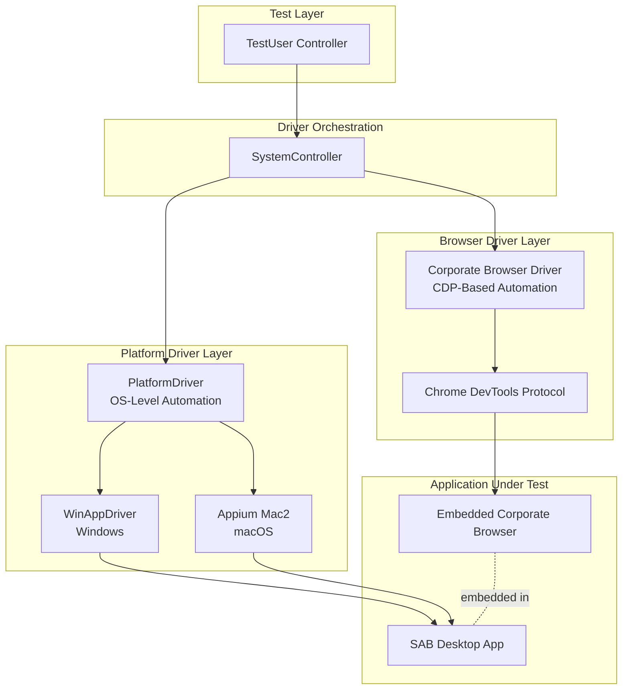
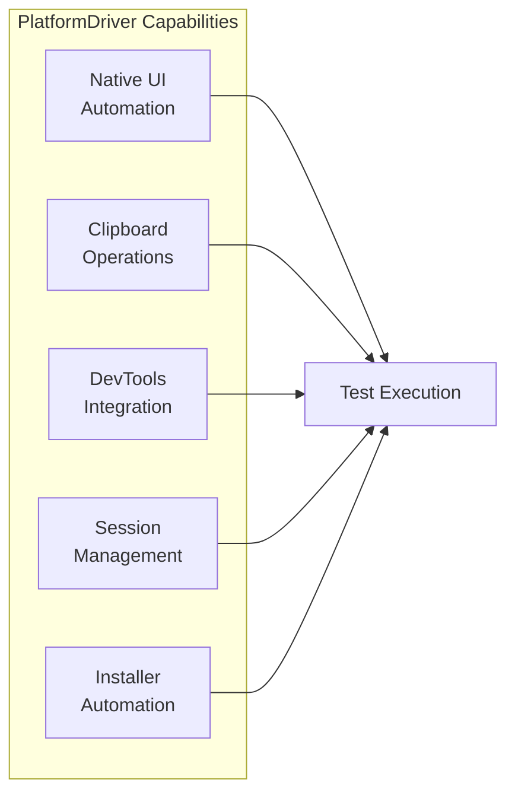
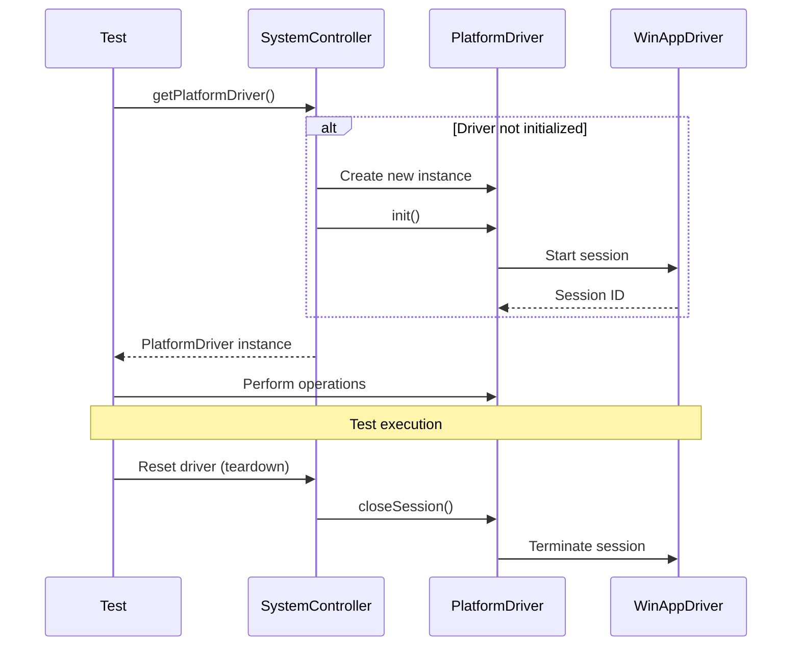
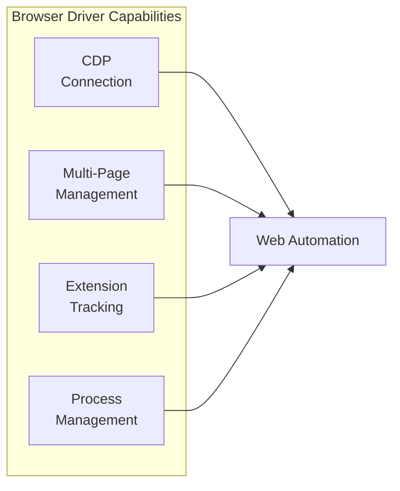
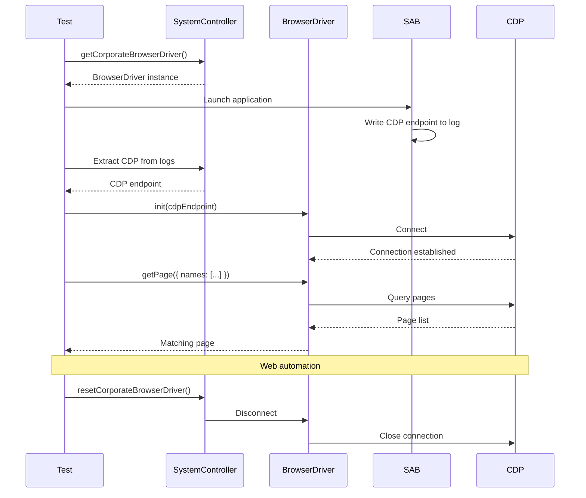
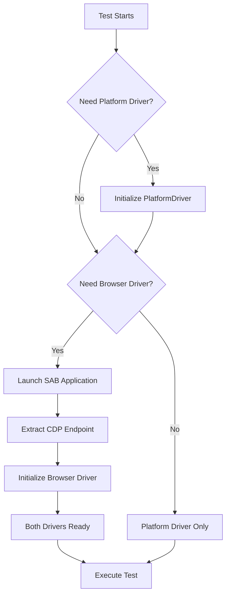

# Driver Architecture

## Overview

The framework implements a sophisticated **dual-driver architecture** for testing native desktop applications (SAB - Secure Application Browser). This architecture separates concerns between operating system-level automation and browser-level automation, enabling comprehensive end-to-end testing of desktop applications with embedded browser components.

## Dual-Driver Model



### Architecture Benefits

| Aspect                     | Benefit                                                 |
| -------------------------- | ------------------------------------------------------- |
| **Separation of Concerns** | OS automation separate from browser automation          |
| **Platform Flexibility**   | Supports Windows (WinAppDriver) and macOS (Appium Mac2) |
| **Comprehensive Coverage** | Test both native UI elements and web content            |
| **Parallel Capabilities**  | Drivers can operate independently when needed           |
| **Clean Abstractions**     | Page objects tailored to each driver type               |

## Platform Driver

The **PlatformDriver** handles operating system-level automation, enabling interaction with native UI elements, system dialogs, and desktop applications.

### Responsibilities



### Core Capabilities

#### 1. WebDriverIO Browser Instance

Provides access to the underlying WebDriverIO browser for native automation:

```typescript
const platformDriver = await testUser
  .systemController()
  .getPlatformDriver();

const browser = platformDriver.getWebDriverIOBrowser();

// Interact with native elements
await browser.$('~ButtonId').click();
```

#### 2. Clipboard Operations

Cross-platform clipboard management:

```typescript
// Read clipboard content
const clipboardText = await platformDriver.getClipboardText();

// Set clipboard content
await platformDriver.setClipboardText('Test data');

// Clear clipboard
await platformDriver.setClipboardText('');
```

**Use Cases**:
- Testing copy/paste functionality
- Verifying DLP clipboard policies
- Data transfer validation

#### 3. DevTools Integration

Open browser DevTools for debugging:

```typescript
await platformDriver.openDevTools('console'); // or 'network', 'elements'
```

#### 4. Session Management

```typescript
// Initialize platform driver session
await platformDriver.init();

// Get unique session identifier
const sessionId = platformDriver.getId();

// Close session and cleanup
await platformDriver.closeSession();
```

### Platform-Specific Implementations

#### Windows (WinAppDriver)

```typescript
// Windows-specific capabilities
const capabilities = {
  platformName: 'Windows',
  'appium:automationName': 'Windows',
  'appium:app': 'Root',
  'appium:deviceName': 'WindowsPC',
};
```

**Supported Page Objects**:
- `MSIInstallerPage`: MSI installer automation
- `MSIXInstallerPage`: MSIX installer automation
- `WinUnityTrayPage`: System tray interactions
- `WinDesktopPage`: Desktop-level operations

#### macOS (Appium Mac2)

```typescript
// macOS-specific capabilities
const capabilities = {
  platformName: 'mac',
  'appium:automationName': 'mac2',
  'appium:bundleId': 'com.example.app',
  'appium:showServerLogs': true,
};
```

**Supported Page Objects**:
- `MacUnityTrayPage`: Menu bar interactions
- `MacDesktopPage`: Desktop-level operations

### Platform Driver Lifecycle



## Browser Driver (Corporate Browser)

The **Corporate Browser Driver** manages automation of the embedded browser component using Chrome DevTools Protocol (CDP), enabling web content interaction within the desktop application.

### Responsibilities



### Core Capabilities

#### 1. CDP Connection Management

Establishes and maintains Chrome DevTools Protocol connections:

```typescript
const browserDriver = testUser
  .systemController()
  .getCorporateBrowserDriver();

// Initialize with CDP endpoint
await browserDriver.init(cdpEndpoint);

// Check connection status
const isConnected = browserDriver.getBrowser()?.isConnected();
```

**CDP Endpoint Discovery**:
```typescript
// Extract CDP endpoint from application logs
const helper = await testUser
  .systemController()
  .useSabHandlers()
  .primary()
  .getHelper();

const cdp = await helper.getCDPFromLog();
```

#### 2. Multi-Page/Tab Management

Manage multiple browser pages and tabs:

```typescript
// Get current active page
const currentPage = browserDriver.getCurrentPage();

// Get page by title
const specificPage = await browserDriver.getPage({
  names: [
    { title: 'Login Page' },
    { title: 'Dashboard' }
  ],
  timeout: 30000,
});

// Close all tabs except first
await browserDriver.closeAllTabsExceptFirst();
```

**Page Title Matching**:
```typescript
type TPageTitleChecker = {
  title: string;
  matchType?: 'exact' | 'contains' | 'regex';
};
```

#### 3. Extension Build Tracking

Track Corporate Browser extension version:

```typescript
// Set extension build number
browserDriver.setExtensionNumber(buildNumber);

// Get extension build number
const extensionBuild = browserDriver.getExtensionNumber();
```

#### 4. Process Management

Track and manage browser process:

```typescript
// Set process ID
browserDriver.setProcessId(processId);

// Get process ID
const pid = browserDriver.getProcessId();
```

### Browser Driver Lifecycle



## Dual-Driver Coordination

### TestUser Orchestration

The `TestUser` class coordinates both drivers through the `SystemController`:

```typescript
class TestUser {
  private controller: SystemController;
  
  // Get platform driver
  async getPlatformDriver(): Promise<TPlatformDriver> {
    return await this.systemController().getPlatformDriver();
  }
  
  // Get browser driver
  getCorporateBrowserDriver(): TCorporateBrowserDriver {
    return this.systemController().getCorporateBrowserDriver();
  }
}
```

### Driver Initialization Order



### Driver Reset Strategies

#### Isolated Mode (Per-Test Reset)

```typescript
// After each test
await platformDriver.closeSession();
await browserDriver.disconnect();

// Drivers are reinitialized for next test
```

**Use Case**: Tests requiring fresh application state

#### Persistent Mode (Shared Session)

```typescript
// Platform driver reset (WinAppDriver termination)
await testUser.systemController().resetPlatformDriver();

// Browser driver persists across tests
// Only close extra tabs
await browserDriver.closeAllTabsExceptFirst();
```

**Use Case**: Faster test execution with shared application instance

### Assistant Invalidation

When drivers are reset, cached test assistants must be invalidated:

```typescript
// Platform driver assistant checks driver validity
async usePlatformDriverAssistant<T, TAAA>(
  t: TUserPlatformDriver<T>
): Promise<TAAA> {
  const cachedAssistant = this.notes.get(mapKey);
  
  // Validate cached assistant's driver is still valid
  if (cachedAssistant) {
    try {
      const platformDriver = await this.systemController()
        .getPlatformDriver();
      
      const cachedDriver = await cachedAssistant.helper
        .getInstance()
        .getPlatformDriver();
      
      // Check if driver IDs match
      if (platformDriver.getId() === cachedDriver.getId()) {
        return cachedAssistant; // Valid cache
      }
    } catch (error) {
      // Driver was reset, cache invalid
    }
  }
  
  // Reinitialize assistant with new driver
  return await this.createNewAssistant(t);
}
```

## Page Object Patterns

### Platform Driver Page Objects

Page objects for native UI elements:

```typescript
// MSI Installer automation
const installerTA = await testUser.usePlatformDriverAssistant<
  MSIInstallerPage,
  TAMSIInstallerPage
>(MSIInstallerPage);

await installerTA.actions.install();

// System tray interactions
const trayTA = await testUser.usePlatformDriverAssistant<
  WinUnityTrayPage,
  TAWinUnityTrayPage
>(WinUnityTrayPage);

await trayTA.actions.openMenu();
```

### Browser Driver Page Objects

Page objects for web content within Corporate Browser:

```typescript
// Login page automation
const loginTA = await testUser.useCorporateBrowserAssistant<
  LoginPage,
  TALoginPage
>(LoginPage);

await loginTA.actions.login();

// App launcher page
const launcherTA = await testUser.useCorporateBrowserAssistant<
  AppLauncherPage,
  TAAppLauncherPage
>(AppLauncherPage, {
  timeout: 30000,
});

await launcherTA.actions.launchApp('Document Editor');
```

## Best Practices

### 1. Driver Selection

Choose the appropriate driver for the task:

```typescript
// ✅ Use Platform Driver for native UI
const platformDriver = await testUser
  .systemController()
  .getPlatformDriver();
await platformDriver.getClipboardText();

// ✅ Use Browser Driver for web content
const browserDriver = testUser
  .systemController()
  .getCorporateBrowserDriver();
const page = await browserDriver.getCurrentPage();
```

### 2. Proper Cleanup

Always clean up drivers in teardown:

```typescript
// Isolated mode
await platformDriver.closeSession();
await browserDriver.disconnect();

// Persistent mode
await testUser.systemController().resetPlatformDriver();
await browserDriver.closeAllTabsExceptFirst();
```

### 3. Error Handling

Handle driver initialization failures gracefully:

```typescript
try {
  const platformDriver = await testUser
    .systemController()
    .getPlatformDriver();
} catch (error) {
  // Log error and cleanup
  await testUser.returnTestAccountToPool();
  throw error;
}
```

### 4. Assistant Caching Awareness

Be aware of assistant caching behavior:

```typescript
// First call creates and caches assistant
const assistant1 = await testUser.usePlatformDriverAssistant(PageClass);

// Second call returns cached assistant (if driver still valid)
const assistant2 = await testUser.usePlatformDriverAssistant(PageClass);

// After driver reset, new assistant is created
await testUser.systemController().resetPlatformDriver();
const assistant3 = await testUser.usePlatformDriverAssistant(PageClass);
```

## Related Documentation

- [AAA Pattern](./aaa-pattern.md) - TestUser and assistant patterns
- [Fixtures](./fixtures.md) - Driver lifecycle in isolated vs persistent modes
- [SAB Testing](./sab-testing.md) - Comprehensive SAB testing guide
- [Test Assistants](./test-assistants.md) - Assistant creation and usage
