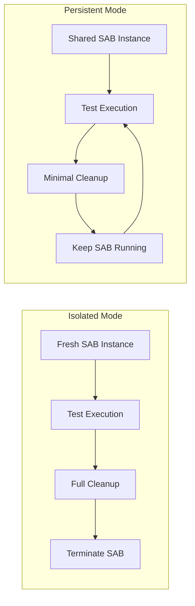
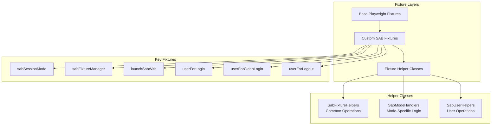

# Fixture Management

## Overview

The framework implements a sophisticated fixture management system built on Playwright's fixture architecture, providing flexible test lifecycle management with support for both isolated and persistent execution modes. This system is particularly critical for SAB (Secure Application Browser) testing where application state management significantly impacts test execution time and reliability.

## SAB Session Modes

The framework supports two distinct session modes, each optimized for different testing scenarios:



### Isolated Mode

**Purpose**: Complete test isolation with fresh application state

**Characteristics**:
- New SAB instance for each test
- Full application data cache restoration
- Complete cleanup and termination after test
- Platform driver reset between tests
- Credentials refreshed for each test

**Use Cases**:
- Tests requiring pristine application state
- Installation/uninstallation testing
- Login/logout flow testing
- Tests that modify application configuration

**Trade-offs**:
- ✅ Maximum test isolation
- ✅ No state pollution between tests
- ❌ Slower execution (SAB launch overhead)
- ❌ Higher resource usage

### Persistent Mode

**Purpose**: Fast test execution with shared application instance

**Characteristics**:
- Single SAB instance shared across tests
- Application data cache preserved
- Minimal cleanup (close extra tabs only)
- Platform driver reset but SAB keeps running
- No credential refresh between tests

**Use Cases**:
- Functional testing within logged-in session
- UI interaction testing
- Workflow testing
- Regression test suites

**Trade-offs**:
- ✅ Faster execution (no SAB launch overhead)
- ✅ Lower resource usage
- ❌ Potential state pollution
- ❌ Requires careful test design

### Mode Selection

```typescript
// In test file
import { test } from '../src/fixtures';

// Isolated mode (default)
test.use({ eabSessionMode: 'isolated' });

// Persistent mode
test.use({ eabSessionMode: 'persistent' });

test('My test', async ({ adminUser }) => {
  // Test implementation
});
```

## Fixture Architecture



## Fixture Helper Classes

### SabFixtureHelpers

Provides common setup and teardown operations:

```typescript
class SabFixtureHelpers {
  // Get SAB configuration
  static getSabConfig() {
    return utilManager
      .processNode()
      .facade()
      .getter()
      .getSabConfigHandler()
      .getConfig();
  }
  
  // Setup SAB environment variables
  static async setupSabEnvironment(options: {
    adminUser: TestUser;
  }) {
    await options.adminUser
      .systemController()
      .useSabHandlers()
      .primary()
      .setSabEnvVariables({
        environment: utilManager.processNode().facade().getter().getNodeEnv(),
        debug: true,
      });
  }
  
  // Create attachment manager
  static createAttachmentManager(options: {
    testInfo: TestInfo;
    testRetainOption: TTestRetainOptions;
  }) {
    return new TestAttachmentManager({
      testInfo: options.testInfo,
      testRetainOption: options.testRetainOption,
      verboseDebuggerOption: this.getSabConfig().verboseToggle,
    });
  }
  
  // Common teardown operations
  static async performCommonTeardown(options: {
    testUser: TestUser;
    testInfo: TestInfo;
    backupInstaller: TInstaller;
    testRetainOption: TTestRetainOptions;
    restoreDataCache?: boolean;
    terminateSab?: boolean;
  }) {
    // Attach test artifacts
    // Restore installer and data cache
    // Reset platform driver
    // Return test account to pool
  }
}
```

### SabModeHandlers

Implements mode-specific lifecycle management:

```typescript
class SabModeHandlers {
  // Isolated mode handler
  static async handleIsolatedMode(
    adminUser: TestUser,
    testInfo: TestInfo,
    use: () => Promise<void>
  ) {
    // Terminate any existing SAB
    await SabUserHelpers.checkSabAliveAndTerminateIfRequested({
      testUser: adminUser,
      terminateIfAlive: true,
    });
    
    // Start recording
    await startRecording(adminUser, testRetainOption);
    
    try {
      // Setup environment
      await SabFixtureHelpers.setupSabEnvironment({ adminUser });
      
      // Restore app data cache
      await restoreAppDataCache(adminUser);
      
      // Refresh credentials
      await refreshSabCredentials(adminUser, testInfo);
      
      // Execute test
      await use();
    } finally {
      // Full cleanup
      await SabFixtureHelpers.performCommonTeardown({
        testUser: adminUser,
        testInfo,
        restoreDataCache: true,
        terminateSab: true,
      });
    }
  }
  
  // Persistent mode handler
  static async handlePersistentMode(
    adminUser: TestUser,
    testInfo: TestInfo,
    use: () => Promise<void>
  ) {
    // Check if global SAB is running
    const isSabRunning = await SabUserHelpers.checkSabAliveAndTerminateIfRequested({
      testUser: adminUser,
      terminateIfAlive: false,
    });
    
    if (!isSabRunning) {
      // Launch global SAB instance
      await SabFixtureHelpers.setupSabEnvironment({ adminUser });
      await adminUser.systemController().useSabHandlers().primary().launchSAB();
    }
    
    await startRecording(adminUser, testRetainOption);
    
    try {
      // Execute test
      await use();
    } finally {
      // Minimal cleanup
      await SabFixtureHelpers.performCommonTeardown({
        testUser: adminUser,
        testInfo,
        restoreDataCache: false,
        terminateSab: false,
      });
      
      // Close extra tabs only
      await adminUser
        .systemController()
        .getCorporateBrowserDriver()
        .closeAllTabsExceptFirst();
    }
  }
}
```

### SabUserHelpers

Provides user-related operations:

```typescript
class SabUserHelpers {
  // Handle SAB login state
  static async handleSabLoginState(options: {
    testUser: TestUser;
  }) {
    try {
      // Check if App Launcher page is accessible
      await options.testUser.useCorporateBrowserAssistant(
        AppLauncherPage,
        { timeout: 5000 }
      );
    } catch (error) {
      // Not logged in, perform login flow
      await this.performLoginFlow({ testUser: options.testUser });
    }
  }
  
  // Perform login flow
  static async performLoginFlow(options: {
    testUser: TestUser;
  }) {
    const loginTA = await options.testUser.useCorporateBrowserAssistant(
      LoginPage
    );
    
    const loginPageDisplayed = 
      await loginTA.arrange.ensureLoginPageIsDisplayed();
    
    if (loginPageDisplayed) {
      await loginTA.actions.login();
    } else {
      await loginTA.actions.loginWithDefaultDomain();
    }
    
    // Wait for app launcher
    await options.testUser.useCorporateBrowserAssistant(
      AppLauncherPage,
      { timeout: 30000 }
    );
  }
  
  // Check SAB status and optionally terminate
  static async checkSabAliveAndTerminateIfRequested(options: {
    testUser: TestUser;
    terminateIfAlive?: boolean;
    logStatus?: boolean;
  }): Promise<boolean> {
    const isSabAlive = await options.testUser
      .systemController()
      .useSabHandlers()
      .primary()
      .isSabAlive();
    
    if (options.logStatus) {
      utilManager.logger().info.log(
        `SAB status: ${isSabAlive ? 'alive' : 'not running'}`
      );
    }
    
    if (isSabAlive && options.terminateIfAlive) {
      await options.testUser
        .systemController()
        .useSabHandlers()
        .primary()
        .terminateSAB();
    }
    
    return isSabAlive;
  }
  
  // Backup credentials
  static async backupCredentials(options: {
    testUser: TestUser;
  }) {
    await (
      await options.testUser
        .systemController()
        .useSabHandlers()
        .primary()
        .getCredentialsUtil()
    ).backup();
  }
  
  // Restore credentials
  static async restoreCredentials(options: {
    testUser: TestUser;
  }) {
    await (
      await options.testUser
        .systemController()
        .useSabHandlers()
        .primary()
        .getCredentialsUtil()
    ).restore();
  }
}
```

## Key Fixtures

### sabSessionMode

Controls the session mode for tests:

```typescript
type TSabSessionMode = 'isolated' | 'persistent';

const defaultSabSessionMode: TSabSessionMode = 'isolated';

// Usage
test.use({ sabSessionMode: 'persistent' });
```

### sabFixtureManager

Main orchestrator that delegates to mode handlers:

```typescript
sabFixtureManager: async ({ adminUser, sabSessionMode }, use, testInfo) => {
  if (sabSessionMode === 'isolated') {
    await SabModeHandlers.handleIsolatedMode(adminUser, testInfo, use);
  } else {
    await SabModeHandlers.handlePersistentMode(adminUser, testInfo, use);
  }
}
```

### launchSabWith

Launches SAB with optional profile configuration:

```typescript
launchSabWith: async ({ adminUser }, use) => {
  await use(async (options: {
    testUser: TestUser;
    useNewProfile?: boolean;
  }) => {
    if (options.useNewProfile) {
      await backupProfile(options.testUser);
    }
    
    await SabFixtureHelpers.setupSabEnvironment({
      adminUser: options.testUser,
    });
    
    await options.testUser
      .systemController()
      .useSabHandlers()
      .primary()
      .launchSAB();
  });
}

// Usage
test('My test', async ({ launchSabWith, testUser }) => {
  await launchSabWith({
    testUser,
    useNewProfile: true,
  });
});
```

### userForLogin

Prepares user for login testing:

```typescript
userForLogin: async ({ adminUser }, use) => {
  await use(async (options: {
    testUser: TestUser;
    launchSAB: boolean;
  }) => {
    // Backup credentials
    await SabUserHelpers.backupCredentials({
      testUser: options.testUser,
    });
    
    // Ensure login page is ready
    await SabUserHelpers.ensureLoginPageIsReady({
      testUser: options.testUser,
    });
    
    // Launch SAB if requested
    if (options.launchSAB) {
      await options.testUser
        .systemController()
        .useSabHandlers()
        .primary()
        .launchSAB();
    }
  });
}

// Usage
test('Login test', async ({ userForLogin, testUser }) => {
  await userForLogin({
    testUser,
    launchSAB: true,
  });
  
  // Perform login test
});
```

### userForCleanLogin

Prepares user with fresh credentials:

```typescript
userForCleanLogin: async ({ adminUser }, use) => {
  await use(async (options: {
    testUser: TestUser;
    launchSAB: boolean;
  }) => {
    // Delete existing credentials
    await deleteCredentials(options.testUser);
    
    // Launch SAB if requested
    if (options.launchSAB) {
      await options.testUser
        .systemController()
        .useSabHandlers()
        .primary()
        .launchSAB();
    }
  });
}
```

### userForLogout

Prepares user for logout testing:

```typescript
userForLogout: async ({ adminUser }, use) => {
  await use(async (options: {
    testUser: TestUser;
    launchSAB: boolean;
  }) => {
    // Ensure user is logged in
    await SabUserHelpers.handleSabLoginState({
      testUser: options.testUser,
    });
    
    // Launch SAB if requested
    if (options.launchSAB) {
      await options.testUser
        .systemController()
        .useSabHandlers()
        .primary()
        .launchSAB();
    }
  });
}
```

## Attachment Management

### TestAttachmentManager

Manages test artifacts and attachments:

```typescript
class TestAttachmentManager {
  constructor(options: {
    testInfo: TestInfo;
    testRetainOption: TTestRetainOptions;
    verboseDebuggerOption: boolean;
  });
  
  // Attach video recording
  async attachVideo(platformDriver: WebDriverIOBrowser): Promise<void>;
  
  // Attach logs
  async attachLogsToTest(testUser: TestUser): Promise<void>;
  
  // Attach SAB information
  async attachAllSabInfoToTest(testUser: TestUser): Promise<void>;
  
  // Attach CDP tracer
  async attachCdpTracer(): Promise<void>;
  
  // Attach verbose debugger
  async attachVerboseDebugger(): Promise<void>;
  
  // Attach browser page checker
  async attachBrowserPageChecker(): Promise<void>;
  
  // Attach archive
  async attachArchive(): Promise<void>;
}
```

### Retention Policies

```typescript
type TTestRetainOptions = 
  | 'retainOnFailure'
  | 'always'
  | 'disabled';

// Configuration
const config = {
  videoRecording: 'retainOnFailure' as TTestRetainOptions,
};
```

## Platform Driver Reset

### Why Reset is Necessary

Platform drivers must be reset between tests to properly terminate WinAppDriver sessions:

```typescript
async function resetPlatformDriver(
  testUser: TestUser,
  testInfo: TestInfo
): Promise<void> {
  if (testUser.systemController().hasPlatformDriver()) {
    await testUser.systemController().resetPlatformDriver();
  }
}
```

### Lazy Reinitialization

In persistent mode, platform driver assistants are lazily reinitialized:

```typescript
// First call after reset creates new driver
const assistant = await testUser.usePlatformDriverAssistant(PageClass);

// Driver is initialized on-demand
const platformDriver = await testUser
  .systemController()
  .getPlatformDriver();
```

## Best Practices

### 1. Choose Appropriate Mode

```typescript
// ✅ Use isolated mode for state-sensitive tests
test.use({ sabSessionMode: 'isolated' });
test('Installation test', async ({ adminUser }) => {
  // Fresh SAB instance
});

// ✅ Use persistent mode for functional tests
test.use({ sabSessionMode: 'persistent' });
test('UI interaction test', async ({ adminUser }) => {
  // Shared SAB instance
});
```

### 2. Use Specialized Fixtures

```typescript
// ✅ Use userForLogin for login tests
test('Login flow', async ({ userForLogin, testUser }) => {
  await userForLogin({ testUser, launchSAB: true });
  // Test login
});

// ✅ Use userForLogout for logout tests
test('Logout flow', async ({ userForLogout, testUser }) => {
  await userForLogout({ testUser, launchSAB: true });
  // Test logout
});
```

### 3. Configure Retention Appropriately

```typescript
// For debugging, retain all artifacts
const config = {
  videoRecording: 'always',
  verboseToggle: true,
};

// For CI, retain only on failure
const config = {
  videoRecording: 'retainOnFailure',
  verboseToggle: false,
};
```

### 4. Handle Fixture Errors

```typescript
sabFixtureManager: async ({ adminUser, sabSessionMode }, use, testInfo) => {
  try {
    await use();
  } catch (error) {
    // Mark test as failed if it passed (fixture error)
    if (testInfo.status === 'passed') {
      testInfo.status = 'failed';
    }
    throw error;
  } finally {
    // Cleanup always runs
    await cleanup();
  }
}
```

## Related Documentation

- [Drivers](./drivers.md) - Platform driver and browser driver architecture
- [SAB Testing](./sab-testing.md) - Comprehensive SAB testing guide
- [AAA Pattern](./aaa-pattern.md) - TestUser and assistant patterns
- [Infrastructure](./infrastructure.md) - CI/CD and parallel execution
