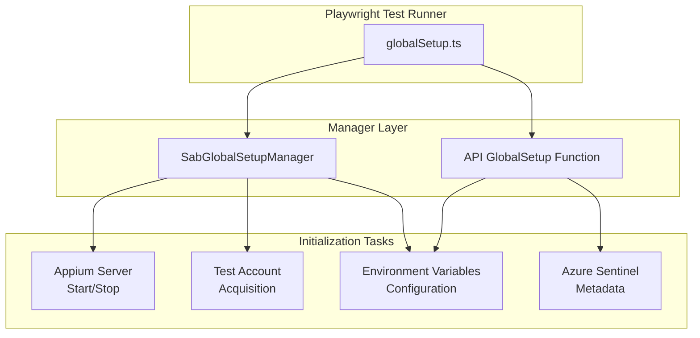
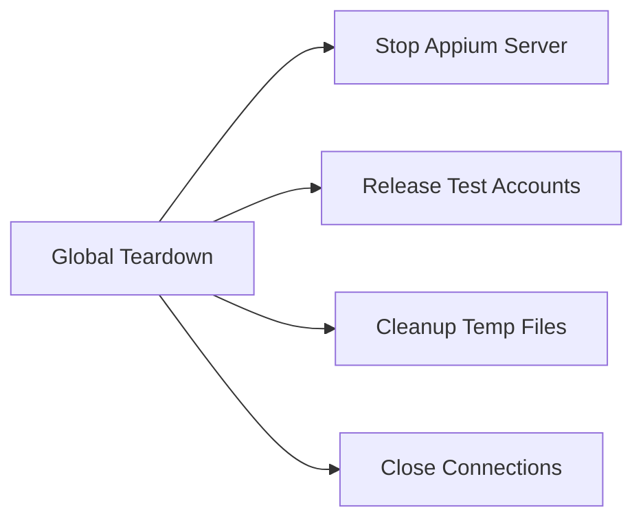

# Global Setup Management

## Overview

The framework implements a modular global setup system that initializes test environments before test execution. This system uses dedicated manager classes to handle complex initialization tasks like starting Appium servers, acquiring test accounts, and configuring environment variables.

## Global Setup Architecture



## SAB Global Setup Manager

The `SabGlobalSetupManager` class orchestrates SAB test environment initialization:

### Responsibilities

| Responsibility                 | Description                                      |
| ------------------------------ | ------------------------------------------------ |
| **Appium Server Management**   | Start/stop Appium server for platform automation |
| **Test Account Acquisition**   | Acquire test accounts from repository            |
| **Environment Variable Setup** | Configure SAB-specific environment variables     |
| **Cleanup Coordination**       | Ensure proper teardown in global teardown        |

### Implementation

```typescript
// apps/sab/src/globalSetup.ts
import { SabGlobalSetupManager } from './global-setup-manager';

let globalSetupManager: SabGlobalSetupManager;

export default async function globalSetup() {
  // Create manager instance
  globalSetupManager = new SabGlobalSetupManager();
  
  // Initialize environment
  await globalSetupManager.setup();
  
  // Start Appium server
  await globalSetupManager.startAppiumServer();
}

export function getGlobalSetupManager(): SabGlobalSetupManager {
  return globalSetupManager;
}
```

### SabGlobalSetupManager Class

```typescript
export class SabGlobalSetupManager {
  private appiumServer: AppiumServer | null = null;
  private testAccounts: TestUser[] = [];
  
  // Setup environment
  async setup(): Promise<void> {
    utilManager.logger().info.log('Starting SAB global setup');
    
    // Load environment configuration
    this.loadEnvironmentConfig();
    
    // Acquire test accounts
    await this.acquireTestAccounts();
    
    // Setup environment variables
    this.setupEnvironmentVariables();
    
    utilManager.logger().info.log('SAB global setup complete');
  }
  
  // Start Appium server
  async startAppiumServer(): Promise<void> {
    const platform = utilManager.os().platform.isWindows()
      ? 'windows'
      : 'mac';
    
    utilManager.logger().info.log(
      `Starting Appium server for ${platform}`
    );
    
    this.appiumServer = new AppiumServer({
      host: 'localhost',
      port: 4724,
      logLevel: 'info',
    });
    
    await this.appiumServer.start();
    
    utilManager.logger().info.log('Appium server started');
  }
  
  // Acquire test accounts
  private async acquireTestAccounts(): Promise<void> {
    const accountCount = this.getRequiredAccountCount();
    
    utilManager.logger().info.log(
      `Acquiring ${accountCount} test accounts`
    );
    
    for (let i = 0; i < accountCount; i++) {
      const account = await TestAccountRepository.acquire({
        role: TEnumUserRole.ADMIN,
      });
      
      this.testAccounts.push(account);
    }
    
    utilManager.logger().info.log(
      `Acquired ${this.testAccounts.length} test accounts`
    );
  }
  
  // Setup environment variables
  private setupEnvironmentVariables(): void {
    const env = utilManager
      .processNode()
      .facade()
      .getter()
      .getNodeEnv();
    
    // Set SAB environment
    process.env.SAB_ENVIRONMENT = env;
    
    // Set Appium configuration
    process.env.APPIUM_HOST = 'localhost';
    process.env.APPIUM_PORT = '4724';
    
    // Set Corporate Browser ports
    process.env.CORPORATE_BROWSER_LOGIN_PORT = '19227';
    process.env.CORPORATE_BROWSER_APP_SESSION_PORT = '19228';
    process.env.CORPORATE_BROWSER_INTERNET_SESSION_PORT = '19229';
    
    utilManager.logger().info.log('Environment variables configured');
  }
  
  // Get required account count based on workers
  private getRequiredAccountCount(): number {
    const workers = parseInt(process.env.WORKERS || '1', 10);
    return workers;
  }
  
  // Cleanup (called in global teardown)
  async teardown(): Promise<void> {
    utilManager.logger().info.log('Starting SAB global teardown');
    
    // Stop Appium server
    if (this.appiumServer) {
      await this.appiumServer.stop();
      utilManager.logger().info.log('Appium server stopped');
    }
    
    // Return test accounts
    for (const account of this.testAccounts) {
      await TestAccountRepository.release(account);
    }
    
    utilManager.logger().info.log(
      `Released ${this.testAccounts.length} test accounts`
    );
    
    utilManager.logger().info.log('SAB global teardown complete');
  }
}
```

## API Global Setup

The API global setup function configures environment variables for API testing:

### Implementation

```typescript
// apps/api/src/fixtures/globalSetup.ts
import { config } from 'dotenv';
import { utilManager } from '@mammothcyber-qa/shared/util-core';

export default async function globalSetup() {
  utilManager.logger().info.log('Starting API global setup');
  
  // Load environment configuration
  const env = utilManager
    .processNode()
    .facade()
    .getter()
    .getNodeEnv();
  
  config({ path: `./config/.env.${env}` });
  
  // Set API endpoints
  setupAPIEndpoints();
  
  // Set port configuration
  setupPortConfiguration();
  
  // Set Azure Sentinel metadata
  setupAzureSentinelMetadata();
  
  utilManager.logger().info.log('API global setup complete');
}

function setupAPIEndpoints(): void {
  const env = utilManager
    .processNode()
    .facade()
    .getter()
    .getNodeEnv();
  
  // Set REST API endpoint
  process.env.INTRA_REST_API = `https://api-${env}.example.com`;
  
  // Set website URL
  process.env.WEBSITE_URL = `https://${env}.example.com`;
  
  utilManager.logger().info.log('API endpoints configured');
}

function setupPortConfiguration(): void {
  // Corporate Browser ports
  process.env.CORPORATE_BROWSER_LOGIN_PORT = '19227';
  process.env.CORPORATE_BROWSER_APP_SESSION_PORT = '19228';
  process.env.CORPORATE_BROWSER_INTERNET_SESSION_PORT = '19229';
  process.env.CORPORATE_BROWSER_PORT = '4567';
  
  // Appium configuration
  process.env.APPIUM_HOST = 'localhost';
  process.env.APPIUM_FOR_TERMINAL_PORT = '4724';
  
  utilManager.logger().info.log('Port configuration set');
}

function setupAzureSentinelMetadata(): void {
  const env = utilManager
    .processNode()
    .facade()
    .getter()
    .getNodeEnv();
  
  // Set Azure Sentinel workspace
  process.env.AZURE_SENTINEL_WORKSPACE_ID = 
    env === 'prod' 
      ? 'prod-workspace-id'
      : 'qa-workspace-id';
  
  // Set data layer version
  process.env.DATA_LAYER_VERSION = '2.0';
  
  // Set canary version
  process.env.CANARY_VERSION = 'v1.2.3';
  
  utilManager.logger().info.log('Azure Sentinel metadata configured');
}
```

## Global Teardown

### SAB Global Teardown

```typescript
// apps/sab/src/globalTeardown.ts
import { getGlobalSetupManager } from './globalSetup';

export default async function globalTeardown() {
  const manager = getGlobalSetupManager();
  
  if (manager) {
    await manager.teardown();
  }
}
```

### Teardown Responsibilities



## Appium Server Management

### AppiumServer Class

```typescript
class AppiumServer {
  private process: ChildProcess | null = null;
  
  constructor(private config: {
    host: string;
    port: number;
    logLevel: 'info' | 'debug' | 'error';
  }) {}
  
  async start(): Promise<void> {
    const args = [
      '--address', this.config.host,
      '--port', this.config.port.toString(),
      '--log-level', this.config.logLevel,
    ];
    
    this.process = spawn('appium', args, {
      stdio: 'inherit',
    });
    
    // Wait for server to be ready
    await this.waitForServerReady();
  }
  
  async stop(): Promise<void> {
    if (this.process) {
      this.process.kill('SIGTERM');
      
      // Wait for graceful shutdown
      await new Promise((resolve) => {
        this.process?.on('exit', resolve);
      });
      
      this.process = null;
    }
  }
  
  private async waitForServerReady(): Promise<void> {
    const maxAttempts = 30;
    const delayMs = 1000;
    
    for (let i = 0; i < maxAttempts; i++) {
      try {
        const response = await fetch(
          `http://${this.config.host}:${this.config.port}/status`
        );
        
        if (response.ok) {
          return;
        }
      } catch (error) {
        // Server not ready yet
      }
      
      await new Promise(resolve => setTimeout(resolve, delayMs));
    }
    
    throw new Error('Appium server failed to start');
  }
}
```

## Test Account Acquisition

### Pre-Allocation Strategy

```typescript
class SabGlobalSetupManager {
  private async acquireTestAccounts(): Promise<void> {
    // Calculate required accounts based on workers
    const workers = this.getWorkerCount();
    const accountsPerWorker = 1;
    const totalAccounts = workers * accountsPerWorker;
    
    utilManager.logger().info.log(
      `Acquiring ${totalAccounts} accounts for ${workers} workers`
    );
    
    // Acquire accounts in parallel
    const acquisitionPromises = Array.from(
      { length: totalAccounts },
      () => TestAccountRepository.acquire({
        role: TEnumUserRole.ADMIN,
      })
    );
    
    this.testAccounts = await Promise.all(acquisitionPromises);
    
    // Store account IDs in environment for worker access
    process.env.TEST_ACCOUNT_IDS = this.testAccounts
      .map(account => account.username)
      .join(',');
  }
  
  private getWorkerCount(): number {
    // Check for explicit worker count
    if (process.env.WORKERS) {
      return parseInt(process.env.WORKERS, 10);
    }
    
    // Check Playwright shard info
    const shardInfo = utilManager
      .processNode()
      .facade()
      .getter()
      .getPlaywrightShardInfo();
    
    if (shardInfo.isSharded()) {
      return shardInfo.getShardTotal();
    }
    
    // Default to 1
    return 1;
  }
}
```

## Environment Variable Configuration

### Configuration Matrix

| Variable                                  | SAB Setup | API Setup | Description                    |
| ----------------------------------------- | --------- | --------- | ------------------------------ |
| `SAB_ENVIRONMENT`                         | ✅         | ❌         | SAB environment (qa/demo/prod) |
| `APPIUM_HOST`                             | ✅         | ✅         | Appium server host             |
| `APPIUM_PORT`                             | ✅         | ❌         | Appium server port             |
| `APPIUM_FOR_TERMINAL_PORT`                | ❌         | ✅         | Terminal Appium port           |
| `CORPORATE_BROWSER_LOGIN_PORT`            | ✅         | ✅         | Login port                     |
| `CORPORATE_BROWSER_APP_SESSION_PORT`      | ✅         | ✅         | App session port               |
| `CORPORATE_BROWSER_INTERNET_SESSION_PORT` | ✅         | ✅         | Internet session port          |
| `CORPORATE_BROWSER_PORT`                  | ❌         | ✅         | Corporate Browser port         |
| `INTRA_REST_API`                          | ❌         | ✅         | REST API endpoint              |
| `WEBSITE_URL`                             | ❌         | ✅         | Website URL                    |
| `AZURE_SENTINEL_WORKSPACE_ID`             | ❌         | ✅         | Azure Sentinel workspace       |
| `DATA_LAYER_VERSION`                      | ❌         | ✅         | Data layer version             |
| `CANARY_VERSION`                          | ❌         | ✅         | Canary version                 |

## Best Practices

### 1. Use Manager Pattern

```typescript
// ✅ Good - Manager encapsulates complexity
class SabGlobalSetupManager {
  async setup() {
    await this.startAppiumServer();
    await this.acquireTestAccounts();
    this.setupEnvironmentVariables();
  }
}

// ❌ Avoid - Procedural setup
async function globalSetup() {
  // Start Appium
  // Acquire accounts
  // Setup env vars
  // All in one function
}
```

### 2. Proper Cleanup

```typescript
// ✅ Good - Cleanup in teardown
async teardown() {
  await this.appiumServer?.stop();
  await this.releaseTestAccounts();
}

// ❌ Avoid - No cleanup
async teardown() {
  // Nothing - resources leak
}
```

### 3. Logging

```typescript
// ✅ Good - Informative logging
utilManager.logger().info.log('Starting Appium server');
await this.appiumServer.start();
utilManager.logger().info.log('Appium server started successfully');

// ❌ Avoid - Silent execution
await this.appiumServer.start();
```

### 4. Error Handling

```typescript
// ✅ Good - Handle errors gracefully
async setup() {
  try {
    await this.startAppiumServer();
  } catch (error) {
    utilManager.logger().error.log(
      `Failed to start Appium: ${error.message}`
    );
    throw error;
  }
}

// ❌ Avoid - Unhandled errors
async setup() {
  await this.startAppiumServer(); // May throw
}
```

## Troubleshooting

### Common Issues

| Issue                             | Cause                  | Solution                                              |
| --------------------------------- | ---------------------- | ----------------------------------------------------- |
| **Appium fails to start**         | Port already in use    | Check for existing Appium processes                   |
| **Account acquisition timeout**   | Repository unavailable | Verify test account repository connection             |
| **Environment variables not set** | Setup not called       | Ensure globalSetup is configured in Playwright config |
| **Teardown not running**          | Missing globalTeardown | Add globalTeardown to Playwright config               |

### Debug Logging

```typescript
// Enable debug logging
process.env.DEBUG = 'true';

// Log all environment variables
utilManager.logger().debug.log(
  'Environment variables:',
  JSON.stringify(process.env, null, 2)
);

// Log Appium server status
const status = await fetch('http://localhost:4724/status');
utilManager.logger().debug.log(
  'Appium status:',
  await status.json()
);
```

## Related Documentation

- [Configuration](./configuration.md) - Environment variable management
- [Test User Management](./test-user-management.md) - Test account repository
- [Drivers](./drivers.md) - Platform driver and Appium integration
- [Infrastructure](./infrastructure.md) - CI/CD and parallel execution
