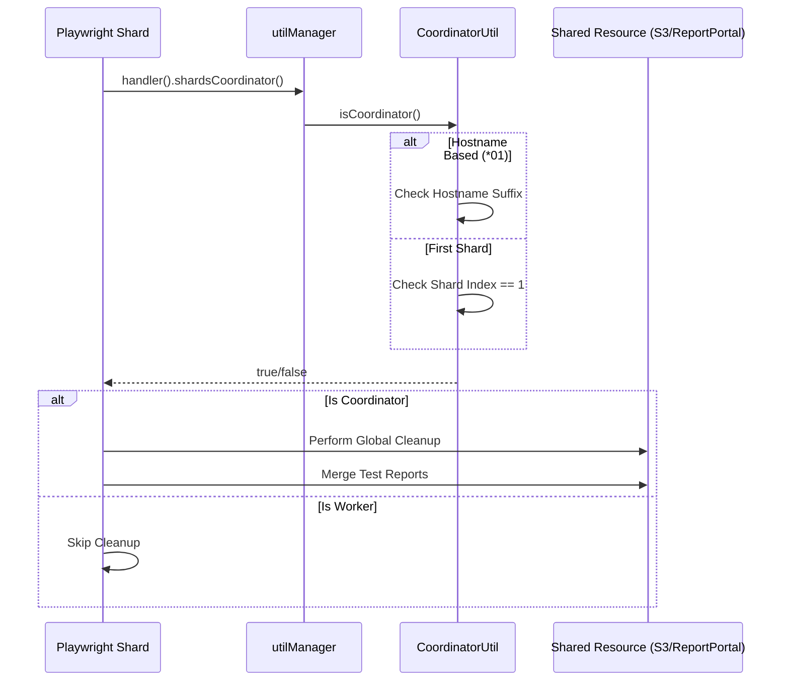

# Infrastructure & CI/CD

The automation framework relies on a heterogeneous set of Jenkins agents to handle different testing workloads: **Linux Containers** for API/Web, **Native Mac** for MacOS Unity testing, and **Native Windows** for Windows Unity testing.

## 🏗️ Pipeline Architecture

### 1. The Containerized Pipeline (Default)
Used for reliable, backend-heavy tests (API) or headless web tests.
-   **Agent**: `jenkins-slave` + `playwright` Docker container.
-   **Optimization**:
    -   Copies source to `/app` to avoid filesystem I/O locking issues on mounted volumes.
    -   Runs `npx playwright test` in isolated scratch space.

```groovy
container('playwright') {
    sh '''
        cp -a playwright/src /app
        cd /app
        npx playwright test --project="api testing"
    '''
}
```

### 2. The Native macOS Pipeline
Used for testing the Mac Unity Tray and Mac Installer.
-   **Agent**: `label 'macbook-slave'`.
-   **Execution**: Native `npm ci` (no Docker).
-   **Headed Mode**: Required for UI interaction.
    ```bash
    npx playwright test --project="e2e testing" --headed
    ```

### 3. The Native Windows Pipeline
Used for testing the Windows Unity Tray, MSI Installer, and Corporate Browser (Win).
-   **Agent**: `label 'windows-slave'`.
-   **Filtering**: Specifically targeting "Mammoth Browser" tag.
-   **Shell**: Uses `bat` commands and Windows environment variable syntax (`set VAR=val`).

## 🧱 Distributed Sharding (`util-coordinator`)

To handle the extensive EAB test suite, we utilize Playwright's sharding capability managed by our `CoordinatorUtil`.

### The Coordinator Strategy
Since some cleanup actions (like wiping shared S3 buckets or generating global reports) must happen only *once* per run, we assign a **Coordinator Shard** responsible for these tasks.



| Strategy           | Description                                                                      | Used In                 |
| :----------------- | :------------------------------------------------------------------------------- | :---------------------- |
| **Hostname Based** | The machine with a specific suffix (e.g., `*01`) is the specialized coordinator. | VM Pools (Static IPs)   |
| **First Shard**    | Shard `1/n` is always the coordinator.                                           | GitHub Actions / Docker |
| **Round Robin**    | Coordinator role rotates based on modulo logic.                                  | Load Balancing          |

```typescript
// utilManager detects the strategy automatically
if (utilManager.handler().shardsCoordinator().isHostnameCoordinator()) {
    await performGlobalCleanup();
}
```

## 📜 Helper Script Abstraction (libs/shared/util-core/src/scripts)

The framework masks OS differences using a dual-script strategy. The `NodeProcess` wrapper automatically selects the `.ps1` or `.sh` version based on the runtime platform.

| Function         | Windows Script (`powershell/eab`) | Mac Script (`shell/eab`)  |
| :--------------- | :-------------------------------- | :------------------------ |
| **Launch**       | `launch-eab.ps1`                  | `launch-eab.sh`           |
| **Kill**         | `kill-eab-process.ps1`            | `kill-eab-process.sh`     |
| **Health Check** | `check-eab-is-alive.ps1`          | `check-eab-is-alive.sh`   |
| **Clean Env**    | `cleanup-windows.ps1`             | `kill-process-by-port.sh` |

### Key Scripts

-   **`update-win-settings-for-automation.ps1`**: Prepares a fresh Windows Agent by disabling Screen Lock, Sleep, and Windows Defender Real-time scanning (temporary) to prevent test interference.
-   **`monitor-node-processes.ps1`**: A "Watchdog" running in parallel to log CPU/Memory spikes during long test runs.
-   **`Clipboard-Manager.ps1`**: Bridges the gap for native clipboard verification (since headless browsers can't easily access the OS clipboard).

## 📊 Reporting & Notifications

### Dual HTML Reports
We generate separate artifacts for API and E2E to prevent large reports from crashing browsers.
-   `out/api_html/index.html`
-   `out/e2e_html/index.html`

jenkins `publishHTML` is configured to aggregate these into a single "Playwright result" tab.

### Teams Integration
Failed builds automatically trigger an Office 365 Connector webhook:
```groovy
office365ConnectorWebhooks([[
    notifyFailure: true,
    notifyRepeatedFailure: true,
    // ...
]])
```

## 🔑 Secrets & Environment

### `EnvService` Logic
Secrets are injected via Jenkins `withCredentials` into standard environment variables.
-   **Jenkins**: `ADMIN_PASSWORD` (Secret Text)
-   **Node**: `process.env.ADMIN_PASSWORD` via `util-core`

The `EnvService` in `libs/shared/util-core` provides strongly-typed access:
```typescript
// Throws Error if missing in CI, logs warning in Dev
const password = EnvService.get('ADMIN_PASSWORD');
```

## 📊 Report Portal Integration

Report Portal provides centralized test result aggregation with powerful filtering and analytics.

### Launch Attributes

Each test launch includes metadata for filtering:

```typescript
const attributes = utilManager.reportPortal().baseLaunchAttributes('SAB');
// Creates: test_app_type, type, env, platform

const rpConfig = utilManager.reportPortal().obtainRPConfig(
  sabRelease,
  installer
);
// Adds: build_installer_type, build_tag, build_version, rc_number, shards
```

### Coordinator-Based Launch Management

Only the coordinator shard manages Report Portal launches:

```typescript
if (utilManager.handler().shardsCoordinator().isHostnameCoordinator()) {
  await startReportPortalLaunch();
}

// All shards report to the same launch
// Coordinator finalizes after all shards complete
```

For detailed Report Portal configuration, see [Reporting & Logging](./reporting.md).

## Related Documentation

- [Orchestration](./orchestration.md) - Sharding coordination and utilManager
- [Reporting](./reporting.md) - Report Portal integration and ExecutionTracker
- [Configuration](./configuration.md) - Environment variable management
- [Global Setup](./global-setup.md) - Test environment initialization

