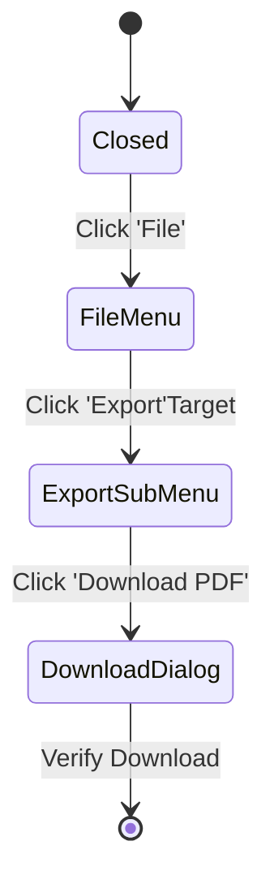

# Microsoft 365 (Office) Automation

Automating complex Single Page Applications (SPAs) like Word Online requires overcoming significant challenges: **nested cross-origin iframes**, **canvas-based rendering**, and **dynamic DOM nodes** that only exist after user interaction.

## 🖼️ Frame Architecture (The `FrameChildElement`)

Standard Playwright selectors (`page.locator`) fail in M365 because the editor runs inside a dynamic iframe (`#WacFrame_Word_0`) that is often reloaded or nested.

We developed `FrameChildElement` to abstract this complexity.

### Logic Flow
1.  **Frame Resolution**: The base `M365Page` holds a reference to the `FrameElement` (the editor iframe).
2.  **Parent-Child Chain**: Every UI element (Buttons, Dialogs) is instantiated as a `FrameChildElement`.
3.  **Lazy Evaluation**: The element locator is not resolved until the action (click/fill) is called, ensuring the frame reference is fresh.

```typescript
// M365Page.ts
this.m365Frame = new FrameElement(this.page.locator('#WacFrame'), 'iframe');

// Finding an element inside the frame
const fileMenu = this.m365Frame.getByRole<FrameChildElement>('menu');
```

## 🖱️ Complex Interaction Patterns

### 1. The File Menu State
Interacting with the "File" menu is not simple DOM traversal. It requires a state-machine approach because sub-menus (like "Create a Copy" or "Export") are **sibling nodes**, not child nodes, and they only render when triggered.

### 2. Complex Interactions (The "State Machine" Approach)
M365 menus (File, Home, Insert) are dynamic. We model them as state machines rather than static pages.



#### The `FileMenu` State
Instead of returning a `void` promise, identifying the "File" button returns a specialized accessor:
```typescript
async getFileMenu(): Promise<FileMenuAccessor> {
    await this.uiActions.click(this.elements.fileButton); // State Transition
    return new FileMenuAccessor(this.page); // New State Context
}
```
This forces the test to follow the actual UI flow, preventing "Click download" calls when the menu isn't open.
-   **Regex Matching**: We use flexible regexs (`/Download as PDF$/i`) to handle localization and dynamic text changes.

**Implementation Details:**
-   **Sibling Discovery**: Sub-menus are often attached to the `<body>` root, not the parent menu item.
-   **Regex Matching**: We use flexible regexs (`/Download as PDF$/i`) to handle localization and dynamic text changes.

```typescript
private getFileMenu() {
    // 1. Get the main menu
    const fileMenu = this.m365Frame.getByRole('menu');

    // 2. Define the sub-menu accessor (Lazy)
    const exportMenu = () => {
        // The Export submenu is a NEW 'menu' element that appears separately
        const exportSubmenu = this.m365Frame.getByRole('menu', { name: /Export/i });
        
        return {
            itself: exportSubmenu,
            downloadAsPdf: exportSubmenu.getByRole('menuitem', { name: /Download as PDF/i })
        };
    };

    return { exportAction: ..., exportMenu: exportMenu() };
}
```

### 2. Dialogs with Nested Iframes
Features like "Stock Images" render a **Dialog** (HTML) which contains an **Iframe** (Cross-Origin), which contains the **Grid** (Virtual List).

**Traversing the Stack:**
1.  **Dialog**: `m365Frame.getByRole('dialog')`
2.  **Inner Frame**: `dialog.getDescendantElement('iframe')` -> Wrapped in `new FrameElement()`
3.  **Listbox**: `innerFrame.getByRole('listbox')`
4.  **Item**: `listbox.getDescendantElement('[role="option"]')`

## 🧩 Context Menu Simulation
Context menus in M365 Canvas cannot be right-clicked natively via coordinates easily (due to resolution scaling). 
We assume a **Keyboard-First** approach or use **Accessibility APIs** where possible, or simulate the specific event chain that triggers the menu overlay.
