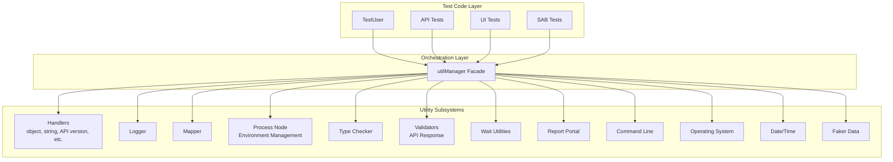
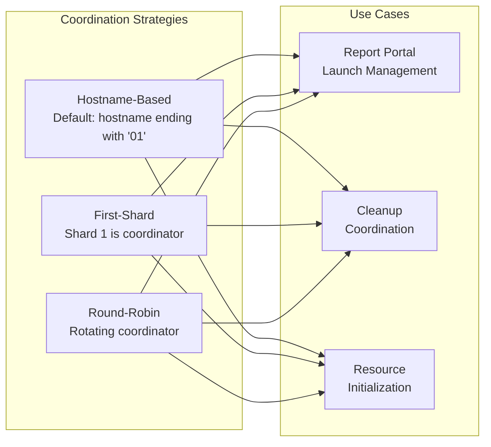
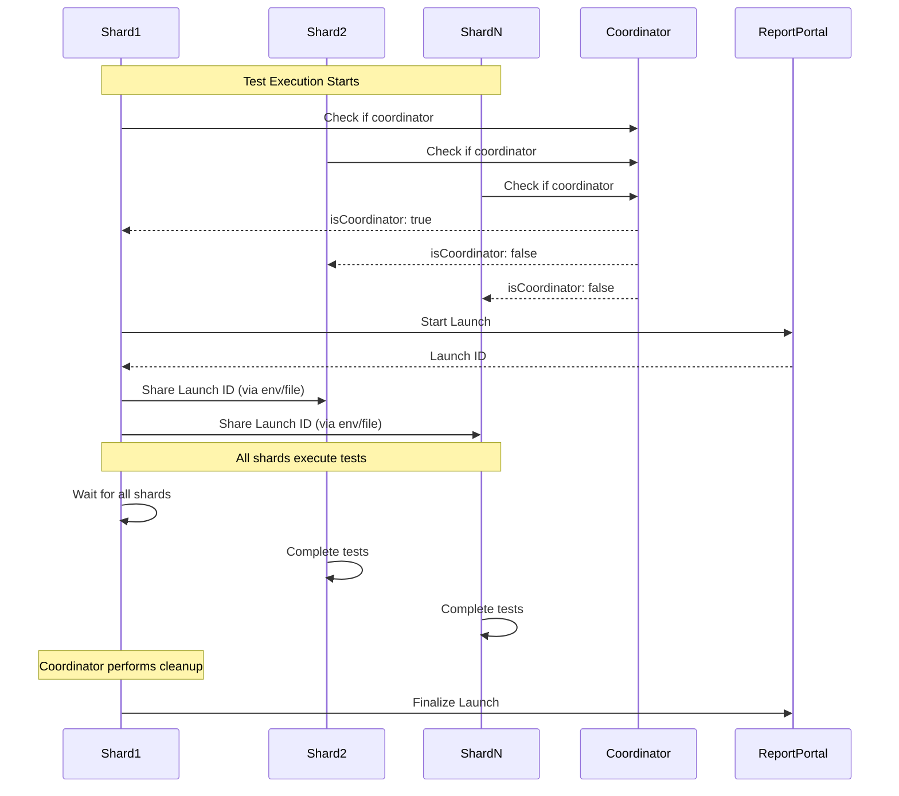
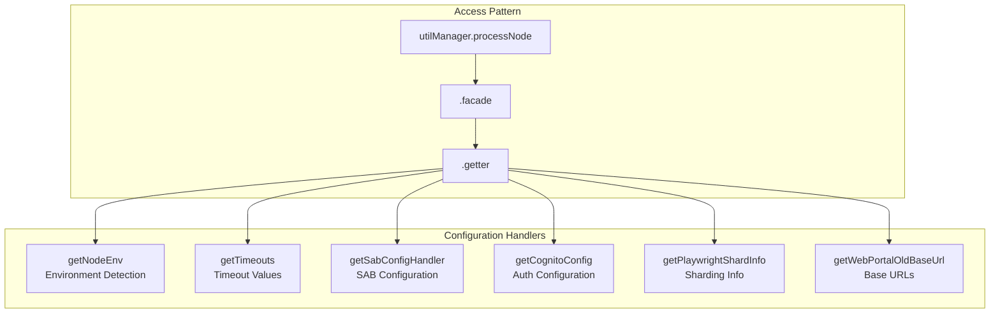

# Framework Orchestration & Utilities

## Overview

The automation framework employs a centralized orchestration pattern through the `utilManager` facade, providing unified access to utilities, handlers, and coordination mechanisms. This architecture enables consistent utility usage across all test types while maintaining clean separation of concerns.

## Central Orchestrator: utilManager

The `utilManager` serves as the primary entry point for accessing framework utilities, implementing a facade pattern that simplifies complex subsystem interactions.

### Architecture Pattern



### Utility Categories

The `utilManager` provides access to the following utility categories:

#### 1. Handlers (`handler()`)

Provides specialized handlers for common operations:

```typescript
// Object manipulation
const serialized = utilManager
  .handler()
  .object()
  .safeJsonStringify(data, { mode: 'pretty' });

// String operations
const sanitized = utilManager
  .handler()
  .string()
  .sanitize(input);

// API version management
const apiPath = utilManager
  .handler()
  .apiVersionHandler()
  .getApiPath();

// Gmail client
const gmailClient = utilManager
  .handler()
  .gmailClient(oAuth2Config);

// TOTP generation
const totp = utilManager
  .handler()
  .totp()
  .generate(secret);

// Sharding coordinator
const isCoordinator = utilManager
  .handler()
  .shardsCoordinator()
  .isHostnameCoordinator();
```

#### 2. Logger (`logger()`)

Centralized logging with multiple severity levels:

```typescript
// Info logging
utilManager.logger().info.log('Operation completed');

// Debug logging
utilManager.logger().debug.log('Debug information');

// Error logging
utilManager.logger().error.log('Error occurred');
```

#### 3. Mapper (`mapper()`)

Data transformation and mapping utilities:

```typescript
const mapped = utilManager.mapper().transform(sourceData);
```

#### 4. Process Node (`processNode()`)

Environment and configuration management through facade pattern:

```typescript
// Get current environment
const env = utilManager
  .processNode()
  .facade()
  .getter()
  .getNodeEnv();

// Get timeout configurations
const timeouts = utilManager
  .processNode()
  .facade()
  .getter()
  .getTimeouts();

// Get SAB-specific configuration
const sabConfig = utilManager
  .processNode()
  .facade()
  .getter()
  .getSabConfigHandler()
  .getConfig();

// Get sharding information
const shardInfo = utilManager
  .processNode()
  .facade()
  .getter()
  .getPlaywrightShardInfo();
```

#### 5. Type Checker (`typeChecker()`)

Runtime type validation:

```typescript
const isValid = utilManager.typeChecker().validate(value, expectedType);
```

#### 6. Validators (`validator()`)

API response validation:

```typescript
const restValidator = utilManager
  .validator()
  .apiResponse()
  .restful();
```

#### 7. Wait Utilities (`waitUntil()`)

Conditional waiting with timeout support:

```typescript
await utilManager.waitUntil().conditionMet<boolean>(
  async () => {
    // Condition check
    return someCondition;
  },
  {
    interval: 1000,
    timeout: 30000,
    message: 'Condition should be met',
  }
);
```

#### 8. Report Portal (`reportPortal()`)

Report Portal integration utilities:

```typescript
const rpClient = utilManager.reportPortal();
```

#### 9. Command Line (`cmdLine()`)

Command line execution utilities:

```typescript
const result = utilManager.cmdLine().execute(command);
```

#### 10. Operating System (`os()`)

OS-specific operations:

```typescript
const hostname = utilManager.os().platform.hostname();
const isWindows = utilManager.os().platform.isWindows();
const isMac = utilManager.os().platform.isMac();
```

#### 11. Date/Time (`dateTime()`)

Date and time utilities:

```typescript
const formatted = utilManager.dateTime().format(date);
```

#### 12. Faker (`faker()`)

Test data generation:

```typescript
const fakeEmail = utilManager.faker().internet.email();
const fakeName = utilManager.faker().person.fullName();
```

## Sharding Coordination

The framework implements sophisticated coordination logic for parallel test execution, ensuring that certain operations (like Report Portal launch management and cleanup) are performed by a single designated coordinator shard.

### Coordination Strategies



### Strategy Details

#### 1. Hostname-Based Coordination (Default)

Designates machines with hostnames ending in a specific suffix (default: `'01'`) as coordinators.

**Use Case**: VM-based parallel execution where VM-01 handles coordination tasks.

```typescript
// Check if current shard is coordinator
const isCoordinator = utilManager
  .handler()
  .shardsCoordinator()
  .isHostnameCoordinator();

if (isCoordinator) {
  // Perform coordinator-only tasks
  await startReportPortalLaunch();
}
```

**Logic**:
- Extracts last 2 digits from hostname
- Compares with coordinator suffix (default: `'01'`)
- Non-VM machines (no hostname digits) are always coordinators

#### 2. First-Shard Coordination

Shard 1 is always designated as the coordinator.

**Use Case**: Simple coordination where the first shard handles initialization.

```typescript
const isCoordinator = utilManager
  .handler()
  .shardsCoordinator()
  .isFirstShardCoordinator();
```

**Logic**:
- Checks if current shard number equals 1
- Simple and predictable coordination

#### 3. Round-Robin Coordination

Distributes coordinator role across shards using modulo operation.

**Use Case**: Load distribution for coordinator tasks.

```typescript
const coordinatorInfo = utilManager
  .handler()
  .shardsCoordinator()
  .getCoordinatorInfo({
    strategy: CoordinatorStrategy.ROUND_ROBIN,
  });

if (coordinatorInfo.isCoordinator) {
  // Perform coordinator tasks
}
```

### Coordinator Information

Get detailed information about coordinator determination:

```typescript
const info = utilManager
  .handler()
  .shardsCoordinator()
  .getCoordinatorInfo();

console.log({
  isCoordinator: info.isCoordinator,
  reason: info.reason,
  hostname: info.hostname,
  shardNumber: info.shardNumber,
  totalShards: info.totalShards,
  strategy: info.strategy,
});
```

### Coordination Flow



## Configuration Facade Pattern

The framework uses a facade pattern for configuration access, providing a clean interface to complex configuration subsystems.

### Facade Hierarchy



### Common Configuration Patterns

```typescript
// Environment detection
const env = utilManager
  .processNode()
  .facade()
  .getter()
  .getNodeEnv(); // 'qa' | 'demo' | 'prod'

// Timeout configuration
const timeouts = utilManager
  .processNode()
  .facade()
  .getter()
  .getTimeouts();

console.log({
  testDefault: timeouts.testDefault,
  expectDefault: timeouts.expectDefault,
  action: timeouts.action,
  short: timeouts.short,
  thirtySeconds: timeouts.thirtySeconds,
  oneSecond: timeouts.oneSecond,
});

// Sharding information
const shardInfo = utilManager
  .processNode()
  .facade()
  .getter()
  .getPlaywrightShardInfo();

console.log({
  isSharded: shardInfo.isSharded(),
  shardNumber: shardInfo.getShardNumber(),
  totalShards: shardInfo.getShardTotal(),
});
```

## Best Practices

### 1. Consistent Utility Access

Always access utilities through `utilManager` rather than direct imports:

```typescript
// ✅ Good
const logger = utilManager.logger();
logger.info.log('Message');

// ❌ Avoid
import { utilLogger } from './util-logger';
utilLogger.info.log('Message');
```

### 2. Facade Pattern for Configuration

Use the facade pattern for all configuration access:

```typescript
// ✅ Good
const config = utilManager
  .processNode()
  .facade()
  .getter()
  .getSabConfigHandler()
  .getConfig();

// ❌ Avoid direct access
import { sabConfig } from './config';
```

### 3. Coordinator Pattern for Shared Resources

Use coordinator pattern for operations that should run once across all shards:

```typescript
const isCoordinator = utilManager
  .handler()
  .shardsCoordinator()
  .isHostnameCoordinator();

if (isCoordinator) {
  // Initialize shared resources
  await initializeSharedResource();
}

// All shards can now use the resource
await useSharedResource();
```

### 4. Type-Safe Utility Usage

Leverage TypeScript for type-safe utility access:

```typescript
// Type-safe JSON serialization
const data: ComplexType = { /* ... */ };
const json = utilManager
  .handler()
  .object()
  .safeJsonStringify(data, { mode: 'pretty' });

// Type-safe conditional waiting
await utilManager.waitUntil().conditionMet<boolean>(
  async () => condition,
  { timeout: 5000 }
);
```

## Related Documentation

- [Configuration Management](./configuration.md) - Environment loading and overrides
- [Infrastructure & Sharding](./infrastructure.md) - Parallel execution architecture
- [AAA Pattern](./aaa-pattern.md) - TestUser integration with utilManager
