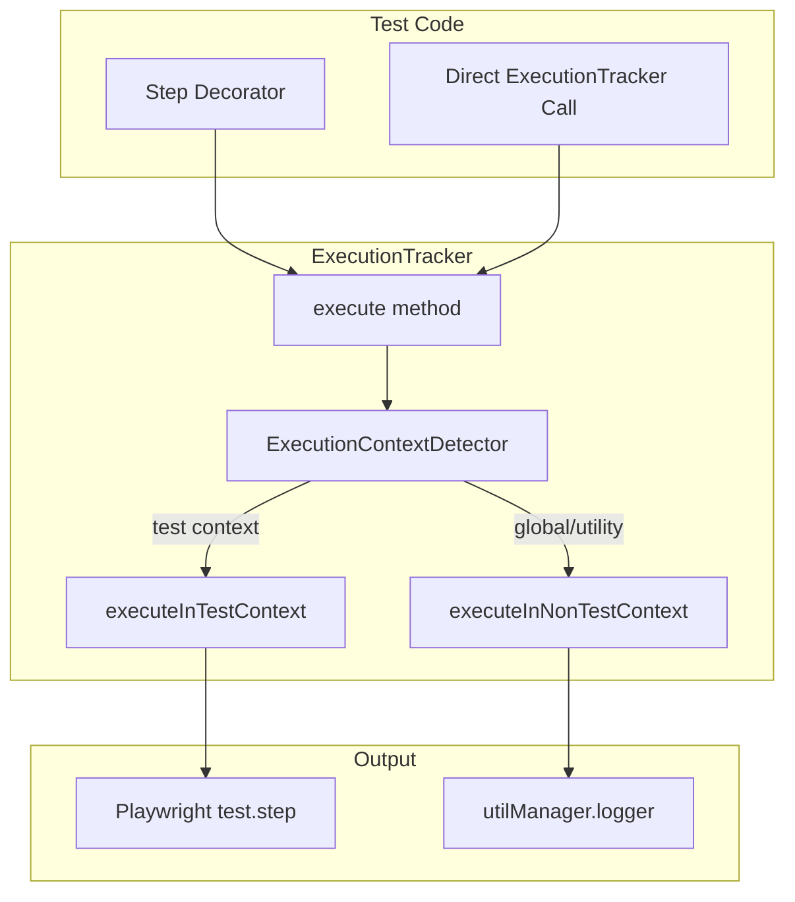
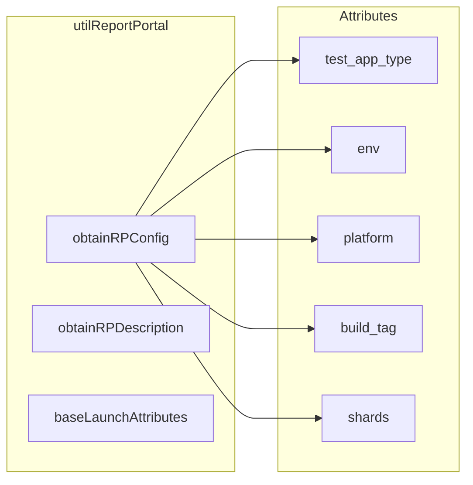

# Reporting & Logging

## Overview

The framework implements sophisticated reporting and logging capabilities that work seamlessly across test contexts (test execution, global setup/teardown, utility methods). This includes integration with Report Portal, context-aware logging through the `ExecutionTracker`, and the `@Step` decorator for automatic test step reporting.

## Execution Tracker

The `ExecutionTracker` provides consistent logging and execution tracking across all contexts—automatically detecting whether code is running in test context, global setup/teardown, or utility methods.

### Architecture



### Context Detection

The `ExecutionContextDetector` analyzes the call stack to determine execution context:

| Context     | Detection Pattern              | Behavior                                  |
| ----------- | ------------------------------ | ----------------------------------------- |
| **test**    | Called within test functions   | Uses `test.step()` for Playwright reports |
| **global**  | Called in globalSetup/Teardown | Uses direct logging                       |
| **utility** | Static methods, helpers        | Uses direct logging                       |

### Usage

#### Using @Step Decorator

The `@Step` decorator automatically wraps methods with context-aware logging:

```typescript
import { Step } from '@framework/feature-aaa';

class LoginPageActions {
  // Auto-detect context: test.step in tests, direct logging in global setup
  @Step()
  async login() {
    await this.fillUsername();
    await this.fillPassword();
    await this.clickSubmit();
  }
  
  // With custom description
  @Step({ description: 'Perform login with credentials' })
  async loginWithCredentials(username: string, password: string) {
    // ...
  }
  
  // Works on static methods too
  @Step()
  static async staticHelper() {
    // ...
  }
}
```

#### Using ExecutionTracker Directly

For methods that need explicit control:

```typescript
import { ExecutionTracker, executeWithLogging, executeAdaptiveStep } from '@framework/feature-aaa';

// Method 1: executeWithLogging
await executeWithLogging(
  async () => {
    await performOperation();
  },
  'performOperation',
  this, // context
  [arg1, arg2], // arguments for logging
  { description: 'Performing important operation' }
);

// Method 2: executeAdaptiveStep
await executeAdaptiveStep(
  async () => {
    await anotherOperation();
  },
  'anotherOperation',
  this,
  [],
  'This operation is critical'
);

// Method 3: safeTestStep (for direct test.step calls)
await safeTestStep(
  'Step name in report',
  async () => {
    await someOperation();
  },
  { box: true },
  async () => {
    // Fallback if test.step not available
    await someOperation();
  }
);
```

### Argument Sanitization

The `ExecutionTracker` automatically sanitizes arguments for logging:

```typescript
// Sensitive data is masked
const sanitized = ExecutionTracker.sanitizeArgs(
  [{ password: 'secret123', email: 'user@example.com' }],
  this
);
// Result: [{ password: '***', email: 'user@example.com' }]
```

**Masked Fields**:
- `password`, `secret`, `token`, `key`, `authorization`
- Long strings are truncated
- Circular references are handled

## Report Portal Integration

The framework provides comprehensive Report Portal integration for test result aggregation, filtering, and analysis.

### Report Portal Utilities



### Launch Attributes

Launch attributes provide metadata for filtering and organizing test results:

```typescript
const attributes = utilManager.reportPortal().baseLaunchAttributes('SAB');

// Creates attributes:
// - test_app_type: 'SAB'
// - type: 'E2E'
// - env: 'qa' (from NODE_ENV)
// - platform: 'Windows' or 'macOS'
```

### Build Configuration

For SAB tests, build-specific attributes are added:

```typescript
const rpConfig = utilManager.reportPortal().obtainRPConfig(
  sabRelease, // GitHub release data
  { type: 'MSI', name: 'SABInstaller.msi' }
);

// Adds attributes:
// - build_installer_type: 'MSI;SABInstaller.msi'
// - build_tag: 'v1.2.3-20260101-qa'
// - build_version: '1.2.3'
// - build_time: '20260101'
// - rc_number: '1' (for release candidates)
// - shards: '4' (if sharded execution)
```

### Launch Description

Generate descriptive launch information:

```typescript
const description = utilManager.reportPortal().obtainRPDescription({
  sabRelease,
  npxCommand: 'npx nx run sab:test --shard=1/4',
  upstreamRunArtifactsDisplayUrl: 'https://jenkins/job/...',
});

// Output:
// SAB E2E Test
// NPX_CMD: npx nx run sab:test
// Upstream Run Artifacts Display URL: https://jenkins/job/...
// SAB URL: https://github.com/.../releases/tag/v1.2.3
```

### Attribute Keys

| Key                    | Description              | Example Values       |
| ---------------------- | ------------------------ | -------------------- |
| `test_app_type`        | Test application type    | API, Web Portal, SAB |
| `type`                 | Test type                | E2E                  |
| `env`                  | Environment              | qa, demo, prod       |
| `platform`             | Operating system         | Windows, macOS       |
| `build_installer_type` | Installer type and name  | MSI;SAB.msi          |
| `build_tag`            | GitHub release tag       | v1.2.3-20260101-qa   |
| `build_version`        | Version string           | 1.2.3                |
| `rc_number`            | Release candidate number | 1, 2                 |
| `shards`               | Total shard count        | 4                    |

## Logging System

### Logger Structure

```typescript
const logger = utilManager.logger();

// Info level
logger.info.log('Operation completed');

// Debug level
logger.debug.log('Debug information');

// Error level
logger.error.log('Error occurred');
```

### Log Prefixes

Methods are logged with context-aware prefixes:

```
[ExecutionTracker] LoginPageActions.login()
[safeTestStep] Performing login
```

### Verbose Logging

Enable debug logging for troubleshooting:

```typescript
// Environment variable
process.env.DEBUG = 'true';

// Or in code
utilManager.logger().debug.log('Detailed execution trace');
```

## HTML Report Generation

### Dual Report Structure

The framework generates separate HTML reports:

```
out/
├── api_html/
│   └── index.html      # API test results
├── e2e_html/
│   └── index.html      # E2E test results
└── sab_html/
    └── index.html      # SAB test results
```

### Playwright Reporter Configuration

```typescript
// playwright.config.ts
reporter: [
  ['html', { outputFolder: './out/sab_html' }],
  ['list'],
  ['@reportportal/agent-js-playwright', {
    apiKey: process.env.RP_API_KEY,
    endpoint: process.env.RP_ENDPOINT,
    launch: 'SAB E2E Tests',
    project: 'automation',
    attributes: launchAttributes,
    description: launchDescription,
  }],
]
```

## Best Practices

### 1. Use @Step for AAA Methods

```typescript
// ✅ Good - @Step on Arrange/Act/Assert methods
class LoginPageActions {
  @Step()
  async login() { /* ... */ }
}

// ❌ Avoid - @Step on every tiny method
class LoginPage {
  @Step() // Too granular
  async clickButton() { /* ... */ }
}
```

### 2. Provide Meaningful Descriptions

```typescript
// ✅ Good - Clear, actionable description
@Step({ description: 'Create admin user with full permissions' })
async createAdminUser() { /* ... */ }

// ❌ Avoid - Generic description
@Step({ description: 'Do something' })
async createAdminUser() { /* ... */ }
```

### 3. Handle Sensitive Data

```typescript
// ✅ Good - Sensitive data automatically masked
@Step()
async login(username: string, password: string) {
  // password is masked in logs
}

// When needed, manually mask
const masked = utilManager
  .handler()
  .object()
  .maskTokenForLogging(sensitiveValue);
```

## Related Documentation

- [Orchestration](./orchestration.md) - utilManager and logging utilities
- [Infrastructure](./infrastructure.md) - CI/CD and report aggregation
- [Configuration](./configuration.md) - Report Portal configuration
