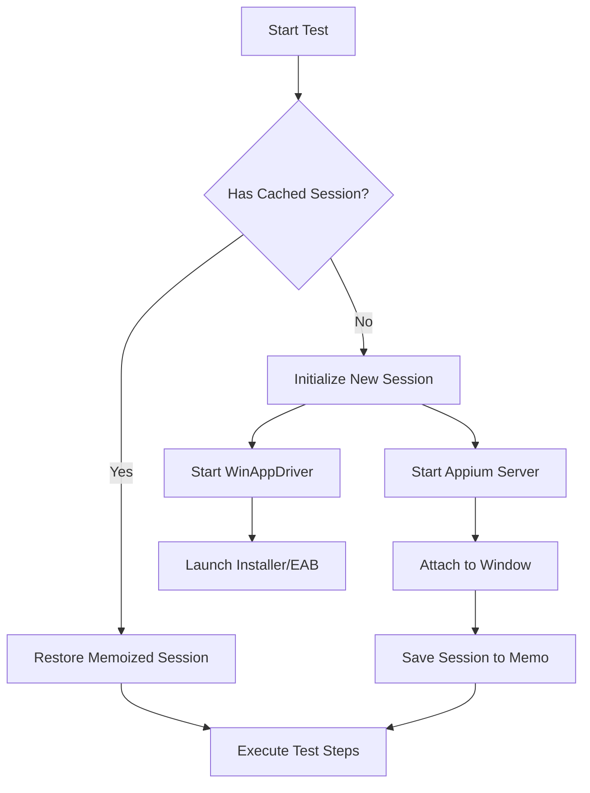

# SAB & Desktop Testing

Testing the Secure Access Browser (SAB) requires a sophisticated orchestration of Native OS drivers and Browser drivers, along with a custom lifecycle to ensure performance and reliability.

## 🚙 Generic Driver Implementation

The framework abstracts the desktop automation through `PlatformDriver` and `CorporateBrowserDriver`.

### Dual-Driver Architecture



### 1. The `PlatformDriver`
Wraps **WinAppDriver** (Windows) or **Appium** (Mac) to control the OS-level windows.
-   **Windows**: Uses `WindowsDriver` to find the "Unity" tray icon or MSI installer window.
-   **macOS**: Wraps `WebDriverIO` connecting to `Appium Mac2 Driver`.

**Initialization Logic:**
The `PlatformDriver` is lazy-loaded via the `TestUser` controller.
```typescript
const desktopPage = await testUser.usePlatformDriverAssistant(
    WinDesktopPage // or MacDesktopPage
);
```
Under the hood, this triggers:
1.  Check for existing driver session (Persistent Mode).
2.  If none, launch `WinAppDriver.exe` (on Windows).
3.  Establish W3C WebDriver session.

## 🏛️ Architecture: The Dual-Driver Model

To automate a Hybrid App like SAB (Native Shell + Web Content), we run two drivers in parallel.

### 1. Platform Driver (Native)
Controls the "Outer Shell": System Tray, Installer Wizards, Permission Dialogs.
-   **Windows**: Wraps `WebDriverIO` connecting to `WinAppDriver`.
-   **macOS**: Wraps `WebDriverIO` connecting to `Appium Mac2 Driver`.

**Initialization Logic:**
The `PlatformDriver` is lazy-loaded via the `TestUser` controller.
```typescript
const desktopPage = await testUser.usePlatformDriverAssistant(
    WinDesktopPage // or MacDesktopPage
);
```
Under the hood, this triggers:
1.  Check for existing driver session (Persistent Mode).
2.  If none, launch `WinAppDriver.exe` (on Windows).
3.  Establish W3C WebDriver session.

### 2. Corporate Browser Driver (Web)
Controls the "Inner Content": The actual browser tabs.
-   **Protocol**: Direct Chrome DevTools Protocol (CDP) connection.
-   **Port**: Fixed port `9222` is used for stability (`--remote-debugging-port=9222`).

## ⚡ Performance: Persistent Session & Memoization

Starting SAB takes 10-20 seconds. To avoid this penalty per test, we use **Persistent Sessions** combined with **State Restoration**.

### The "Memo" Pattern
We use a shared memory store (`LauncherMemo`) attached to the Worker process to track state.

```typescript
// test-playwright-fixtures-eab.ts check
const memo = await testUser.systemController()
    .useEabHandlers()
    .primary()
    .obtainLauncherMemo('initialLogin');

if (!memo) {
   // Do the heavy login ONCE per worker
   await performLogin();
   // Mark as done
   await writeLauncherMemo({ testName: 'initialLogin', flag: true });
}
```

### Data Cache Restoration
Between tests, instead of killing the process, we restore the *data* state.
1.  **Backup**: Upon first successful launch, the `AppData` folder is backed up.
2.  **Restore**: In `afterEach`, we overwrite the current `AppData` with the clean backup.
    -   *Implementation*: `getAppDataFolderUtil().restore()`

## 🎥 Video Recording
We utilize custom driver commands to record the *entire* desktop, not just the browser viewport.

**Windows Implementation:**
```typescript
// Executes a custom command defined in our WinAppDriver extension
driver.executeScript('windows: startRecordingScreen', [{
    videoFilter: 'scale=trunc(iw/2)*2:-2' // ffmpeg scaling
}]);
```

**macOS Implementation:**
Uses native AVFoundation capture via Appium.

## 🐛 Debug Mode
When `EAB_DEBUG=true` is set in the environment:
1.  **Skip Termination**: On test failure, the SAB instance is left open.
2.  **Skip Restore**: State is preserved for manual inspection.
This behavior is controlled in `isDebugMode(testInfo)`.
