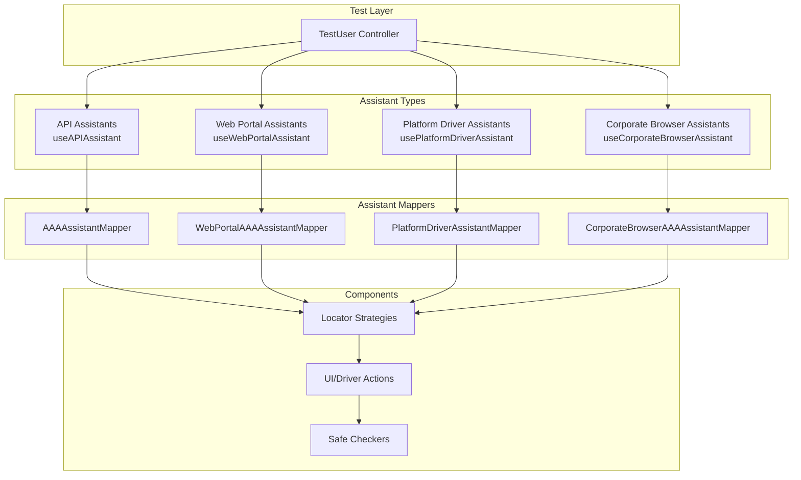
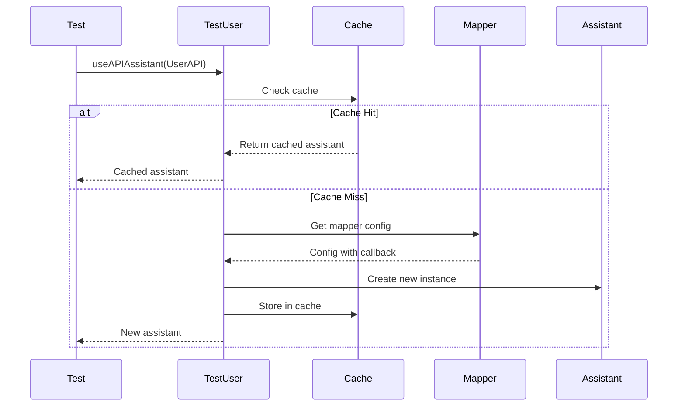

# Test Assistants

## Overview

The framework implements a comprehensive test assistant pattern that provides type-safe, reusable test automation interfaces across all test types. Test assistants follow the AAA (Arrange-Act-Assert) pattern and are automatically managed by the `TestUser` class with intelligent caching and lifecycle management.

## Assistant Architecture



## Assistant Types

### 1. API Assistants

For REST and GraphQL API automation:

```typescript
// Create API assistant
const userAPIAssistant = await testUser.useAPIAssistant<
  UserAPI,
  TAUserAPI
>(UserAPI);

// Use AAA pattern
const user = await userAPIAssistant.arrange.createUser({
  username: 'test@example.com',
  role: 'admin',
});

const response = await userAPIAssistant.actions.getUser(user.id);

await userAPIAssistant.assert.userExists(user.id);
```

**Common API Assistants**:
- `TAUserAPI` - User management
- `TATenantEntryAPI` - Tenant operations
- `TAEmailDomainAPI` - Email domain configuration
- `TAQAWebServerAPI` - QA server utilities

### 2. Web Portal Assistants

For web UI automation using Playwright Page:

```typescript
// Create web portal assistant
const loginPageTA = await testUser.useWebPortalAssistant<
  LoginPage,
  TALoginPage
>(LoginPage, {
  page: page,
});

// Use AAA pattern
await loginPageTA.arrange.navigateToLoginPage();
await loginPageTA.actions.login();
await loginPageTA.assert.loginSuccessful();
```

**Common Web Portal Assistants**:
- `TALoginPage` - Login functionality
- `TADashboardPage` - Dashboard interactions
- `TAUserManagementPage` - User administration

### 3. Platform Driver Assistants

For native OS-level automation:

```typescript
// Create platform driver assistant
const installerTA = await testUser.usePlatformDriverAssistant<
  MSIInstallerPage,
  TAMSIInstallerPage
>(MSIInstallerPage);

// Use AAA pattern
await installerTA.arrange.prepareInstaller();
await installerTA.actions.install();
await installerTA.assert.installationSuccessful();
```

**Common Platform Driver Assistants**:
- `TAMSIInstallerPage` - MSI installation
- `TAMSIXInstallerPage` - MSIX installation
- `TAWinUnityTrayPage` - Windows system tray
- `TAMacUnityTrayPage` - macOS menu bar
- `TAWinDesktopPage` - Windows desktop operations
- `TAMacDesktopPage` - macOS desktop operations

### 4. Corporate Browser Assistants

For web content within Corporate Browser:

```typescript
// Create browser assistant
const appLauncherTA = await testUser.useCorporateBrowserAssistant<
  AppLauncherPage,
  TAAppLauncherPage
>(AppLauncherPage, {
  timeout: 30000,
});

// Use AAA pattern
await appLauncherTA.arrange.ensurePageLoaded();
await appLauncherTA.actions.launchApp('Document Editor');
await appLauncherTA.assert.appLaunched('Document Editor');
```

**Common Corporate Browser Assistants**:
- `TALoginPage` - Corporate Browser login
- `TAAppLauncherPage` - Application launcher
- `TADocumentEditorPage` - Document editing

## Assistant Mappers

Assistant mappers register the relationship between service classes and their AAA assistants:

### AAAAssistantMapper (API)

```typescript
AAAAssistantMapper.getMapper().set(UserAPI, {
  getTACallBackFunction: (options: TTestAAAOptions<UserAPI>) => {
    return {
      arrange: new UserAPIArrange(options.apiService),
      actions: new UserAPIActions(options.apiService),
      assert: new UserAPIAssert(options.apiService),
      helper: {
        getInstance: () => options.apiService,
      },
    };
  },
  gqlEndpoint: 'https://api.example.com/graphql',
  restHost: 'https://api.example.com',
  restApiPath: 'v1',
});
```

### WebPortalAAAAssistantMapper

```typescript
WebPortalAAAAssistantMapper.getMapper().set(LoginPage, {
  getTACallBackFunction: (options: TTestAAAOptions<LoginPage>) => {
    return {
      arrange: new LoginPageArrange(options.instance),
      actions: new LoginPageActions(options.instance),
      assert: new LoginPageAssert(options.instance),
      helper: {
        getInstance: () => options.instance,
      },
    };
  },
  locatorStrategies: webPortalLocatorStrategies,
  uiActions: webPortalUIActions,
});
```

### PlatformDriverAssistantMapper

```typescript
PlatformDriverAssistantMapper.getMapper().set(MSIInstallerPage, {
  getTACallBackFunction: (options: TTestAAAOptions<MSIInstallerPage>) => {
    return {
      arrange: new MSIInstallerArrange(options.instance),
      actions: new MSIInstallerActions(options.instance),
      assert: new MSIInstallerAssert(options.instance),
      helper: {
        getInstance: () => options.instance,
      },
    };
  },
  locatorStrategies: platformDriverLocatorStrategies,
  driverActions: platformDriverActions,
});
```

### CorporateBrowserAAAAssistantMapper

```typescript
CorporateBrowserAAAAssistantMapper.getMapper().set(AppLauncherPage, {
  getTACallBackFunction: (options: TTestAAAOptions<AppLauncherPage>) => {
    return {
      arrange: new AppLauncherArrange(options.instance),
      actions: new AppLauncherActions(options.instance),
      assert: new AppLauncherAssert(options.instance),
      helper: {
        getInstance: () => options.instance,
      },
    };
  },
  locatorStrategies: corporateBrowserLocatorStrategies,
  uiActions: corporateBrowserUIActions,
  pageTitles: [
    { title: 'App Launcher', matchType: 'exact' },
  ],
  safeChecker: async (instance) => {
    // Validate page state
    return { isValid: true };
  },
});
```

## Assistant Lifecycle

### Creation and Caching



### Cache Key Generation

```typescript
private getMapKey(
  t: TApi<T>,
  options?: TUriOptions | TPageOptions
): string {
  // Combine type and options for unique key
  const typeKey = t.name;
  const optionsKey = options 
    ? JSON.stringify(options)
    : '';
  
  return `${typeKey}_${optionsKey}`;
}
```

### Cache Invalidation

Assistants are invalidated when their underlying drivers are reset:

```typescript
// Platform driver assistant validation
async usePlatformDriverAssistant<T, TAAA>(
  t: TUserPlatformDriver<T>
): Promise<TAAA> {
  const cachedAssistant = this.notes.get(mapKey);
  
  if (cachedAssistant) {
    try {
      const platformDriver = await this.systemController()
        .getPlatformDriver();
      
      const cachedDriver = await cachedAssistant.helper
        .getInstance()
        .getPlatformDriver();
      
      // Validate driver IDs match
      if (platformDriver.getId() === cachedDriver.getId()) {
        return cachedAssistant; // Valid cache
      }
    } catch (error) {
      // Driver was reset, cache invalid
      utilManager.logger().debug.log(
        `Cached assistant invalid: ${error.message}`
      );
    }
  }
  
  // Reinitialize assistant
  this.notes.delete(mapKey);
  return await this.createNewAssistant(t);
}
```

## Assistant Components

### Locator Strategies

Reusable locator patterns for finding elements:

```typescript
type TLocatorStrategies = {
  // By test ID
  byTestId: (testId: string) => Locator;
  
  // By role
  byRole: (role: string, options?: { name?: string }) => Locator;
  
  // By text
  byText: (text: string, options?: { exact?: boolean }) => Locator;
  
  // By placeholder
  byPlaceholder: (placeholder: string) => Locator;
  
  // Custom locators
  custom: (selector: string) => Locator;
};
```

**Usage**:
```typescript
class LoginPageArrange {
  constructor(
    private page: Page,
    private locators: TLocatorStrategies
  ) {}
  
  async navigateToLoginPage() {
    await this.page.goto('/login');
    
    // Use locator strategy
    const loginButton = this.locators.byTestId('login-button');
    await loginButton.waitFor();
  }
}
```

### UI Actions

Common UI interaction patterns:

```typescript
type TUIActions = {
  // Click with retry
  click: (locator: Locator, options?: ClickOptions) => Promise<void>;
  
  // Fill with clear
  fill: (locator: Locator, value: string) => Promise<void>;
  
  // Select option
  select: (locator: Locator, value: string) => Promise<void>;
  
  // Wait for element
  waitFor: (locator: Locator, state?: 'visible' | 'hidden') => Promise<void>;
  
  // Scroll into view
  scrollIntoView: (locator: Locator) => Promise<void>;
};
```

### Driver Actions

Platform-specific actions for native automation:

```typescript
type TDriverActions = {
  // Click native element
  clickNative: (selector: string) => Promise<void>;
  
  // Type text
  typeText: (selector: string, text: string) => Promise<void>;
  
  // Wait for native element
  waitForNative: (selector: string, timeout?: number) => Promise<void>;
  
  // Get element attribute
  getAttribute: (selector: string, attribute: string) => Promise<string>;
};
```

### Safe Checkers

Validate page state before operations:

```typescript
type TSafeChecker<T> = (instance: T) => Promise<TBrowserPageChecker>;

type TBrowserPageChecker = {
  isValid: boolean;
  reason?: string;
  pageTitle?: string;
  pageUrl?: string;
};

// Example safe checker
const appLauncherSafeChecker: TSafeChecker<AppLauncherPage> = async (instance) => {
  const page = instance.getPage();
  const title = await page.title();
  
  if (title !== 'App Launcher') {
    return {
      isValid: false,
      reason: `Expected 'App Launcher' but got '${title}'`,
      pageTitle: title,
    };
  }
  
  return { isValid: true, pageTitle: title };
};
```

## Cross-App Usage

### API Assistants in Web Portal Tests

```typescript
// Web portal test using API assistant for setup
test('User management', async ({ adminUser, page }) => {
  // Use API to create test data
  const userAPI = await adminUser.useAPIAssistant<UserAPI, TAUserAPI>(UserAPI);
  const user = await userAPI.arrange.createUser({
    username: 'test@example.com',
  });
  
  // Use web portal to verify
  const userPageTA = await adminUser.useWebPortalAssistant<
    UserManagementPage,
    TAUserManagementPage
  >(UserManagementPage, { page });
  
  await userPageTA.assert.userVisible(user.username);
});
```

### Platform Driver Assistants in SAB Tests

```typescript
// SAB test using both platform and browser assistants
test('SAB installation and login', async ({ adminUser }) => {
  // Use platform driver for installation
  const installerTA = await adminUser.usePlatformDriverAssistant<
    MSIInstallerPage,
    TAMSIInstallerPage
  >(MSIInstallerPage);
  
  await installerTA.actions.install();
  
  // Use browser assistant for login
  const loginTA = await adminUser.useCorporateBrowserAssistant<
    LoginPage,
    TALoginPage
  >(LoginPage);
  
  await loginTA.actions.login();
});
```

### Shared Utility Assistants

```typescript
// QA Web Server API used across test types
const qaServerAPI = await adminUser.useAPIAssistant<
  QAWebServerAPIManager,
  TAQAWebServerAPI
>(QAWebServerAPIManager);

// Get SAB build information
const buildInfo = await qaServerAPI.actions.getSABBuildInfo();

// Download SAB installer
const installerPath = await qaServerAPI.actions.downloadSABInstaller(
  buildInfo.tagName
);
```

## Best Practices

### 1. Use Type-Safe Assistants

```typescript
// ✅ Good - Type-safe
const userAPI = await testUser.useAPIAssistant<UserAPI, TAUserAPI>(UserAPI);
const user = await userAPI.actions.getUser(userId); // Type-safe

// ❌ Avoid - Untyped
const userAPI = await testUser.useAPIAssistant(UserAPI);
const user = await userAPI.actions.getUser(userId); // No type safety
```

### 2. Follow AAA Pattern

```typescript
// ✅ Good - Clear AAA separation
await assistant.arrange.setupTestData();
await assistant.actions.performOperation();
await assistant.assert.verifyResult();

// ❌ Avoid - Mixed concerns
await assistant.setupAndPerformAndVerify();
```

### 3. Leverage Caching

```typescript
// ✅ Good - Reuse cached assistant
const userAPI = await testUser.useAPIAssistant<UserAPI, TAUserAPI>(UserAPI);
await userAPI.actions.createUser(user1);
await userAPI.actions.createUser(user2); // Same cached instance

// ❌ Avoid - Recreating assistants
for (const user of users) {
  const userAPI = await testUser.useAPIAssistant<UserAPI, TAUserAPI>(UserAPI);
  await userAPI.actions.createUser(user); // Unnecessary recreation
}
```

### 4. Handle Assistant Invalidation

```typescript
// Platform driver reset invalidates assistants
await testUser.systemController().resetPlatformDriver();

// Next call creates new assistant with new driver
const installerTA = await testUser.usePlatformDriverAssistant(
  MSIInstallerPage
); // New instance created
```

## Related Documentation

- [AAA Pattern](./aaa-pattern.md) - TestUser and AAA pattern details
- [Drivers](./drivers.md) - Platform and browser driver architecture
- [Fixtures](./fixtures.md) - Assistant lifecycle in different modes
- [API Testing](./api-testing.md) - API assistant patterns
- [SAB Testing](./sab-testing.md) - SAB-specific assistants
