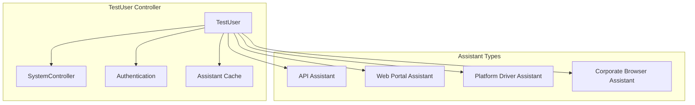
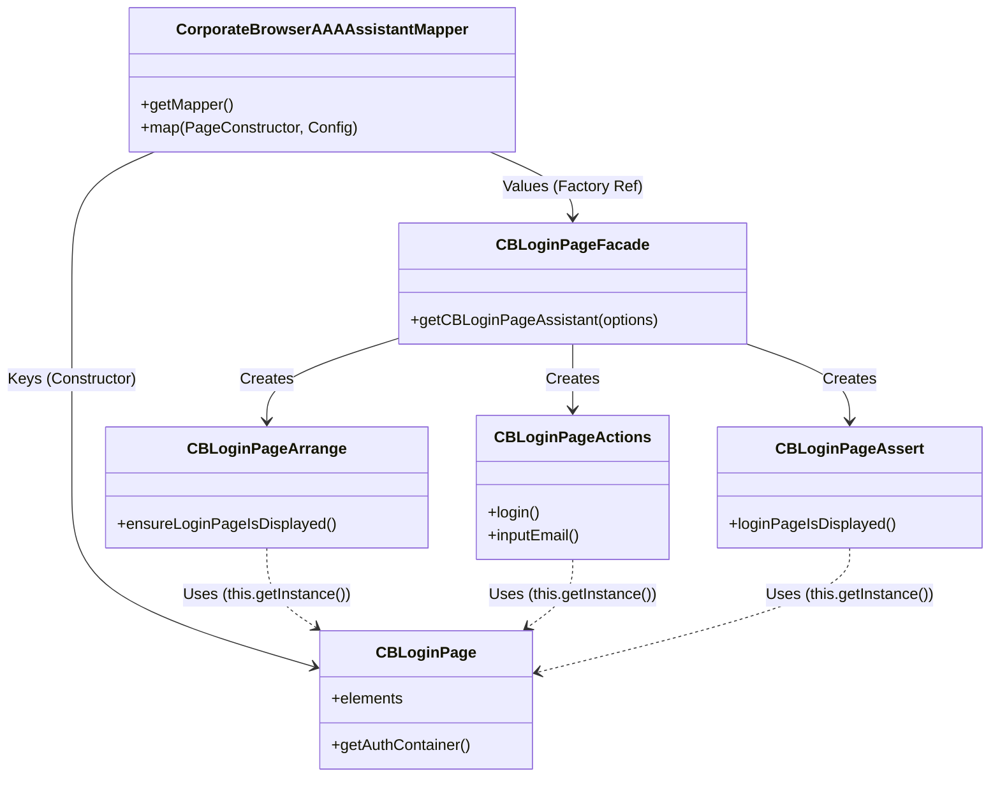

# Test Assistants & The AAA Pattern

## 🎯 Overview & Philosophy

The framework utilizes a strict **Arrange-Act-Assert (AAA)** pattern, enforced structurally through Page Objects and Controllers. This ensures a clear separation of concerns:
- **Arrange**: Setup test data, navigate to pages, or prepare the environment.
- **Act**: Execute the specific user interaction or API call.
- **Assert**: Verify the results against expected outcomes.

All test automation capabilities are delivered through **Test Assistants**, which are automatically managed by the `TestUser` controller with intelligent caching and lifecycle management.

---

## 👤 The `TestUser` Controller

The `TestUser` class is the central orchestrator. It acts as a gateway to all testing interfaces (API, Web, Desktop).

### Architecture


### Core Responsibilities
| Responsibility        | Description                                                      |
| :-------------------- | :--------------------------------------------------------------- |
| **Identity**          | Manages username, password, role, and metadata.                  |
| **Authentication**    | Handles Cognito sessions and automatic token refresh.            |
| **Assistant Factory** | Creates, injects dependencies into, and caches assistants.       |
| **System Control**    | Provides access to underlying drivers (Playwright, Appium, CDP). |

---

## 🛠️ The Four Assistant Types

### 1. API Assistants
Used for REST and GraphQL automation.
```typescript
const userAPI = await testUser.useAPIAssistant<UserAPI, TAUserAPI>(UserAPI);

// AAA Flow
const user = await userAPI.arrange.createUser({ username: 'test@example.com' });
const response = await userAPI.actions.getUser(user.id);
await userAPI.assert.userExists(user.id);
```

### 2. Web Portal Assistants
For standard browser UI automation using Playwright `Page`.
```typescript
const loginPage = await testUser.useWebPortalAssistant<LoginPage, TALoginPage>(LoginPage, { page });

// AAA Flow
await loginPage.arrange.navigateToLoginPage();
await loginPage.actions.login();
await loginPage.assert.loginSuccessful();
```

### 3. Platform Driver Assistants
For native OS-level automation (Windows/macOS) via the Platform Driver.
```typescript
const installer = await testUser.usePlatformDriverAssistant<MSIInstallerPage, TAMSIInstallerPage>(MSIInstallerPage);

// AAA Flow
await installer.arrange.prepareInstaller();
await installer.actions.install();
await installer.assert.installationSuccessful();
```

### 4. Corporate Browser Assistants
For web content within the Corporate Browser (utilizing CDP).
```typescript
const appLauncher = await testUser.useCorporateBrowserAssistant<AppLauncherPage, TAAppLauncherPage>(AppLauncherPage);

// AAA Flow
await appLauncher.arrange.ensurePageLoaded();
await appLauncher.actions.launchApp('Safe Space');
await appLauncher.assert.appLaunched('Safe Space');
```

---

### High-Level Architecture

The feature-aaa library follows a layered architecture with clear separation of concerns:

```
┌───────────────────────────────────────────────────────────────────────────────────────┐
│                                     Test Script                                       │
│                                (Test Implementation)                                  │
└──────────────────────────────────────────┬────────────────────────────────────────────┘
                                           │
                                           ▼
┌───────────────────────────────────────────────────────────────────────────────────────┐
│                                     TestUser                                          │
│  ┌─────────────────────────────────────────────────────────────────────────────────┐  │
│  │  • User credentials & session management                                        │  │
│  │  • Assistant methods                                                            │  │
│  │  • Notes (assistant cache)                                                      │  │
│  │  • System controller access                                                     │  │
│  └─────────────────────────────────────────────────────────────────────────────────┘  │
└───────────┬──────────────┬───────────────┬──────────────────────┬─────────────────────┘
            │              │               │                      │
    ┌───────▼──────┐ ┌─────▼───────┐ ┌─────▼──────────┐ ┌─────────▼──────────┐
    │     API      │ │    Web      │ │CorporateBrowser│ │   Platform Driver  │
    │  Assistant   │ │   Portal    │ │   Assistant    │ │     Assistant      │
    │              │ │  Assistant  │ │                │ │                    │
    │              │ │             │ │                │ │                    │
    └───────┬──────┘ └─────┬───────┘ └───────┬────────┘ └─────────┬──────────┘
            │              │                 │                    │
    ┌───────▼──────────────▼─────────────────▼────────────────────▼────────────┐
    │                             Mapper Layer                                 │
    │  ┌──────────┐  ┌──────────┐     ┌──────────┐          ┌──────────┐       │
    │  │   API    │  │   Web    │     │Corporate │          │ Platform │       │
    │  │ Mapper   │  │  Portal  │     │Browser   │          │  Driver  │       │
    │  │          │  │  Mapper  │     │ Mapper   │          │  Mapper  │       │
    │  └────┬─────┘  └────┬─────┘     └────┬─────┘          └────┬─────┘       │
    └───────┼─────────────┼────────────────┼─────────────────────┼─────────────┘
            │             │                │                     │
    ┌───────▼─────────────▼────────────────▼─────────────────────▼─────────────┐
    │                            Assistant Layer                               │
    │  ┌──────────┐  ┌──────────┐  ┌──────────┐                                │
    │  │ Arrange  │  │ Actions  │  │  Assert  │                                │
    │  │          │  │          │  │          │                                │
    │  └──────────┘  └──────────┘  └──────────┘                                │
    └──────────────────────────────────────────────────────────────────────────┘
            │             │                │                     │
    ┌───────▼─────────────▼────────────────▼─────────────────────▼─────────────┐
    │                          Service/Page Layer                              │
    │  ┌──────────┐  ┌──────────┐     ┌──────────┐          ┌──────────┐       │
    │  │   API    │  │   Page   │     │Corporate │          │ Desktop  │       │
    │  │ Clients  │  │ Objects  │     │Browser   │          │  Page    │       │
    │  │ (HTTPS)  │  │(BasePage)│     │Page Model│          │ Objects  │       │
    │  └──────────┘  └──────────┘     └──────────┘          └──────────┘       │
    └──────────────────────────────────────────────────────────────────────────┘
```

---

The `corporate-browser` module implements a structured **Page Object Model (POM)** enhanced with the **AAA (Arrange-Act-Assert)** pattern. This architecture decouples element definition (Page Object) from test logic (AAA Assistant), coordinated by a Facade and registered via a Config Mapper.

### Architectural Overview

1.  **Page Object (`pageObjectManager/`)**: Responsible *only* for defining DOM elements and low-level element retrieval. It knows "what" is on the page but not "how" to test it.
2.  **AAA Assistant (`assistant/`)**: Contains the business logic, split into three specialized classes:
    *   **Arrange**: Setup steps (e.g., ensure page is loaded, set default domain).
    *   **Act**: User interactions (e.g., perform login, click buttons).
    *   **Assert**: Verifications (e.g., check error messages, verify redirection).
3.  **Facade**: A factory that bundles the Arrange, Act, and Assert instances into a single "Assistant" object.
4.  **Config Mapper**: A registry that links a Page Object class to its corresponding Assistant factory and configuration (like resilience checks).

### Dependency Diagram



### Component Details & Code Snippets

#### 1. The Config Mapper
Located in `config-aaa-assistant-mapper.ts`, this file registers the relationship between the Page Object class and its Assistant factory. It effectively tells the framework: *"When I have an `CBLoginPage`, use `getCBLoginPageAssistant` to control it."*

```typescript
// libs/shared/feature-aaa/src/lib/eab/corporate-browser/config-aaa-assistant-mapper.ts
// ... imports ...

// Type for the mapper data
export type TMapperData = {
  getTACallBackFunction: (args: any) => any;
  locatorStrategies: TLocatorStrategies;
  uiActions: TUIActions;
  pageTitles?: TPageTitleChecker[];
  safeChecker?: (args: any) => any;
};

// The mapper
const mapper: Map<
  TConstructor<unknown>,
  TMapperData
> = new Map();

export const CorporateBrowserAAAAssistantMapper = {
  getMapper: () => {
    // ...
    mapper.set(CBLoginPage, {
      getTACallBackFunction: getCBLoginPageAssistant, // The Facade Factory
      locatorStrategies,
      uiActions: actions,
      pageTitles: [TEnumValuesPageTitleChecker.LoginPage],
      safeChecker: loginPageSafeChecker, // Resilience logic
    });
    // ...
    return mapper;
  },
};
```

#### 2. The Facade
Located in `assistant/loginPage/cb-loginPage-facade.ts`, this serves as the entry point. It receives the test options (including the Page Object instance) and instantiates the AAA classes.

```typescript
// libs/shared/feature-aaa/src/lib/eab/corporate-browser/assistant/loginPage/cb-loginPage-facade.ts
import { CBLoginPageActions } from './cb-loginPage-actions';
import { CBLoginPageArrange } from './cb-loginPage-arrange';
import { CBLoginPageAssert } from './cb-loginPage-assert';

export const getCBLoginPageAssistant = (
  testAAAOptions: TTestAAAOptions<CBLoginPage>,
): TACBLoginPage => {
  const arrange = new CBLoginPageArrange(testAAAOptions);
  return {
    arrange: arrange,
    actions: new CBLoginPageActions(testAAAOptions),
    assert: new CBLoginPageAssert(testAAAOptions),
    helper: arrange,
  };
};
```

#### 3. Arrange, Act, Assert Classes
These classes extend `TestAAA` (or a Mixin), which gives them access to the Page Object instance via `this.getInstance()`.

**Arrange** (`cb-loginPage-arrange.ts`):
```typescript
// libs/shared/feature-aaa/src/lib/eab/corporate-browser/assistant/loginPage/cb-loginPage-arrange.ts
export class CBLoginPageArrange extends CBPageArrangeMixin<...>(BaseClassCBLoginPage) {
  @Step()
  async ensureLoginPageIsDisplayed() {
    // Access page object methods/elements
    const page = this.getInstance().getPage();
    // Logic to set local storage, check environment, etc.
  }
}
```

**Act** (`cb-loginPage-actions.ts`):
```typescript
// libs/shared/feature-aaa/src/lib/eab/corporate-browser/assistant/loginPage/cb-loginPage-actions.ts
export class CBLoginPageActions extends CBPageActionsMixin<...>(BaseClassCBLoginPage) {
  @Step()
  async login() {
    await this.inputEmail();
    await this.clickContinueButton();
    await this.inputPassword();
    await this.clickContinueButton();
  }

  @Step()
  async inputEmail(email: string = ...) {
    // Uses elements defined in the Page Object
    await this.getInstance().uiActions.fill.inputField.perform(
      this.getInstance().elements.authContainer.content().form().email,
      { text: email },
    );
  }
}
```

**Assert** (`cb-loginPage-assert.ts`):
```typescript
// libs/shared/feature-aaa/src/lib/eab/corporate-browser/assistant/loginPage/cb-loginPage-assert.ts
export class CBLoginPageAssert extends CBPageAssertMixin<...>(BaseClassCBLoginPage) {
  @Step()
  async loginPageIsDisplayed() {
    await expect.soft(
        this.getInstance().elements.authContainer.itself.getLocator(),
        'Login form should be displayed',
      ).toBeVisible();
  }
}
```

#### 4. The Page Object
Located in `pageObjectManager/cb-loginPage.ts`, it purely defines the structure of the page using `MiscElement`.

```typescript
// libs/shared/feature-aaa/src/lib/eab/corporate-browser/pageObjectManager/cb-loginPage.ts
export class CBLoginPage extends BasePage<TCBLoginPageElements> implements IElements {
  initializeElements() {
    this.elements = {
      authContainer: this.getAuthContainer(),
      // ...
    };
  }

  private getAuthContainer() {
    // Define element selectors only
    const container = new MiscElement(
      this.page,
      'article[class*="Auth_"]',
      this.locatorStrategies.byLocator,
    );
    // ... hierarchy definitions ...
    return { itself: container, /* ... children */ };
  }
}
```

### How It Works Together

1.  **Initialization**: The test framework identifies it needs the `CBLoginPage`.
2.  **Lookup**: It queries `CorporateBrowserAAAAssistantMapper` using the `CBLoginPage` class.
3.  **Instantiation**: It retrieves the config, finds the `getTACallBackFunction` (the Facade), and executes it, passing the initialized `CBLoginPage` instance.
4.  **Usage**: The test now has an object with `.arrange`, `.actions`, and `.assert` properties.
    *   Calling `actions.login()` executes logic in `CBLoginPageActions`.
    *   That action internally calls `this.getInstance().elements...` to get the DOM locator from `CBLoginPage`.
    *   It then performs the Playwright interaction on that locator.

---

## 🧰 Core Toolset

Test Assistants rely on standardized components to ensure consistent behavior:

- **Locator Strategies**: Centralized selector logic (e.g., `byTestId`, `byRole`, `byAria`).
- **UI/Driver Actions**: Standardized interaction methods with built-in retries, logging via `@Step` decorators, and Report Portal integration.
- **Safe Checkers**: Validation logic run during initialization to ensure the environment/page is in a ready state.

---

## ⛓️ Related Documentation
- [Test User Management](./test-user-management.md) - TestUser lifecycle and account pooling
- [Token Management](./token-management.md) - Authentication and token refresh
- [Drivers](./drivers.md) - Platform and Corporate Browser driver architecture
- [Fixtures](./fixtures.md) - Isolated vs persistent session modes
