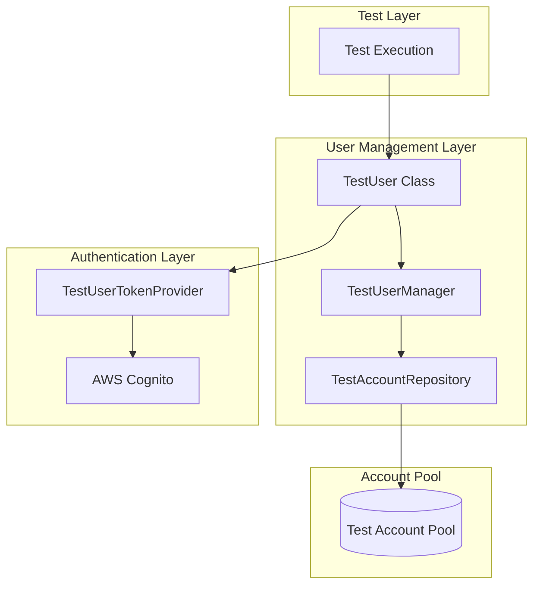
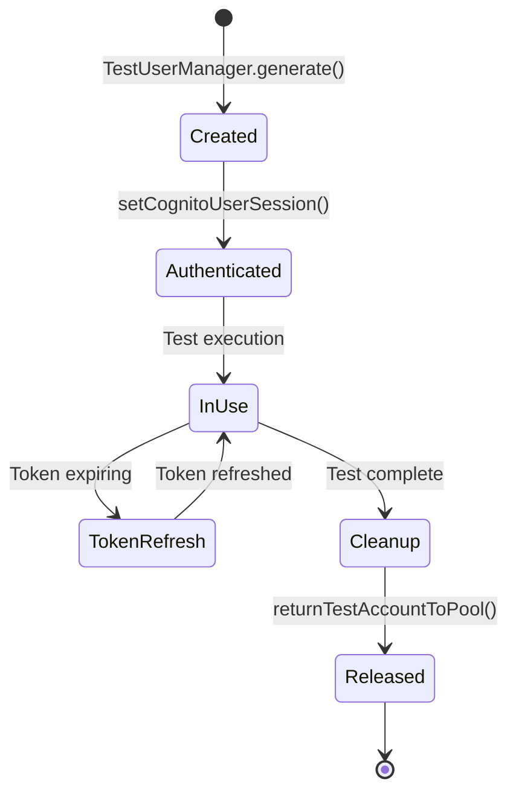

# Test User Management

## Overview

The framework implements a sophisticated test user management system that handles user lifecycle, authentication, and account pooling. This system ensures efficient test execution by managing a shared pool of test accounts and providing clean user state for each test.

## Architecture



## TestUser Class

The `TestUser` class represents a test actor with authentication, assistants, and system control capabilities:

### Core Properties

```typescript
export class TestUser {
  // Identity
  username!: string;
  password: string = '';
  userType: TEnumUserRole = TEnumUserRole.USER;
  alias?: string;
  subDomainName?: string;
  
  // Authentication
  private cognitoUserSession?: CognitoUserSession;
  private cognitoAuthInfo?: TCognitoAuthInfo;
  
  // Metadata
  metadata: TUserMetaData = {
    accessRoleIds: [],
    isMagicLinkTurnOn: false,
    invitationCode: undefined,
    isCognitoUser: false,
    status: undefined,
  };
  
  // Internal state
  private notes: Map<unknown, unknown> = new Map();
  private controller: SystemController;
}
```

### User Lifecycle



### Authentication Management

```typescript
class TestUser {
  // Set/refresh Cognito session
  async setCognitoUserSession(): Promise<void> {
    const session = await cognitoAuthorizationForUser({
      username: this.username,
      password: this.password,
    });
    
    this.cognitoUserSession = session;
    this.setAuthResult(session);
  }
  
  // Get current auth info
  getCognitoAuthInfo(): TCognitoAuthInfo {
    if (!this.cognitoAuthInfo) {
      throw new Error('CognitoAuthInfo not available');
    }
    return this.cognitoAuthInfo;
  }
  
  // Check if token is expiring
  isTokenExpiring(): boolean {
    if (!this.cognitoAuthInfo) return true;
    
    const expiryTime = this.cognitoAuthInfo.expiresAt;
    const now = Date.now();
    const bufferMs = 5 * 60 * 1000; // 5 minutes
    
    return (expiryTime - now) < bufferMs;
  }
  
  // Set auth result from session
  private setAuthResult(session: CognitoUserSession): void {
    const idToken = session.getIdToken();
    const accessToken = session.getAccessToken();
    const refreshToken = session.getRefreshToken();
    
    this.cognitoAuthInfo = {
      idToken: idToken.getJwtToken(),
      accessToken: accessToken.getJwtToken(),
      refreshToken: refreshToken.getToken(),
      expiresAt: idToken.getExpiration() * 1000, // Convert to ms
    };
  }
}
```

### System Controller Integration

```typescript
class TestUser {
  // Get system controller
  systemController(): SystemController {
    if (!this.controller) {
      this.controller = new SystemController(this);
    }
    return this.controller;
  }
  
  // Return account to pool
  async returnTestAccountToPool(): Promise<void> {
    await TestAccountRepository.release(this);
  }
}
```

## TestUserManager

The `TestUserManager` provides factory methods for creating test users:

### User Generation

```typescript
export class TestUserManager {
  // Generate user with specific role
  static async generate(options: {
    role: TEnumUserRole;
    subDomain?: string;
    alias?: string;
  }): Promise<TestUser> {
    // Acquire account from repository
    const account = await TestAccountRepository.acquire({
      role: options.role,
    });
    
    // Create TestUser instance
    const testUser = new TestUser();
    testUser.username = account.username;
    testUser.password = account.password;
    testUser.userType = options.role;
    testUser.alias = options.alias;
    testUser.subDomainName = options.subDomain;
    
    // Initialize Cognito session
    await testUser.setCognitoUserSession();
    
    return testUser;
  }
  
  // Generate admin user
  static async generateAdmin(options?: {
    subDomain?: string;
    alias?: string;
  }): Promise<TestUser> {
    return await this.generate({
      role: TEnumUserRole.ADMIN,
      ...options,
    });
  }
  
  // Generate regular user
  static async generateUser(options?: {
    subDomain?: string;
    alias?: string;
  }): Promise<TestUser> {
    return await this.generate({
      role: TEnumUserRole.USER,
      ...options,
    });
  }
  
  // Generate viewer user
  static async generateViewer(options?: {
    subDomain?: string;
    alias?: string;
  }): Promise<TestUser> {
    return await this.generate({
      role: TEnumUserRole.VIEWER,
      ...options,
    });
  }
}
```

### Usage in Tests

```typescript
// Generate admin user
const adminUser = await TestUserManager.generateAdmin({
  alias: 'test-admin',
});

// Use in test
const userAPI = await adminUser.useAPIAssistant<UserAPI, TAUserAPI>(UserAPI);
await userAPI.actions.createUser({ username: 'new@example.com' });

// Cleanup
await adminUser.returnTestAccountToPool();
```

## TestAccountRepository

The `TestAccountRepository` manages a pool of test accounts:

### Account Pool Management

```typescript
export class TestAccountRepository {
  private static accountPool: Map<TEnumUserRole, TestAccount[]> = new Map();
  private static inUseAccounts: Set<string> = new Set();
  
  // Initialize pool
  static async initialize(): Promise<void> {
    // Load accounts from configuration
    const accounts = await this.loadAccountsFromConfig();
    
    // Organize by role
    for (const account of accounts) {
      const roleAccounts = this.accountPool.get(account.role) || [];
      roleAccounts.push(account);
      this.accountPool.set(account.role, roleAccounts);
    }
    
    utilManager.logger().info.log(
      `Initialized account pool with ${accounts.length} accounts`
    );
  }
  
  // Acquire account from pool
  static async acquire(options: {
    role: TEnumUserRole;
  }): Promise<TestAccount> {
    const roleAccounts = this.accountPool.get(options.role);
    
    if (!roleAccounts || roleAccounts.length === 0) {
      throw new Error(`No accounts available for role: ${options.role}`);
    }
    
    // Find available account
    const availableAccount = roleAccounts.find(
      account => !this.inUseAccounts.has(account.username)
    );
    
    if (!availableAccount) {
      throw new Error(
        `All accounts for role ${options.role} are in use`
      );
    }
    
    // Mark as in use
    this.inUseAccounts.add(availableAccount.username);
    
    utilManager.logger().debug.log(
      `Acquired account: ${availableAccount.username}`
    );
    
    return availableAccount;
  }
  
  // Release account back to pool
  static async release(testUser: TestUser): Promise<void> {
    this.inUseAccounts.delete(testUser.username);
    
    utilManager.logger().debug.log(
      `Released account: ${testUser.username}`
    );
  }
  
  // Get pool statistics
  static getPoolStats(): {
    total: number;
    inUse: number;
    available: number;
    byRole: Map<TEnumUserRole, { total: number; inUse: number }>;
  } {
    let total = 0;
    const byRole = new Map<TEnumUserRole, { total: number; inUse: number }>();
    
    for (const [role, accounts] of this.accountPool.entries()) {
      const roleTotal = accounts.length;
      const roleInUse = accounts.filter(
        account => this.inUseAccounts.has(account.username)
      ).length;
      
      total += roleTotal;
      byRole.set(role, {
        total: roleTotal,
        inUse: roleInUse,
      });
    }
    
    return {
      total,
      inUse: this.inUseAccounts.size,
      available: total - this.inUseAccounts.size,
      byRole,
    };
  }
}
```

### Account Configuration

```typescript
// config/test-accounts.json
{
  "accounts": [
    {
      "username": "admin1@example.com",
      "password": "${SHARED_PASSWORD}",
      "role": "ADMIN"
    },
    {
      "username": "admin2@example.com",
      "password": "${SHARED_PASSWORD}",
      "role": "ADMIN"
    },
    {
      "username": "user1@example.com",
      "password": "${SHARED_PASSWORD}",
      "role": "USER"
    },
    {
      "username": "viewer1@example.com",
      "password": "${SHARED_PASSWORD}",
      "role": "VIEWER"
    }
  ]
}
```

### Pool Initialization

```typescript
// In globalSetup
export default async function globalSetup() {
  // Initialize test account repository
  await TestAccountRepository.initialize();
  
  // Log pool statistics
  const stats = TestAccountRepository.getPoolStats();
  utilManager.logger().info.log(
    `Account pool initialized: ${stats.total} total, ${stats.available} available`
  );
}
```

## Fixture Integration

### Playwright Fixtures

```typescript
// Base fixtures with user management
export const test = base.extend<{
  adminUser: TestUser;
  regularUser: TestUser;
}>({
  // Admin user fixture
  adminUser: async ({}, use) => {
    const user = await TestUserManager.generateAdmin();
    
    try {
      await use(user);
    } finally {
      await user.returnTestAccountToPool();
    }
  },
  
  // Regular user fixture
  regularUser: async ({}, use) => {
    const user = await TestUserManager.generateUser();
    
    try {
      await use(user);
    } finally {
      await user.returnTestAccountToPool();
    }
  },
});
```

### Usage in Tests

```typescript
test('User management test', async ({ adminUser, regularUser }) => {
  // Admin creates user
  const userAPI = await adminUser.useAPIAssistant<UserAPI, TAUserAPI>(UserAPI);
  await userAPI.actions.createUser({
    username: regularUser.username,
  });
  
  // Regular user verifies access
  const dashboardTA = await regularUser.useWebPortalAssistant<
    DashboardPage,
    TADashboardPage
  >(DashboardPage, { page });
  
  await dashboardTA.assert.dashboardAccessible();
});
```

## User Metadata Management

### Metadata Structure

```typescript
type TUserMetaData = {
  accessRoleIds: string[];
  isMagicLinkTurnOn: boolean;
  invitationCode?: string;
  isCognitoUser: boolean;
  status?: 'active' | 'inactive' | 'pending';
};
```

### Metadata Operations

```typescript
class TestUser {
  // Update metadata
  updateMetadata(updates: Partial<TUserMetaData>): void {
    this.metadata = {
      ...this.metadata,
      ...updates,
    };
  }
  
  // Check if user has role
  hasRole(roleId: string): boolean {
    return this.metadata.accessRoleIds.includes(roleId);
  }
  
  // Add role
  addRole(roleId: string): void {
    if (!this.hasRole(roleId)) {
      this.metadata.accessRoleIds.push(roleId);
    }
  }
  
  // Remove role
  removeRole(roleId: string): void {
    this.metadata.accessRoleIds = this.metadata.accessRoleIds.filter(
      id => id !== roleId
    );
  }
}
```

## Best Practices

### 1. Always Return Accounts to Pool

```typescript
// ✅ Good - Account returned in finally
const user = await TestUserManager.generateAdmin();
try {
  await performTest(user);
} finally {
  await user.returnTestAccountToPool();
}

// ❌ Avoid - Account not returned on error
const user = await TestUserManager.generateAdmin();
await performTest(user); // May throw
await user.returnTestAccountToPool(); // Never called
```

### 2. Use Fixtures for Automatic Cleanup

```typescript
// ✅ Good - Fixture handles cleanup
test('My test', async ({ adminUser }) => {
  // Use adminUser
  // Cleanup automatic
});

// ❌ Avoid - Manual management
test('My test', async ({}) => {
  const user = await TestUserManager.generateAdmin();
  // Use user
  // Must remember to cleanup
});
```

### 3. Monitor Pool Usage

```typescript
// Log pool statistics periodically
const stats = TestAccountRepository.getPoolStats();
utilManager.logger().info.log(
  `Pool stats: ${stats.inUse}/${stats.total} in use`
);

// Alert if pool is exhausted
if (stats.available === 0) {
  utilManager.logger().error.log('Account pool exhausted!');
}
```

### 4. Handle Account Exhaustion

```typescript
// ✅ Good - Handle exhaustion gracefully
try {
  const user = await TestAccountRepository.acquire({
    role: TEnumUserRole.ADMIN,
  });
} catch (error) {
  if (error.message.includes('in use')) {
    // Wait and retry
    await new Promise(resolve => setTimeout(resolve, 5000));
    return await TestAccountRepository.acquire({
      role: TEnumUserRole.ADMIN,
    });
  }
  throw error;
}
```

## Troubleshooting

### Common Issues

| Issue                       | Cause                   | Solution                                       |
| --------------------------- | ----------------------- | ---------------------------------------------- |
| **Account pool exhausted**  | Too many parallel tests | Increase account pool or reduce parallelism    |
| **Account not released**    | Missing cleanup         | Use fixtures or try-finally blocks             |
| **Authentication failures** | Invalid credentials     | Verify SHARED_PASSWORD environment variable    |
| **Token expired**           | Long-running test       | Token auto-refreshes via TestUserTokenProvider |

### Debug Logging

```typescript
// Log account acquisition
utilManager.logger().debug.log(
  `Acquiring account for role: ${role}`
);

// Log pool statistics
const stats = TestAccountRepository.getPoolStats();
utilManager.logger().debug.log(
  `Pool stats: ${JSON.stringify(stats, null, 2)}`
);

// Log user authentication
utilManager.logger().debug.log(
  `User authenticated: ${testUser.username}`
);
```

## Related Documentation

- [AAA Pattern](./aaa-pattern.md) - TestUser and assistant patterns
- [Token Management](./token-management.md) - Authentication and token refresh
- [Fixtures](./fixtures.md) - User fixtures and lifecycle
- [Global Setup](./global-setup.md) - Account pool initialization
