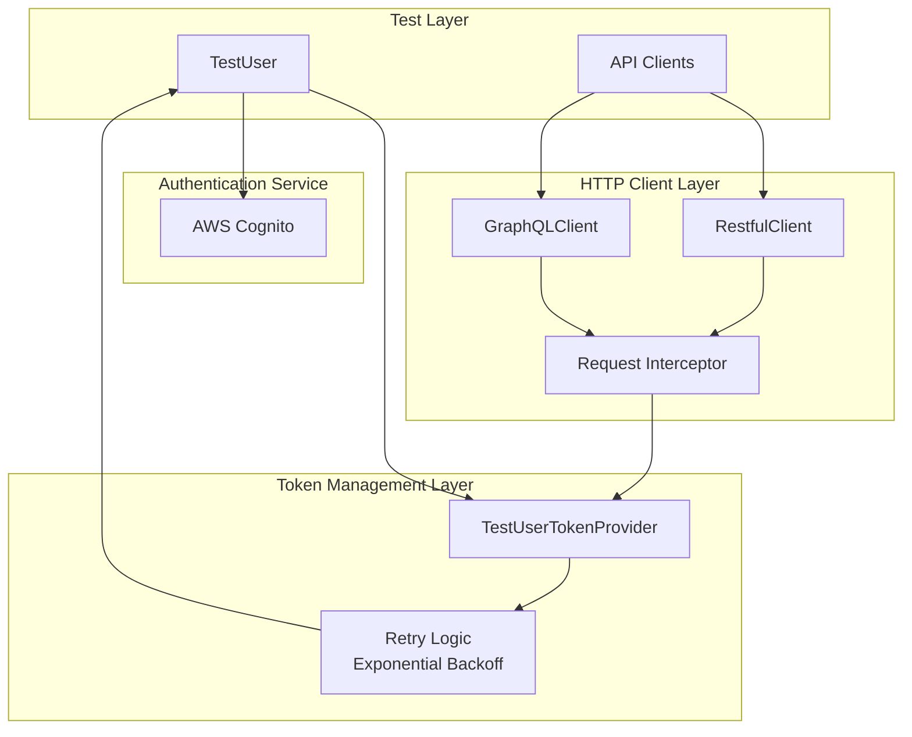
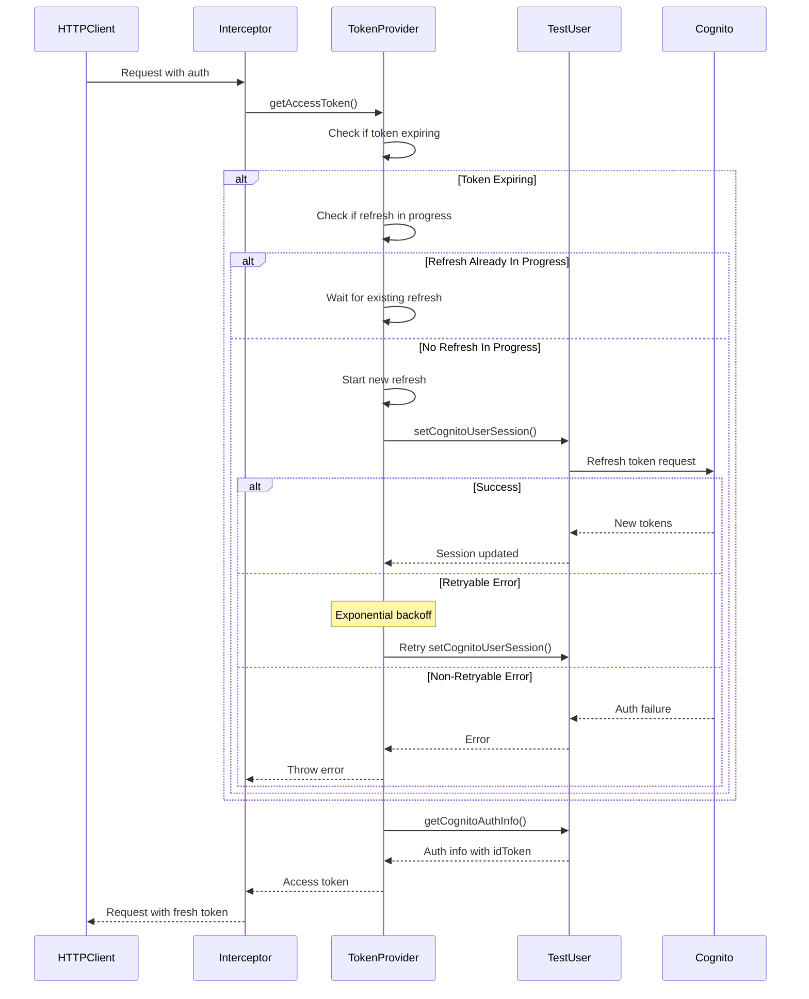
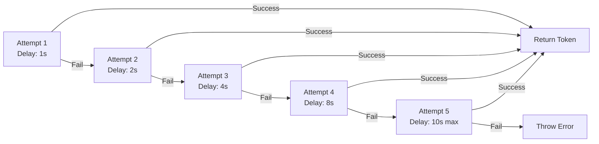
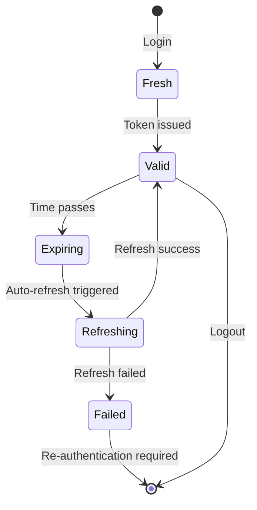

# Token Management & Authentication

## Overview

The framework implements sophisticated token management with automatic refresh, retry logic, and exponential backoff to ensure reliable API authentication across all test types. The `TestUserTokenProvider` class serves as the central component for managing authentication tokens with built-in resilience against transient failures.

## Architecture



## TestUserTokenProvider

The `TestUserTokenProvider` implements the `ITokenProvider` interface, providing automatic token refresh with intelligent retry logic.

### Core Responsibilities

| Responsibility                  | Description                                         |
| ------------------------------- | --------------------------------------------------- |
| **Token Expiry Detection**      | Proactively checks if tokens are expiring           |
| **Automatic Refresh**           | Refreshes tokens before they expire                 |
| **Concurrent Request Handling** | Prevents multiple simultaneous refresh attempts     |
| **Retry Logic**                 | Handles transient failures with exponential backoff |
| **Error Classification**        | Distinguishes retryable from non-retryable errors   |

### Token Refresh Flow



### Implementation Details

#### Token Expiry Check

```typescript
class TestUserTokenProvider implements ITokenProvider {
  async getAccessToken(): Promise<string> {
    // Check if token is expiring
    if (this.testUser.isTokenExpiring()) {
      // Refresh if needed
      if (this.refreshPromise) {
        // Wait for existing refresh
        await this.refreshPromise;
      } else {
        // Start new refresh
        this.refreshPromise = this.refreshToken();
        await this.refreshPromise;
        this.refreshPromise = null;
      }
    }
    
    // Return current token
    const authInfo = this.testUser.getCognitoAuthInfo();
    return authInfo.idToken;
  }
}
```

#### Concurrent Refresh Prevention

The provider uses a promise-based locking mechanism to prevent multiple concurrent refresh attempts:

```typescript
private refreshPromise: Promise<void> | null = null;

async getAccessToken(): Promise<string> {
  if (this.testUser.isTokenExpiring()) {
    if (this.refreshPromise) {
      // Another request is already refreshing, wait for it
      await this.refreshPromise;
    } else {
      // Start new refresh and store promise
      this.refreshPromise = this.refreshToken();
      await this.refreshPromise;
      this.refreshPromise = null;
    }
  }
  
  return this.testUser.getCognitoAuthInfo().idToken;
}
```

**Benefits**:
- Prevents redundant refresh requests
- Ensures all concurrent requests wait for single refresh
- Reduces load on authentication service

## Retry Logic with Exponential Backoff

### Error Classification

The framework distinguishes between retryable and non-retryable errors:

#### Non-Retryable Errors

Authentication and authorization failures that won't succeed on retry:

```typescript
const nonRetryablePatterns = [
  'invalid credentials',
  'authentication failed',
  'user not found',
  'user not authorized',
  'permission denied',
  'unauthorized',
  'forbidden',
  'invalid username',
  'invalid password',
  'account locked',
  'account disabled',
];
```

#### Retryable Errors

Transient failures that may succeed on retry:

```typescript
const retryablePatterns = [
  'timeout',
  'network',
  'connection',
  'econnrefused',
  'enotfound',
  'econnreset',
  'etimedout',
  'service unavailable',
  'internal server error',
  'bad gateway',
  'gateway timeout',
];
```

### Exponential Backoff Algorithm



### Backoff Configuration

```typescript
type TCognitoTokenRefreshRetryConfig = {
  maxAttempts: number;        // Maximum retry attempts (default: 3)
  initialDelayMs: number;     // Initial delay in ms (default: 1000)
  maxDelayMs: number;         // Maximum delay cap (default: 10000)
  backoffMultiplier: number;  // Multiplier for exponential growth (default: 2)
};
```

### Delay Calculation

```typescript
function calculateBackoffDelay(
  attempt: number,
  config: TCognitoTokenRefreshRetryConfig
): number {
  // Exponential: initialDelay * (multiplier ^ (attempt - 1))
  const exponentialDelay =
    config.initialDelayMs *
    Math.pow(config.backoffMultiplier, attempt - 1);
  
  // Cap at maxDelayMs
  return Math.min(exponentialDelay, config.maxDelayMs);
}
```

**Example Delays** (with default config):
- Attempt 1: 1000ms * (2^0) = 1000ms (1s)
- Attempt 2: 1000ms * (2^1) = 2000ms (2s)
- Attempt 3: 1000ms * (2^2) = 4000ms (4s)
- Attempt 4: 1000ms * (2^3) = 8000ms (8s)
- Attempt 5: 1000ms * (2^4) = 16000ms → capped at 10000ms (10s)

### Retry Implementation

```typescript
private async refreshToken(): Promise<void> {
  const retryConfig = utilManager
    .processNode()
    .facade()
    .getter()
    .getCognitoConfig()
    .tokenRefreshRetry;
  
  let lastError: Error | null = null;
  
  for (let attempt = 1; attempt <= retryConfig.maxAttempts; attempt++) {
    try {
      await this.testUser.setCognitoUserSession();
      
      // Success - log if retry
      if (attempt > 1) {
        utilManager.logger().info.log(
          `Token refresh succeeded on attempt ${attempt}/${retryConfig.maxAttempts}`
        );
      }
      return;
      
    } catch (error) {
      lastError = error instanceof Error ? error : new Error(String(error));
      
      // Check if error is non-retryable
      if (!isRetryableError(error)) {
        utilManager.logger().error.log(
          `Non-retryable error: ${lastError.message}`
        );
        throw lastError;
      }
      
      // Retry with backoff
      if (attempt < retryConfig.maxAttempts) {
        const delay = calculateBackoffDelay(attempt, retryConfig);
        utilManager.logger().info.log(
          `Attempt ${attempt} failed. Retrying in ${delay}ms...`
        );
        await sleep(delay);
      }
    }
  }
  
  // All attempts failed
  throw lastError || new Error('Token refresh failed');
}
```

## HTTP Client Integration

### RestfulClient Token Injection

The `RestfulClient` uses an Axios request interceptor to automatically inject fresh tokens:

```typescript
class RestfulClient {
  constructor(
    host: string,
    config?: CreateAxiosDefaults,
    loggingConfig?: TLoggingConfig,
    tokenProvider?: ITokenProvider
  ) {
    this.client = axios.create({ baseURL: host, ...config });
    this.tokenProvider = tokenProvider;
    
    // Add request interceptor for token refresh
    this.client.interceptors.request.use(
      async (requestConfig) => {
        // Skip if Authorization explicitly disabled
        if (requestConfig.headers['Authorization'] === undefined) {
          return requestConfig;
        }
        
        // Get fresh token from provider
        if (this.tokenProvider) {
          const token = await this.tokenProvider.getAccessToken();
          requestConfig.headers.set(
            'Authorization',
            `Bearer ${token}`
          );
        }
        
        return requestConfig;
      },
      (error) => Promise.reject(error)
    );
  }
}
```

### GraphQLClient Integration

Similar pattern for GraphQL requests:

```typescript
class GraphQLClient {
  async request<T>(query: string, variables?: any): Promise<T> {
    // Get fresh token before request
    if (this.tokenProvider) {
      const token = await this.tokenProvider.getAccessToken();
      this.setAuthorizationHeader(token);
    }
    
    return await this.client.request(query, variables);
  }
}
```

### Token Masking for Security

Tokens are masked in logs to prevent credential exposure:

```typescript
const maskedToken = utilManager
  .handler()
  .object()
  .maskTokenForLogging(token);

utilManager.logger().debug.log(
  `Using API token: ${maskedToken}` // Shows only first/last few chars
);
```

## Cognito Integration

### Token Lifecycle



### TestUser Integration

The `TestUser` class provides methods for Cognito session management:

```typescript
class TestUser {
  private cognitoUserSession?: CognitoUserSession;
  private cognitoAuthInfo?: TCognitoAuthInfo;
  
  // Set/refresh Cognito session
  async setCognitoUserSession(): Promise<void> {
    const session = await cognitoAuthorizationForUser({
      username: this.username,
      password: this.password,
    });
    
    this.cognitoUserSession = session;
    this.setAuthResult(session);
  }
  
  // Get current auth info
  getCognitoAuthInfo(): TCognitoAuthInfo {
    if (!this.cognitoAuthInfo) {
      throw new Error('CognitoAuthInfo not available');
    }
    return this.cognitoAuthInfo;
  }
  
  // Check if token is expiring
  isTokenExpiring(): boolean {
    if (!this.cognitoAuthInfo) return true;
    
    const expiryTime = this.cognitoAuthInfo.expiresAt;
    const now = Date.now();
    const bufferMs = 5 * 60 * 1000; // 5 minutes
    
    return (expiryTime - now) < bufferMs;
  }
}
```

### Auth Info Structure

```typescript
type TCognitoAuthInfo = {
  idToken: string;
  accessToken: string;
  refreshToken: string;
  expiresAt: number; // Timestamp in ms
};
```

## Configuration

### Token Refresh Configuration

Configure retry behavior through environment-specific config:

```typescript
const cognitoConfig = utilManager
  .processNode()
  .facade()
  .getter()
  .getCognitoConfig();

console.log({
  maxAttempts: cognitoConfig.tokenRefreshRetry.maxAttempts,
  initialDelayMs: cognitoConfig.tokenRefreshRetry.initialDelayMs,
  maxDelayMs: cognitoConfig.tokenRefreshRetry.maxDelayMs,
  backoffMultiplier: cognitoConfig.tokenRefreshRetry.backoffMultiplier,
});
```

### Per-Client Configuration

Create HTTP clients with token providers:

```typescript
// API client with token provider
const tokenProvider = new TestUserTokenProvider(testUser);

const restClient = RestfulClient.build(
  apiHost,
  { /* axios config */ },
  { /* logging config */ },
  tokenProvider // Token provider
);

// Token automatically refreshed before each request
const response = await restClient.get('/api/users');
```

## Best Practices

### 1. Always Use Token Providers

```typescript
// ✅ Good - Automatic token management
const client = RestfulClient.build(
  host,
  config,
  loggingConfig,
  new TestUserTokenProvider(testUser)
);

// ❌ Avoid - Manual token management
const client = RestfulClient.build(host, config);
client.setAuthorizationHeader(token); // No auto-refresh
```

### 2. Handle Non-Retryable Errors

```typescript
try {
  const token = await tokenProvider.getAccessToken();
} catch (error) {
  // Non-retryable errors indicate auth failure
  // Return test account to pool
  await testUser.returnTestAccountToPool();
  throw error;
}
```

### 3. Configure Appropriate Retry Limits

```typescript
// For critical operations, increase retry attempts
const config = {
  tokenRefreshRetry: {
    maxAttempts: 5,
    initialDelayMs: 1000,
    maxDelayMs: 15000,
    backoffMultiplier: 2,
  },
};
```

### 4. Monitor Token Refresh Logs

```typescript
// Logs indicate refresh attempts and outcomes
utilManager.logger().info.log(
  'Token refresh succeeded on attempt 2/3'
);

utilManager.logger().error.log(
  'Non-retryable error during token refresh: invalid credentials'
);
```

## Troubleshooting

### Common Issues

| Issue                  | Cause                          | Solution                                  |
| ---------------------- | ------------------------------ | ----------------------------------------- |
| **Frequent Refreshes** | Token expiry buffer too large  | Adjust `isTokenExpiring()` buffer         |
| **Refresh Failures**   | Network instability            | Increase `maxAttempts` and `maxDelayMs`   |
| **Auth Errors**        | Invalid credentials            | Check test user credentials in repository |
| **Concurrent Refresh** | Multiple simultaneous requests | Verify promise locking is working         |

### Debug Logging

Enable debug logging to troubleshoot token issues:

```typescript
utilManager.logger().debug.log(
  `Token expiring: ${testUser.isTokenExpiring()}`
);

utilManager.logger().debug.log(
  `Token expires at: ${new Date(authInfo.expiresAt)}`
);
```

## Related Documentation

- [AAA Pattern](./aaa-pattern.md) - TestUser authentication integration
- [API Testing](./api-testing.md) - HTTP client usage with token providers
- [Configuration](./configuration.md) - Cognito configuration management
- [Test User Management](./test-user-management.md) - User lifecycle and credentials
