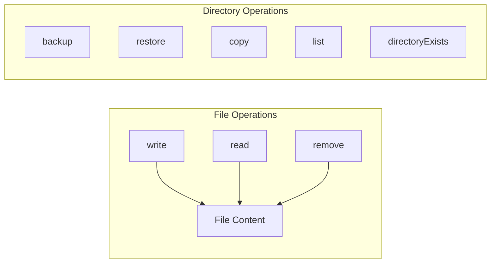

# SAB Utilities & Build Management

## Overview

The framework provides comprehensive utilities for SAB (Secure Application Browser) testing, including file system operations, build management, installer handling, and GitHub release management. These utilities abstract platform differences and provide consistent interfaces for test automation.

## File System Operations

The `fileDirectoryOps` utility provides cross-platform file and directory management:

### Available Operations



### Usage Examples

#### Write Files

```typescript
import { fileDirectoryOps } from '@framework/util-core';

// Write content to file
await fileDirectoryOps.write<string>(
  '/path/to/file.txt',
  'File content'
);

// Write JSON data
await fileDirectoryOps.write<object>(
  '/path/to/data.json',
  { key: 'value' }
);
```

#### Read Files

```typescript
// Read file content
const content = await fileDirectoryOps.read('/path/to/file.txt');
```

#### Backup and Restore

```typescript
// Backup a directory
await fileDirectoryOps.backup(
  '/path/to/source',
  '/path/to/backup'
);

// Restore from backup
await fileDirectoryOps.restore(
  '/path/to/restored',
  '/path/to/backup'
);
```

#### List Directory Contents

```typescript
const files = await fileDirectoryOps.list('/path/to/directory', {
  retention: {
    enabled: true,
    maxAgeDays: 7, // Files older than 7 days
  },
  deleteCriteria: (filePath) => filePath.endsWith('.tmp'),
});

// Returns: [{ path, name, size, modified, isDeleted }]
```

#### Remove Files/Directories

```typescript
await fileDirectoryOps.remove('/path/to/remove');
```

### SAB Data Cache Management

Backup and restore SAB application data:

```typescript
// Backup SAB data cache before test
await sabHandlers
  .primary()
  .getCredentialsUtil()
  .backup();

// Restore after test
await sabHandlers
  .primary()
  .getCredentialsUtil()
  .restore();
```

## GitHub Release Management

### Fetching SAB Releases

```typescript
import { eabCommonOps } from '@framework/util-core';

// Get SAB releases based on test configuration
const releases = await eabCommonOps.getEabReleases({
  tagName: 'v1.2.3',        // Specific tag (optional)
  buildType: 'qa',          // qa | rc | rel
  useCachedBuilds: true,    // Use cached builds if available
});

// First release is the target
const targetRelease = releases[0];
```

### Release Data Structure

```typescript
type TGitHubReleaseData = {
  tag_name: string;        // 'v1.2.3-20260101-qa'
  name: string;            // Release name
  html_url: string;        // GitHub URL
  published_at: string;    // ISO date
  assets: TAsset[];        // Downloadable files
  parsedTag: {
    date: Date;
    versionString: string; // '1.2.3'
    buildInfo: {
      buildType: string;   // 'qa' | 'rc' | 'rel'
      rcNumber?: number;   // For RC builds
    };
  };
};
```

### Release Filtering

The framework supports multiple build type filters:

| Build Type | Description         | Tag Pattern |
| ---------- | ------------------- | ----------- |
| `qa`       | QA builds           | `*-qa`      |
| `rc`       | Release candidates  | `*-rc*`     |
| `rel`      | Production releases | No suffix   |

## SAB Map Data

The framework maintains runtime state through `eabMapData`:

### Available Data Keys

```typescript
import { eabMapData, eabMapDataHandler } from '@framework/util-core';

// Read SAB releases
const releases = eabMapDataHandler
  .reader(eabMapData)
  .getEabReleases();

// Read Windows app manifest
const manifest = eabMapDataHandler
  .reader(eabMapData)
  .getEabWinAppManifest();

// Check if SAB validated
const isChecked = eabMapDataHandler
  .reader(eabMapData)
  .getEabChecked();
```

### Writing Data

```typescript
// Store releases
eabMapDataHandler
  .writer(eabMapData)
  .setEabReleases(releases);

// Store manifest
eabMapDataHandler
  .writer(eabMapData)
  .setEabWinAppManifest(manifest);

// Mark as checked
eabMapDataHandler
  .writer(eabMapData)
  .setEabChecked(true);
```

## GitHub CLI Integration

For authenticated GitHub operations:

```typescript
import { gitHubCLI } from '@framework/util-core';

// Login to GitHub
await gitHubCLI.login();

// Perform operations...

// Logout
await gitHubCLI.logout();
```

## File Lookup Utilities

Search for patterns in log files:

```typescript
import { lookUpInFile } from '@framework/util-core';

// Find CDP endpoint in SAB log
const cdpEndpoint = await lookUpInFile({
  filePath: '/path/to/sab.log',
  searchPattern: /DevTools listening on (ws:\/\/.+)/,
  indexOfMatch: 1,  // Capture group index
  errorMessage: 'CDP endpoint not found in log',
});
```

## Installer Management

### Windows Installers

MSI and MSIX installer automation:

```typescript
// MSI Installation
const installerTA = await testUser.usePlatformDriverAssistant<
  MSIInstallerPage,
  TAMSIInstallerPage
>(MSIInstallerPage);

await installerTA.actions.install();
await installerTA.assert.installationSuccessful();

// MSIX Installation
const msixTA = await testUser.usePlatformDriverAssistant<
  MSIXInstallerPage,
  TAMSIXInstallerPage
>(MSIXInstallerPage);

await msixTA.actions.install();
```

## QA Web Server

The framework includes a test web server for file upload/download testing:

### Starting the Server

```typescript
// Server starts on configurable host/port
// Default: localhost:3000

// Access endpoints:
// - GET /              : Home page
// - GET /upload        : File upload form
// - POST /upload       : Handle file upload
// - GET /files         : List uploaded files
// - GET /files/:name   : Download specific file
```

### Test Data Management

```typescript
import { FileSystemManager } from '@framework/util-core';

// Save test file
await FileSystemManager.saveTestFile(
  'test-document.txt',
  'Test content'
);

// List test files
const files = await FileSystemManager.getTestFiles();

// Clear test data (isolation between tests)
await FileSystemManager.clearTestDataDirectory();
```

### Supported File Types

| Extension | Type                        |
| --------- | --------------------------- |
| `.txt`    | Text files                  |
| `.doc`    | Word documents              |
| `.docx`   | Word documents (new format) |
| `.pdf`    | PDF documents               |
| `.rtf`    | Rich Text Format            |
| `.md`     | Markdown files              |

## Best Practices

### 1. Use Retention Policies

```typescript
// ✅ Good - Use retention for cleanup
await fileDirectoryOps.list(directory, {
  retention: { enabled: true, maxAgeDays: 7 },
});

// ❌ Avoid - No cleanup strategy
await fileDirectoryOps.list(directory);
```

### 2. Always Restore After Backup

```typescript
// ✅ Good - Restore in finally
try {
  await fileDirectoryOps.backup(source, backup);
  await performTest();
} finally {
  await fileDirectoryOps.restore(source, backup);
}
```

### 3. Type-Safe GitHub Release Access

```typescript
// ✅ Good - Use parsed tag data
const version = release.parsedTag.versionString;
const buildType = release.parsedTag.buildInfo.buildType;

// ❌ Avoid - Parse tag manually
const version = release.tag_name.split('-')[0];
```

## Related Documentation

- [Drivers](./drivers.md) - Platform driver for installer automation
- [Global Setup](./global-setup.md) - SAB environment initialization
- [Configuration](./configuration.md) - Build configuration management
- [Fixtures](./fixtures.md) - Data cache management in fixtures
